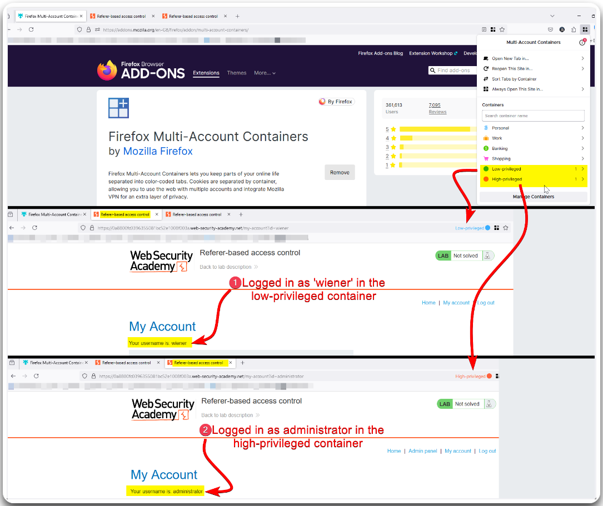
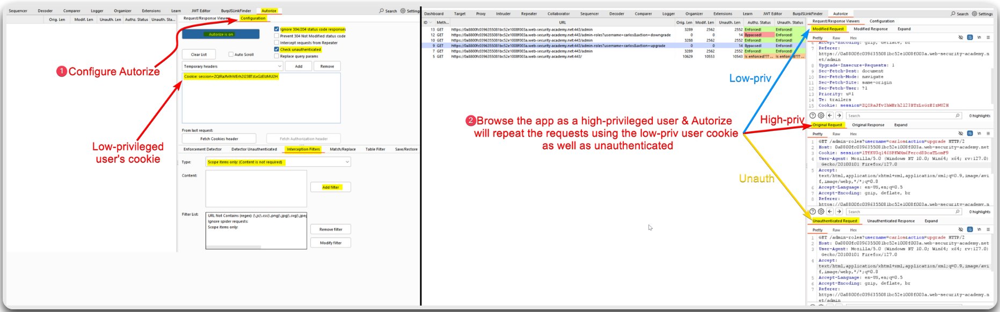

---
layout:
  title:
    visible: true
  description:
    visible: false
  tableOfContents:
    visible: true
  outline:
    visible: true
  pagination:
    visible: true
---

# Automated A-B Testing

## Multi-Account Containers 

For A-B testing we can use a browser extension, such as Firefox's [Multi-Account Containers](https://addons.mozilla.org/en-GB/firefox/addon/multi-account-containers/), and have different sessions simultaneously (Figure 1).

<figure><figcaption>
Figure 1: Performing A-B testing using Firefox's Multi-Account Containers.
</figcaption></figure>

## Autorize 

We can also use Burp's [Autorize](https://portswigger.net/bappstore/f9bbac8c4acf4aefa4d7dc92a991af2f) extension, in which we pass a low-privileged account's cookie and then browse the application as a high-privileged user. The extension then repeats each request made with the latter user as both a low-privileged and an unauthenticated user (Figure 2).

<figure><figcaption>
Figure 2: Performing A-B testing using Burp's Autorize.
</figcaption></figure>


_To test access control issues on things other than headers, such as like UUIDs in the URL path, we can use Burp's_ [_Autorepeater_](https://portswigger.net/bappstore/f89f2837c22c4ab4b772f31522647ed8) _extension in a_ [_similar way_](https://youtu.be/3K1-a7dnA60?t=351) _as Autorize._

