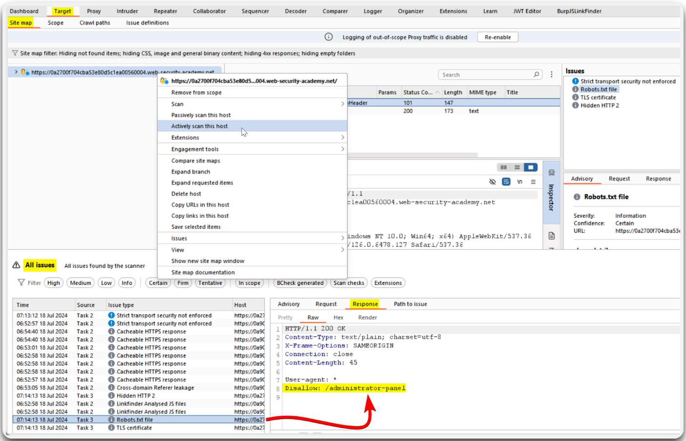
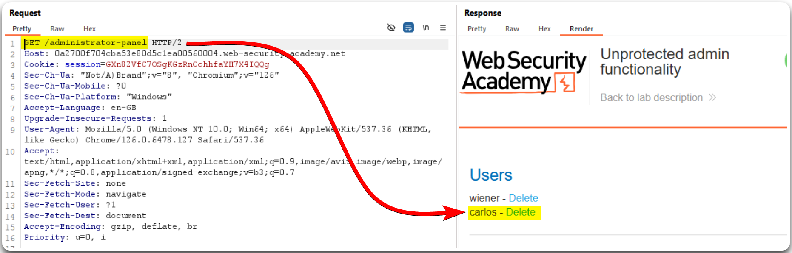

---
layout:
  title:
    visible: true
  description:
    visible: false
  tableOfContents:
    visible: true
  outline:
    visible: true
  pagination:
    visible: true
---

# IDOR / BFLA


An **IDOR** (_Insecure Direct Object Reference_) or **BFLA** (**Broken Function Level Authorization**) is a security flaw where an attacker can perform unauthorized actions by accessing functions or endpoints they shouldn't have access to. This occurs because the application doesn't properly check if a user has the right permissions before allowing them to execute certain functions.


> _The example below is based on PostSwigger's_ [_Unprotected admin functionality_](https://portswigger.net/web-security/access-control/lab-unprotected-admin-functionality) _lab._

Burp's Active Scan reveals an exposed `robots.txt` file which reveals the `/administrator-panel` directory (Figure 1).

<figure><figcaption>
Figure 1: Performing an Active Scan on the target host.
</figcaption></figure>

This directory gives us direct access to administrative functionalities (Figure 2).

<figure><figcaption>
Figure 2: Obtaining access to administrative functionalities.
</figcaption></figure>
