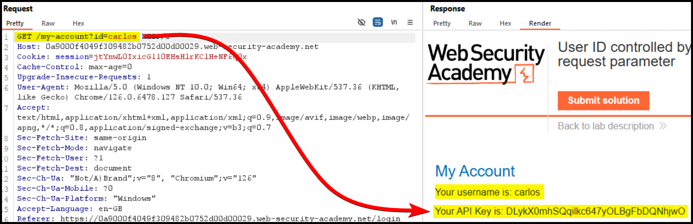
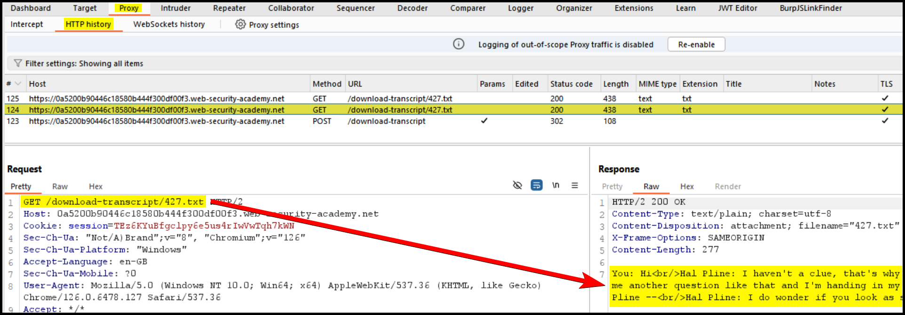

---
layout:
  title:
    visible: true
  description:
    visible: false
  tableOfContents:
    visible: true
  outline:
    visible: true
  pagination:
    visible: true
---

# IDOR / BOLA


Insecure Direct Object Reference (IDOR) or Broken Object Level Authorization (BOLA) is a vulnerability where an attacker can access or manipulate resources they shouldn't be able to, by altering identifiers in requests (e.g., URLs, form fields).



This can lead to unauthorized access to sensitive data or actions, as attackers can exploit insufficient access controls to view or modify other users' data.



Implement proper access controls and authorization checks on the server side, validate and restrict access to resources based on user roles, and avoid exposing direct references to sensitive objects.


## API Key Access 

> _The example below is based on PostSwigger's_ [_User ID controlled by request parameter_](https://portswigger.net/web-security/access-control/lab-user-id-controlled-by-request-parameter) _lab._

When we log into the application with the user `wiener`, we can directly see his API key (Figure 1).

<figure><figcaption>
Figure 1: Obtaining <code>wiener</code>'s API key.
</figcaption></figure>

It seems that the `session` cookie is not tied to a specific user. As a result, we can access `carlos`'s API key by forwarding the latter request in the Repeater and changing the `id` parameter (Figure 2).

<figure><figcaption>
Figure 2: Discovering a BOLA vulnerability &#x26; obtaining the API key of another user.
</figcaption></figure>

## Logs Access 

> _The example below is based on PostSwigger's_ [_Insecure direct object references_](https://portswigger.net/web-security/access-control/lab-insecure-direct-object-references) _lab._

This application has a Live Chat functionality which also provides the ability to view a chat's transcript. The latter feature reveals the directory where the transcript is stored (Figure 3).

<figure><figcaption>
Figure 3: Viewing the transcript of our Live Chat reveals where it is stored.
</figcaption></figure>

Notice that Burp's Active Scan also highlights this feature as a potential issue (Figure 4).

<figure><figcaption>
Figure 4: Burp's Active Scan highlights a Back file issue.
</figcaption></figure>

Similar to the [previous example](https://x7331.gitbook.io/notes/tcm/web-testing/authorization/bola#api-key-access), the session cookie is not tied to a specific user and their transcripts. Thus, we can brute-force the `/download-transcript` directory and access them all (Figure 5).

<figure><figcaption>
Figure 5: Brute-forcing other users' transcripts.
</figcaption></figure>
