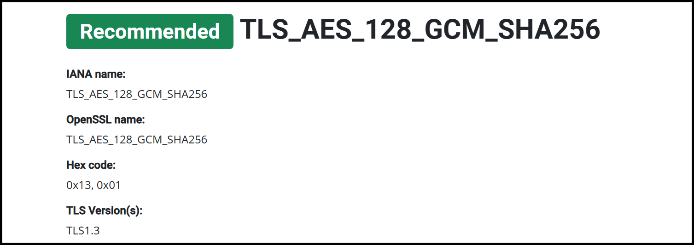

---
layout:
  title:
    visible: true
  description:
    visible: false
  tableOfContents:
    visible: true
  outline:
    visible: true
  pagination:
    visible: true
---

# SSL/TLS


**Secure Sockets Layer/Transport Layer Security** (**SSL/TLS)** **testing** is the process of evaluating the security and configuration of SSL/TLS  protocols on a web server, making sure that data transmitted over the internet is encrypted and secure. It typically involves **checking certificate validity** (correctly installed and not expired), **reviewing** **configuration** (strong encryption algorithm and protocol usage), and **vulnerability scanning** (susceptibility against known attacks).


## Tools

We can use tools, such as [Qualys Online test](https://www.ssllabs.com/ssltest/), to quickly check for SSL/TLS issues. We can also use a variety of offline tools such as those below.



```bash
nmap --script ssl-cert,ssl-enum-ciphers -p 443 www.example.com
```



```bash
sslyze --regular example.com:443
```



```bash
testssl owasp.org
```



```bash
o-saft.pl +check +vulns example.tld
```



Check OWASP's [best practices](https://cheatsheetseries.owasp.org/cheatsheets/Transport\_Layer\_Security\_Cheat\_Sheet.html#server-configuration) and/or individual ciphers on [CipherSuite](https://ciphersuite.info/).

## Example

Scan target with `testssl`.

```bash
$ testssl example.com -oL output.txt


###########################################################
    testssl       3.2rc3 from https://testssl.sh/dev/

      This program is free software. Distribution and
             modification under GPLv2 permitted.
      USAGE w/o ANY WARRANTY. USE IT AT YOUR OWN RISK!

       Please file bugs @ https://testssl.sh/bugs/

###########################################################

 Using "OpenSSL 3.2.2-dev  (Library: OpenSSL 3.2.2-dev )" [~94 ciphers]
 on CSpanias:/usr/bin/openssl
 (built: "Apr  4 20:00:04 2024", platform: "debian-amd64")


 Start 2024-08-05 19:16:14                -->> 93.184.215.14:443 (example.com) <<--

 Further IP addresses:   2606:2800:21f:cb07:6820:80da:af6b:8b2c
 rDNS (93.184.215.14):   --
 Service detected:       HTTP


 Testing protocols via sockets except NPN+ALPN

 SSLv2      not offered (OK)
 SSLv3      not offered (OK)
 TLS 1      offered (deprecated)
 TLS 1.1    offered (deprecated)
 TLS 1.2    offered (OK)
 TLS 1.3    offered (OK): final
 NPN/SPDY   not offered
 ALPN/HTTP2 h2, http/1.1 (offered)

 Testing cipher categories

 NULL ciphers (no encryption)                      not offered (OK)
 Anonymous NULL Ciphers (no authentication)        not offered (OK)
 Export ciphers (w/o ADH+NULL)                     not offered (OK)
 LOW: 64 Bit + DES, RC[2,4], MD5 (w/o export)      not offered (OK)
 Triple DES Ciphers / IDEA                         not offered
 Obsoleted CBC ciphers (AES, ARIA etc.)            offered
 Strong encryption (AEAD ciphers) with no FS       offered (OK)
 Forward Secrecy strong encryption (AEAD ciphers)  offered (OK)


 Testing server's cipher preferences

Hexcode  Cipher Suite Name (OpenSSL)       KeyExch.   Encryption  Bits     Cipher Suite Name (IANA/RFC)
-----------------------------------------------------------------------------------------------------------------------------
SSLv2
 -
SSLv3
 -
TLSv1 (server order)
 xc013   ECDHE-RSA-AES128-SHA              ECDH 256   AES         128      TLS_ECDHE_RSA_WITH_AES_128_CBC_SHA
 xc014   ECDHE-RSA-AES256-SHA              ECDH 256   AES         256      TLS_ECDHE_RSA_WITH_AES_256_CBC_SHA
 x33     DHE-RSA-AES128-SHA                DH 2048    AES         128      TLS_DHE_RSA_WITH_AES_128_CBC_SHA
 x39     DHE-RSA-AES256-SHA                DH 2048    AES         256      TLS_DHE_RSA_WITH_AES_256_CBC_SHA
 x88     DHE-RSA-CAMELLIA256-SHA           DH 2048    Camellia    256      TLS_DHE_RSA_WITH_CAMELLIA_256_CBC_SHA
 x45     DHE-RSA-CAMELLIA128-SHA           DH 2048    Camellia    128      TLS_DHE_RSA_WITH_CAMELLIA_128_CBC_SHA
 x35     AES256-SHA                        RSA        AES         256      TLS_RSA_WITH_AES_256_CBC_SHA
 x84     CAMELLIA256-SHA                   RSA        Camellia    256      TLS_RSA_WITH_CAMELLIA_256_CBC_SHA
 x2f     AES128-SHA                        RSA        AES         128      TLS_RSA_WITH_AES_128_CBC_SHA
 x41     CAMELLIA128-SHA                   RSA        Camellia    128      TLS_RSA_WITH_CAMELLIA_128_CBC_SHA
 x9a     DHE-RSA-SEED-SHA                  DH 2048    SEED        128      TLS_DHE_RSA_WITH_SEED_CBC_SHA
 x96     SEED-SHA                          RSA        SEED        128      TLS_RSA_WITH_SEED_CBC_SHA
TLSv1.1 (server order)
 xc013   ECDHE-RSA-AES128-SHA              ECDH 256   AES         128      TLS_ECDHE_RSA_WITH_AES_128_CBC_SHA
 xc014   ECDHE-RSA-AES256-SHA              ECDH 256   AES         256      TLS_ECDHE_RSA_WITH_AES_256_CBC_SHA
 x33     DHE-RSA-AES128-SHA                DH 2048    AES         128      TLS_DHE_RSA_WITH_AES_128_CBC_SHA
 x39     DHE-RSA-AES256-SHA                DH 2048    AES         256      TLS_DHE_RSA_WITH_AES_256_CBC_SHA
 x88     DHE-RSA-CAMELLIA256-SHA           DH 2048    Camellia    256      TLS_DHE_RSA_WITH_CAMELLIA_256_CBC_SHA
 x45     DHE-RSA-CAMELLIA128-SHA           DH 2048    Camellia    128      TLS_DHE_RSA_WITH_CAMELLIA_128_CBC_SHA
 x35     AES256-SHA                        RSA        AES         256      TLS_RSA_WITH_AES_256_CBC_SHA
 x84     CAMELLIA256-SHA                   RSA        Camellia    256      TLS_RSA_WITH_CAMELLIA_256_CBC_SHA
 x2f     AES128-SHA                        RSA        AES         128      TLS_RSA_WITH_AES_128_CBC_SHA
 x41     CAMELLIA128-SHA                   RSA        Camellia    128      TLS_RSA_WITH_CAMELLIA_128_CBC_SHA
 x9a     DHE-RSA-SEED-SHA                  DH 2048    SEED        128      TLS_DHE_RSA_WITH_SEED_CBC_SHA
 x96     SEED-SHA                          RSA        SEED        128      TLS_RSA_WITH_SEED_CBC_SHA
TLSv1.2 (server order)
 xc02f   ECDHE-RSA-AES128-GCM-SHA256       ECDH 256   AESGCM      128      TLS_ECDHE_RSA_WITH_AES_128_GCM_SHA256
 xc030   ECDHE-RSA-AES256-GCM-SHA384       ECDH 256   AESGCM      256      TLS_ECDHE_RSA_WITH_AES_256_GCM_SHA384
 x9e     DHE-RSA-AES128-GCM-SHA256         DH 2048    AESGCM      128      TLS_DHE_RSA_WITH_AES_128_GCM_SHA256
 x9f     DHE-RSA-AES256-GCM-SHA384         DH 2048    AESGCM      256      TLS_DHE_RSA_WITH_AES_256_GCM_SHA384
 xc027   ECDHE-RSA-AES128-SHA256           ECDH 256   AES         128      TLS_ECDHE_RSA_WITH_AES_128_CBC_SHA256
 xc013   ECDHE-RSA-AES128-SHA              ECDH 256   AES         128      TLS_ECDHE_RSA_WITH_AES_128_CBC_SHA
 xc028   ECDHE-RSA-AES256-SHA384           ECDH 256   AES         256      TLS_ECDHE_RSA_WITH_AES_256_CBC_SHA384
 xc014   ECDHE-RSA-AES256-SHA              ECDH 256   AES         256      TLS_ECDHE_RSA_WITH_AES_256_CBC_SHA
 x67     DHE-RSA-AES128-SHA256             DH 2048    AES         128      TLS_DHE_RSA_WITH_AES_128_CBC_SHA256
 x33     DHE-RSA-AES128-SHA                DH 2048    AES         128      TLS_DHE_RSA_WITH_AES_128_CBC_SHA
 x6b     DHE-RSA-AES256-SHA256             DH 2048    AES         256      TLS_DHE_RSA_WITH_AES_256_CBC_SHA256
 x39     DHE-RSA-AES256-SHA                DH 2048    AES         256      TLS_DHE_RSA_WITH_AES_256_CBC_SHA
 x9c     AES128-GCM-SHA256                 RSA        AESGCM      128      TLS_RSA_WITH_AES_128_GCM_SHA256
 x88     DHE-RSA-CAMELLIA256-SHA           DH 2048    Camellia    256      TLS_DHE_RSA_WITH_CAMELLIA_256_CBC_SHA
 x45     DHE-RSA-CAMELLIA128-SHA           DH 2048    Camellia    128      TLS_DHE_RSA_WITH_CAMELLIA_128_CBC_SHA
 x35     AES256-SHA                        RSA        AES         256      TLS_RSA_WITH_AES_256_CBC_SHA
 x84     CAMELLIA256-SHA                   RSA        Camellia    256      TLS_RSA_WITH_CAMELLIA_256_CBC_SHA
 x2f     AES128-SHA                        RSA        AES         128      TLS_RSA_WITH_AES_128_CBC_SHA
 x41     CAMELLIA128-SHA                   RSA        Camellia    128      TLS_RSA_WITH_CAMELLIA_128_CBC_SHA
 x9a     DHE-RSA-SEED-SHA                  DH 2048    SEED        128      TLS_DHE_RSA_WITH_SEED_CBC_SHA
 x96     SEED-SHA                          RSA        SEED        128      TLS_RSA_WITH_SEED_CBC_SHA
TLSv1.3 (server order)
 x1302   TLS_AES_256_GCM_SHA384            ECDH 256   AESGCM      256      TLS_AES_256_GCM_SHA384
 x1303   TLS_CHACHA20_POLY1305_SHA256      ECDH 256   ChaCha20    256      TLS_CHACHA20_POLY1305_SHA256
 x1301   TLS_AES_128_GCM_SHA256            ECDH 256   AESGCM      128      TLS_AES_128_GCM_SHA256

 Has server cipher order?     yes (OK) -- TLS 1.3 and below


 Testing robust forward secrecy (FS) -- omitting Null Authentication/Encryption, 3DES, RC4

 FS is offered (OK)           TLS_AES_256_GCM_SHA384 TLS_CHACHA20_POLY1305_SHA256 ECDHE-RSA-AES256-GCM-SHA384 ECDHE-RSA-AES256-SHA384 ECDHE-RSA-AES256-SHA
                              DHE-RSA-AES256-GCM-SHA384 DHE-RSA-AES256-SHA256 DHE-RSA-AES256-SHA DHE-RSA-CAMELLIA256-SHA TLS_AES_128_GCM_SHA256 ECDHE-RSA-AES128-GCM-SHA256
                              ECDHE-RSA-AES128-SHA256 ECDHE-RSA-AES128-SHA DHE-RSA-AES128-GCM-SHA256 DHE-RSA-AES128-SHA256 DHE-RSA-AES128-SHA DHE-RSA-SEED-SHA
                              DHE-RSA-CAMELLIA128-SHA
 Elliptic curves offered:     prime256v1
 DH group offered:            Unknown DH group (2048 bits)
 TLS 1.2 sig_algs offered:    RSA-PSS-RSAE+SHA256 RSA-PSS-RSAE+SHA384 RSA-PSS-RSAE+SHA512 RSA+SHA256 RSA+SHA384 RSA+SHA512 RSA+SHA224 RSA+SHA1
 TLS 1.3 sig_algs offered:    RSA-PSS-RSAE+SHA256 RSA-PSS-RSAE+SHA384 RSA-PSS-RSAE+SHA512

 Testing server defaults (Server Hello)

 TLS extensions (standard)    "renegotiation info/#65281" "EC point formats/#11" "session ticket/#35" "status request/#5" "next protocol/#13172" "supported versions/#43"
                              "key share/#51" "max fragment length/#1" "application layer protocol negotiation/#16" "encrypt-then-mac/#22" "extended master secret/#23"
 Session Ticket RFC 5077 hint 7200 seconds, session tickets keys seems to be rotated < daily
 SSL Session ID support       yes
 Session Resumption           Tickets no, ID: no
 TLS clock skew               Random values, no fingerprinting possible
 Certificate Compression      none
 Client Authentication        none
 Signature Algorithm          SHA256 with RSA
 Server key size              RSA 2048 bits (exponent is 65537)
 Server key usage             Digital Signature, Key Encipherment
 Server extended key usage    TLS Web Server Authentication, TLS Web Client Authentication
 Serial                       075BCEF30689C8ADDF13E51AF4AFE187 (OK: length 16)
 Fingerprints                 SHA1 4DA25A6D5EF62C5F95C7BD0A73EA3C177B36999D
                              SHA256 EFBA26D8C1CE3779AC77630A90F82163A3D6892ED6AFEE408672CF19EBA7A362
 Common Name (CN)             www.example.org
 subjectAltName (SAN)         www.example.org example.net example.edu example.com example.org www.example.com www.example.edu www.example.net
 Trust (hostname)             Ok via SAN (same w/o SNI)
 Chain of trust               Ok
 EV cert (experimental)       no
 Certificate Validity (UTC)   208 >= 60 days (2024-01-30 00:00 --> 2025-03-01 23:59)
 ETS/"eTLS", visibility info  not present
 Certificate Revocation List  http://crl3.digicert.com/DigiCertGlobalG2TLSRSASHA2562020CA1-1.crl
                              http://crl4.digicert.com/DigiCertGlobalG2TLSRSASHA2562020CA1-1.crl
 OCSP URI                     http://ocsp.digicert.com
 OCSP stapling                offered, not revoked
 OCSP must staple extension   --
 DNS CAA RR (experimental)    not offered
 Certificate Transparency     yes (certificate extension)
 Certificates provided        2
 Issuer                       DigiCert Global G2 TLS RSA SHA256 2020 CA1 (DigiCert Inc from US)
 Intermediate cert validity   #1: ok > 40 days (2031-03-29 23:59). DigiCert Global G2 TLS RSA SHA256 2020 CA1 <-- DigiCert Global Root G2
 Intermediate Bad OCSP (exp.) Ok


 Testing HTTP header response @ "/"

 HTTP Status Code             200 OK
 HTTP clock skew              +344076 sec from localtime
 HTTP Age (RFC 7234)          344077
 Strict Transport Security    not offered
 Public Key Pinning           --
 Server banner                ECAcc (nyd/D15E)
 Application banner           --
 Cookie(s)                    (none issued at "/")
 Security headers             Cache-Control: max-age=604800
 Reverse Proxy banner         X-Cache: HIT


 Testing vulnerabilities

 Heartbleed (CVE-2014-0160)                not vulnerable (OK), no heartbeat extension
 CCS (CVE-2014-0224)                       not vulnerable (OK)
 Ticketbleed (CVE-2016-9244), experiment.  not vulnerable (OK)
 ROBOT                                     not vulnerable (OK)
 Secure Renegotiation (RFC 5746)           supported (OK)
 Secure Client-Initiated Renegotiation     not vulnerable (OK)
 CRIME, TLS (CVE-2012-4929)                not vulnerable (OK)
 BREACH (CVE-2013-3587)                    potentially NOT ok, "gzip deflate" HTTP compression detected. - only supplied "/" tested
                                           Can be ignored for static pages or if no secrets in the page
 POODLE, SSL (CVE-2014-3566)               not vulnerable (OK), no SSLv3 support
 TLS_FALLBACK_SCSV (RFC 7507)              Downgrade attack prevention supported (OK)
 SWEET32 (CVE-2016-2183, CVE-2016-6329)    not vulnerable (OK)
 FREAK (CVE-2015-0204)                     not vulnerable (OK)
 DROWN (CVE-2016-0800, CVE-2016-0703)      not vulnerable on this host and port (OK)
                                           make sure you don't use this certificate elsewhere with SSLv2 enabled services, see
                                           https://search.censys.io/search?resource=hosts&virtual_hosts=INCLUDE&q=EFBA26D8C1CE3779AC77630A90F82163A3D6892ED6AFEE408672CF19EBA7A362
 LOGJAM (CVE-2015-4000), experimental      not vulnerable (OK): no DH EXPORT ciphers, no common prime detected
 BEAST (CVE-2011-3389)                     TLS1: ECDHE-RSA-AES128-SHA ECDHE-RSA-AES256-SHA DHE-RSA-AES128-SHA DHE-RSA-AES256-SHA DHE-RSA-CAMELLIA256-SHA DHE-RSA-CAMELLIA128-SHA
                                                 AES256-SHA CAMELLIA256-SHA AES128-SHA CAMELLIA128-SHA DHE-RSA-SEED-SHA SEED-SHA
                                           VULNERABLE -- but also supports higher protocols  TLSv1.1 TLSv1.2 (likely mitigated)
 LUCKY13 (CVE-2013-0169), experimental     potentially VULNERABLE, uses cipher block chaining (CBC) ciphers with TLS. Check patches
 Winshock (CVE-2014-6321), experimental    not vulnerable (OK)
 RC4 (CVE-2013-2566, CVE-2015-2808)        no RC4 ciphers detected (OK)


 Running client simulations (HTTP) via sockets

 Browser                      Protocol  Cipher Suite Name (OpenSSL)       Forward Secrecy
------------------------------------------------------------------------------------------------
 Android 6.0                  TLSv1.2   ECDHE-RSA-AES128-GCM-SHA256       256 bit ECDH (P-256)
 Android 7.0 (native)         TLSv1.2   ECDHE-RSA-AES128-GCM-SHA256       256 bit ECDH (P-256)
 Android 8.1 (native)         TLSv1.2   ECDHE-RSA-AES128-GCM-SHA256       256 bit ECDH (P-256)
 Android 9.0 (native)         TLSv1.3   TLS_AES_256_GCM_SHA384            256 bit ECDH (P-256)
 Android 10.0 (native)        TLSv1.3   TLS_AES_256_GCM_SHA384            256 bit ECDH (P-256)
 Android 11 (native)          TLSv1.3   TLS_AES_256_GCM_SHA384            256 bit ECDH (P-256)
 Android 12 (native)          TLSv1.3   TLS_AES_256_GCM_SHA384            256 bit ECDH (P-256)
 Chrome 79 (Win 10)           TLSv1.3   TLS_AES_256_GCM_SHA384            256 bit ECDH (P-256)
 Chrome 101 (Win 10)          TLSv1.3   TLS_AES_256_GCM_SHA384            256 bit ECDH (P-256)
 Firefox 66 (Win 8.1/10)      TLSv1.3   TLS_AES_256_GCM_SHA384            256 bit ECDH (P-256)
 Firefox 100 (Win 10)         TLSv1.3   TLS_AES_256_GCM_SHA384            256 bit ECDH (P-256)
 IE 6 XP                      No connection
 IE 8 Win 7                   TLSv1.0   ECDHE-RSA-AES128-SHA              256 bit ECDH (P-256)
 IE 8 XP                      No connection
 IE 11 Win 7                  TLSv1.2   DHE-RSA-AES128-GCM-SHA256         2048 bit DH
 IE 11 Win 8.1                TLSv1.2   DHE-RSA-AES128-GCM-SHA256         2048 bit DH
 IE 11 Win Phone 8.1          TLSv1.2   ECDHE-RSA-AES128-SHA256           256 bit ECDH (P-256)
 IE 11 Win 10                 TLSv1.2   ECDHE-RSA-AES128-GCM-SHA256       256 bit ECDH (P-256)
 Edge 15 Win 10               TLSv1.2   ECDHE-RSA-AES128-GCM-SHA256       256 bit ECDH (P-256)
 Edge 101 Win 10 21H2         TLSv1.3   TLS_AES_256_GCM_SHA384            256 bit ECDH (P-256)
 Safari 12.1 (iOS 12.2)       TLSv1.3   TLS_AES_256_GCM_SHA384            256 bit ECDH (P-256)
 Safari 13.0 (macOS 10.14.6)  TLSv1.3   TLS_AES_256_GCM_SHA384            256 bit ECDH (P-256)
 Safari 15.4 (macOS 12.3.1)   TLSv1.3   TLS_AES_256_GCM_SHA384            256 bit ECDH (P-256)
 Java 7u25                    TLSv1.0   ECDHE-RSA-AES128-SHA              256 bit ECDH (P-256)
 Java 8u161                   TLSv1.2   ECDHE-RSA-AES128-GCM-SHA256       256 bit ECDH (P-256)
 Java 11.0.2 (OpenJDK)        TLSv1.3   TLS_AES_256_GCM_SHA384            256 bit ECDH (P-256)
 Java 17.0.3 (OpenJDK)        TLSv1.3   TLS_AES_256_GCM_SHA384            256 bit ECDH (P-256)
 go 1.17.8                    TLSv1.3   TLS_AES_256_GCM_SHA384            256 bit ECDH (P-256)
 LibreSSL 2.8.3 (Apple)       TLSv1.2   ECDHE-RSA-AES128-GCM-SHA256       256 bit ECDH (P-256)
 OpenSSL 1.0.2e               TLSv1.2   ECDHE-RSA-AES128-GCM-SHA256       256 bit ECDH (P-256)
 OpenSSL 1.1.0l (Debian)      TLSv1.2   ECDHE-RSA-AES128-GCM-SHA256       256 bit ECDH (P-256)
 OpenSSL 1.1.1d (Debian)      TLSv1.3   TLS_AES_256_GCM_SHA384            256 bit ECDH (P-256)
 OpenSSL 3.0.3 (git)          TLSv1.3   TLS_AES_256_GCM_SHA384            256 bit ECDH (P-256)
 Apple Mail (16.0)            TLSv1.2   ECDHE-RSA-AES128-GCM-SHA256       256 bit ECDH (P-256)
 Thunderbird (91.9)           TLSv1.3   TLS_AES_256_GCM_SHA384            256 bit ECDH (P-256)


 Rating (experimental)

 Rating specs (not complete)  SSL Labs's 'SSL Server Rating Guide' (version 2009q from 2020-01-30)
 Specification documentation  https://github.com/ssllabs/research/wiki/SSL-Server-Rating-Guide
 Protocol Support (weighted)  95 (28)
 Key Exchange     (weighted)  90 (27)
 Cipher Strength  (weighted)  90 (36)
 Final Score                  91
 Overall Grade                B
 Grade cap reasons            Grade capped to B. TLS 1.1 offered
                              Grade capped to B. TLS 1.0 offered
                              Grade capped to A. HSTS is not offered

 Done 2024-08-05 19:18:59 [ 166s] -->> 93.184.215.14:443 (example.com) <<--
```

Check questionable ciphers on [https://ciphersuite.info/](https://ciphersuite.info/) by copying its RFC name.

<figure><figcaption></figcaption></figure>

## Resources




























