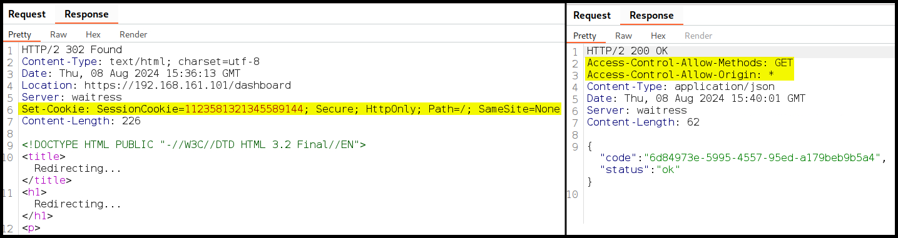

---
layout:
  title:
    visible: true
  description:
    visible: false
  tableOfContents:
    visible: true
  outline:
    visible: true
  pagination:
    visible: true
---

# Cross-Origin 101

## SOP

An **origin** consists of the protocol, host, and port (e.g., `http://www.example:8080.com`), and a **cross-origin or cross-site request** occurs when a domain requests resources from another domain. Browsers enforce the [**Same-Origin Policy (SOP)**](https://developer.mozilla.org/en-US/docs/Web/Security/Same-origin\_policy) to prevent one origin from accessing another's resources by allowing resources to load on the page but blocking JavaScript from reading the response.


_SOP's concept  is similar to that of the_ [_`HttpOnly`_](../common-findings/cookie-flags.md) _cookie flag which prevents JavaScript from accessing it, but allows the browser to send it with HTTP requests._&#x20;


## CORS

[**Cross-Origin Resource Sharing (CORS)**](https://developer.mozilla.org/en-US/docs/Web/HTTP/CORS) allows cross-origin access based on an allowlist; if CORS is not defined, the browser blocks JavaScript from accessing the response by default. However, the request is still sent, and the response can be viewed (Figure 1).

<figure><figcaption><p>Figure 1: The response's content is blocked on the browser but visible otherwise.</p></figcaption></figure>

### Requests

CORS instructs a browser, via headers, on which origins may access server resources and how they can be accessed, **loosening SOP restrictions**. Before sending the actual cross-origin request, the browser makes a **preflight request** using the `OPTIONS` HTTP method to check if the requesting domain is permitted to perform the requested action.

```bash
# example of a CORS preflight request 
OPTIONS /foo HTTP/1.1
Host: megacorpone.com
Accept: text/html,application/xhtml+xml,application/xml;q=0.9,*/*;q=0.8
Accept-Language: en-us,en;q=0.5
Accept-Encoding: gzip,deflate
Connection: keep-alive
# all CORS requests include the Origin header
Origin: https://offensive-security.com
# indicates which HTTP method(s) the actual request will include (optional)
Access-Control-Request-Method: POST
# indicates which request header(s) the actual request will include (optional)
Access-Control-Request-Headers: X-UserId
```


_Some cross-origin requests, known as **simple requests**, do not trigger a preflight, such as standard `GET`, `HEAD`, and `POST` requests. However, requests using other methods, custom HTTP headers, or POST requests with nonstandard `Content-Type` require a preflight request._


### Responses

```bash
# example of a CORS response
HTTP/1.1 200 OK
Server: nginx/1.14.0 (Ubuntu)
Date: Wed, 23 Jun 2021 17:38:47 GMT
Content-Type: text/html; charset=utf-8
Content-Length: 0
Connection: close
# allowed methods
Access-Control-Allow-Methods: GET, POST, OPTIONS
# allowed origin
Access-Control-Allow-Origin: https://offensive-security.com
# if cookies/auth headers are allowed to be transferred
Access-Control-Allow-Credentials: true
# allowed headers (for custom headers or the Authorization header)
Access-Control-Allow-Headers: X-UserId
```


The [`Access-Control-Allow-Credentials`](https://developer.mozilla.org/en-US/docs/Web/HTTP/Headers/Access-Control-Allow-Credentials) header does not have a `false` value. Servers must omit this header if they don't want to transfer credentials. It does not bypass the [`SameSite`](../common-findings/cookie-flags.md#samesite) cookie flag.


## SameSite Cookies

Find more about the `SameSite` flag [here](../common-findings/cookie-flags.md#samesite).
