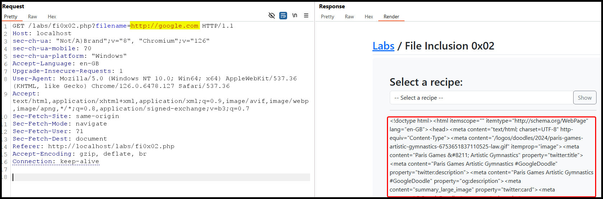

---
layout:
  title:
    visible: true
  description:
    visible: false
  tableOfContents:
    visible: true
  outline:
    visible: true
  pagination:
    visible: true
---

# RFI


**Remote File Inclusion (RFI)** occurs when the attacker, instead of local files, includes files from a remote server.


<figure><figcaption>
Figure 1: Bypassing the traversal sequence filters.
</figcaption></figure>
