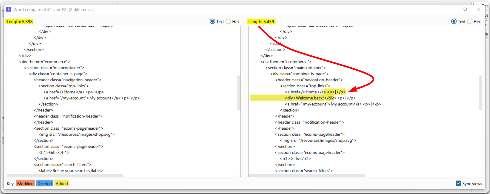
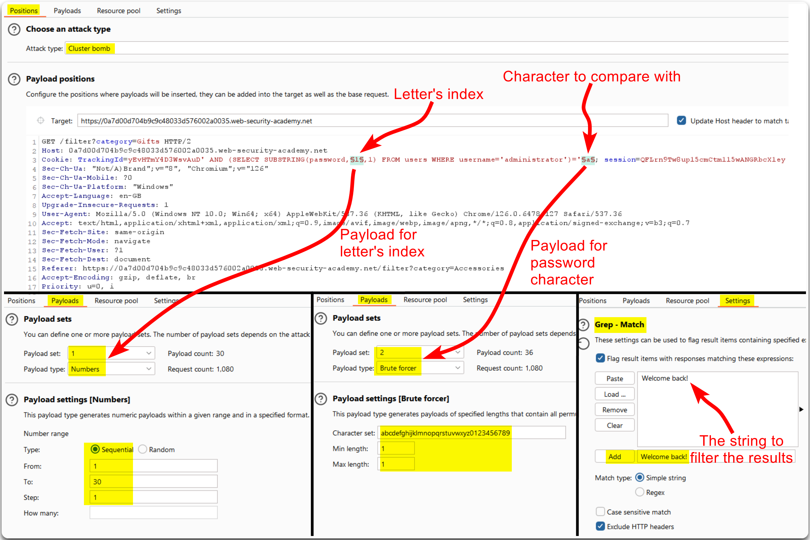
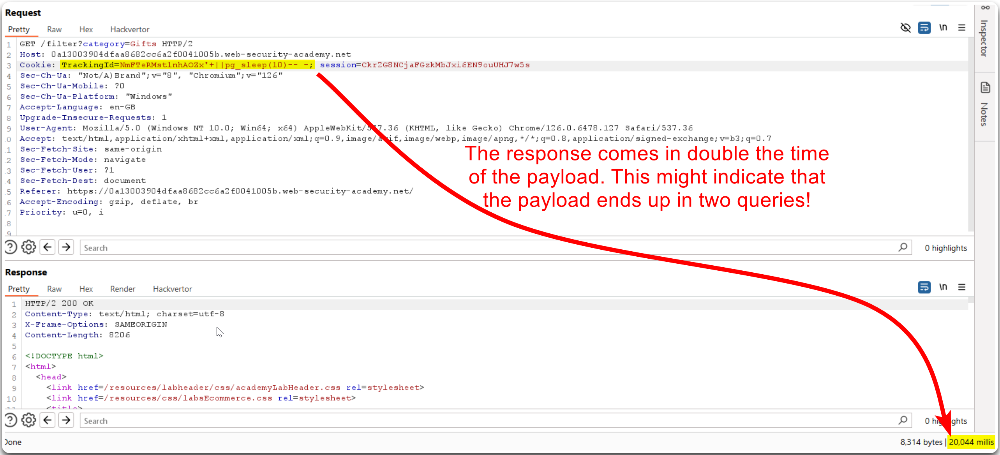
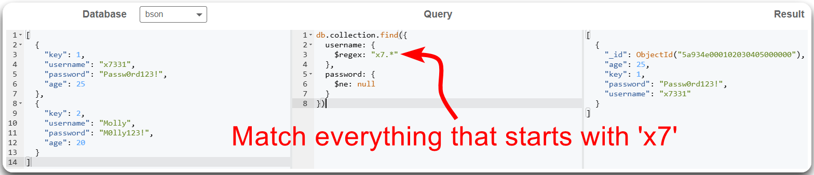
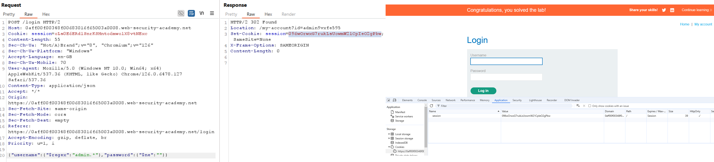

---
layout:
  title:
    visible: true
  description:
    visible: false
  tableOfContents:
    visible: true
  outline:
    visible: true
  pagination:
    visible: true
---

# SQLi


**SQL Injection** (_SQLi_) is a security vulnerability where an attacker inserts or manipulates SQL queries through user inputs to gain unauthorized access, alter data, or execute malicious commands in the database.


## General Information

### Educated Guesses

If we know the web server, we might infer what database in in use.

<table><thead><tr><th width="166">Web Server</th><th width="145">Database</th><th>Db-specific SQLi</th></tr></thead><tbody><tr><td>IIS </td><td>MSSQL</td><td>For <strong>MSSQL-specific</strong> SQLi info see <a href="../../../services/sql/mssql-1433.md#sqli">here</a>. </td></tr><tr><td>Apache/Nginx</td><td>MySQL </td><td>For <strong>MySQL-specific</strong> SQLi info see <a href="../../../services/sql/mysql-3306.md#sqli">here</a>.</td></tr></tbody></table>

### SQLi Types

> _Alex's Blind SQLi_ [_payload examples_](https://www.db-fiddle.com/f/nLpyQDMd49iRygnY9H7CB8/5).

* **Blind SQLi** is a type of SQLi where an attacker can execute SQL commands on a database without seeing the direct results. Instead, the attacker infers the results indirectly, often by observing changes in the web application's behavior or responses.
  * **Blind boolean-based SQLi** is a technique where an attacker sends SQL queries that return true or false. The attacker observes the application's response to determine if the query was true or false, allowing them to infer information about the database without seeing the data directly.
  * **Blind time-based SQLi** is a technique where an attacker sends SQL queries that cause a delay in the database response if the query is true. By measuring the time it takes for the application to respond, the attacker can infer information about the database.

<div align="center">

<figure><figcaption><p>Figure 1: SQL Injection types (<em>imaged adapted from</em> <a href="https://www.qafox.com/sql-injection-types/"><em>here</em></a>).</p></figcaption></figure>

</div>

### Detection

| Payload | URL Encoded |
| ------- | ----------- |
| `'`     | `%27`       |
| `"`     | `%22`       |
| `#`     | `%23`       |
| `;`     | `%3B`       |
| `)`     | `%29`       |

We can also fuzz for pontially banned characters.


```bash
ffuf -k -u https://watch.streamio.htb/search.php -d 'q=FUZZ' -w /usr/share/seclists/Fuzzing/special-chars.txt -c -ic -ac -H 'Content-Type: application/x-www-form-urlencoded'
```


### Discovery

We can enumerate SQLi flaws via:

1. Sending **manual** payloads.
2. Searching for dynamic SQL statements during a **code review**.
3. **Fuzzing** the request.

## Examples

### In-Band (Classic)

> _The example below is based on PostSwigger's_ [_SQL injection UNION attack, retrieving data from other tables_](https://portswigger.net/web-security/sql-injection/union-attacks/lab-retrieve-data-from-other-tables) _lab._

We can start testing for SQLi flaws by fuzzing the request's parameters with common SQLi payloads (Figure 1).

<figure><figcaption><p>Figure 1: Fuzzing for SQLi flaws.</p></figcaption></figure>

Intruder's results indicate that the `category`parameter is vulnerable to SQLi, so the next step is to manually confirm that we can affect the response's behaviour (Figure 2).

<figure><figcaption><p>Figure 2: Validating the SQLi vulnerability.</p></figcaption></figure>

Now we have discovered and validated the SQLi flaw, we can use automated tools, such as [SQLMap](../../../tools/web/sqlmap.md), for data exfiltration (Figure 3).


```bash
sqlmap.py -u "https://0a7d006003157b9a803eda4300a600fd.web-security-academy.net/filter?category=Pets" --batch -v 0 -T users --dump
```


<figure><figcaption><p>Figure 3: Using <code>sqlmap</code> to exfiltrate data from the <code>users</code> table.</p></figcaption></figure>

### Blind (Boolean-based)

_The example below is based on PostSwigger's_ [_Blind SQL injection with conditional responses_](https://portswigger.net/web-security/sql-injection/blind/lab-conditional-responses) _lab._


```sql
SELECT database(); -- test
SELECT substring(database(),1,1); -- t (position,length)
SELECT substring(database(),1,3); -- tes (position,length)
SELECT * FROM products WHERE name = 'Laptop' AND substring((SELECT password FROM users WHERE username='Jessamy'),1,1)>'m';
```


Burp's Active Scan identifies a potential SQLi flaw (Figure 4).

<figure><figcaption><p>Figure 4: Identifying &#x26; validating an SQLi vulnerability.</p></figcaption></figure>

We can send the two responses to Comparer and check what is the differs between them (Figure 5).

<figure><figcaption><p>Figure 5: Using Burp's Comparer to see what differs between the two responses.</p></figcaption></figure>

Now that we know that if our injected statement is `TRUE` we will get a `Welcome back!` message, we can use the `SUBSTRING` function and start enumerating the `administrator`'s password. We can do that efficiently by performing a Cluster bomb attack with Intruder (Figure 6).


```sql
' AND (SELECT SUBSTRING(password,1,1) FROM users WHERE username='administrator')='a
```


<figure><figcaption><p>Figure 6: Performing a Cluster bomb attack with Burp's Intruder.</p></figcaption></figure>

All we need to do now is to filter out the irrevelant responses and sort them by `Payload 1` (Figure 7).

<figure><figcaption><p>Figure 7: Enumerting the <code>administrator</code>'s password.</p></figcaption></figure>


For performing the above task with a custom Python-based script, check the [Copy As Python-Requests](https://portswigger.net/bappstore/b324647b6efa4b6a8f346389730df160) Burp's extension.


### Blind (Time-based)

> _The example below is based on PostSwigger's_ [_Blind SQL injection with time delays_](https://portswigger.net/web-security/sql-injection/blind/lab-time-delays) _lab._

We can start by testing the time-based payloads found on [PortSwigger's SQLi cheatsheet](https://portswigger.net/web-security/sql-injection/cheat-sheet). using string concatenation (Figure 8).

<table><thead><tr><th width="184">Database</th><th>Payload</th></tr></thead><tbody><tr><td>Oracle</td><td><code>dbms_pipe.receive_message(('a'),10)</code></td></tr><tr><td>Microsoft</td><td><code>WAITFOR DELAY '0:0:10'</code></td></tr><tr><td>PostgreSQL</td><td><code>SELECT pg_sleep(10)</code></td></tr><tr><td>MySQL</td><td><code>SELECT SLEEP(10)</code></td></tr></tbody></table>

```sql
'+||pg_sleep(10)-- -;
```

<figure><figcaption><p>Figure 8: Successfully injecting a time-based payload.</p></figcaption></figure>

### NoSQLi

> _The example below is based on PostSwigger's_ [_Exploiting NoSQL operator injection to bypass authentication_](https://portswigger.net/web-security/nosql-injection/lab-nosql-injection-bypass-authentication) _lab._

A simplified example of how `mongodb` queries filters data using [mongoplayground](https://mongoplayground.net/) can be found below (Figure 9).

<figure><figcaption><p>Figure 9: A NoSQLi example of a successful authentication bypass.</p></figcaption></figure>

Replicating the above authentication bypass attempt does not seem to work (Figure 10).

<figure><figcaption><p>Figure 10: A failed authentication bypass attempt.</p></figcaption></figure>

The error message indicates that we might not have an exact match for the `administrator` username. Thus, we can try injecting a regex payload for the `username` parameter (Figure 11 & 12).

<figure><figcaption><p>Figure 11: Testing a regex payload for the <code>username</code> parameter.</p></figcaption></figure>

<figure><figcaption><p>Figure 12: A successful authentication bypass attempt.</p></figcaption></figure>

> _To solve the lab, the cookie must be entered manually through the browser._
