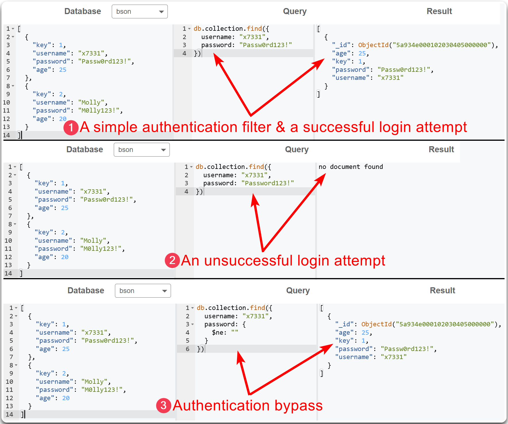
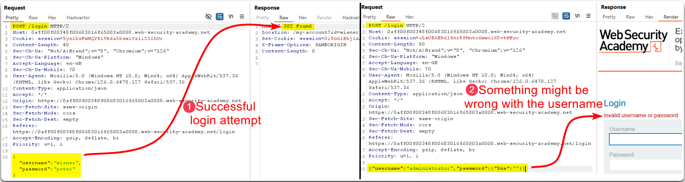
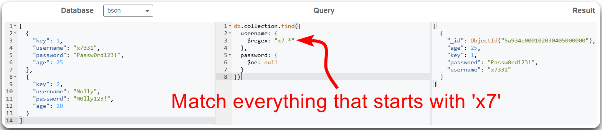
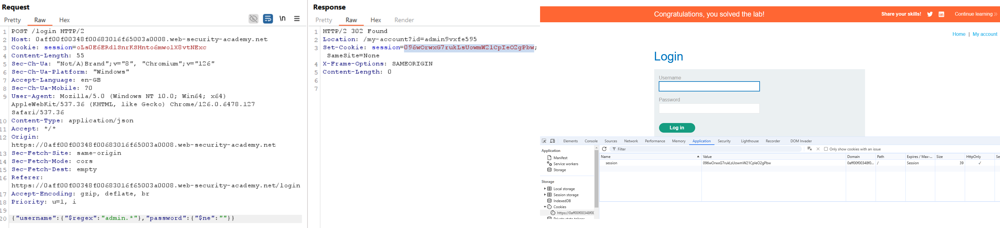

---
layout:
  title:
    visible: true
  description:
    visible: false
  tableOfContents:
    visible: true
  outline:
    visible: true
  pagination:
    visible: true
---

# NoSQLi


NoSQLi is a vulnerability where an attacker manipulates NoSQL database queries by injecting malicious code through user inputs.


> _The example below is based on PostSwigger's_ [_Exploiting NoSQL operator injection to bypass authentication_](https://portswigger.net/web-security/nosql-injection/lab-nosql-injection-bypass-authentication) _lab._

A simplified example of how `mongodb` queries filters data using [mongoplayground](https://mongoplayground.net/) can be found below (Figure 1).

<figure><figcaption>
Figure 1: A NoSQLi example of a successful authentication bypass.
</figcaption></figure>

Replicating the above authentication bypass attempt does not seem to work (Figure 2).

<figure><figcaption>
Figure 2: A failed authentication bypass attempt.
</figcaption></figure>

The error message indicates that we might not have an exact match for the `administrator` username. Thus, we can try injecting a regex payload for the `username` parameter (Figure 3 & 4).

<figure><figcaption>
Figure 3: Testing a regex payload for the <code>username</code> parameter.
</figcaption></figure>

<figure><figcaption>
Figure 4: A successful authentication bypass attempt.
</figcaption></figure>

> _To solve the lab, the cookie must be entered manually through the browser._
