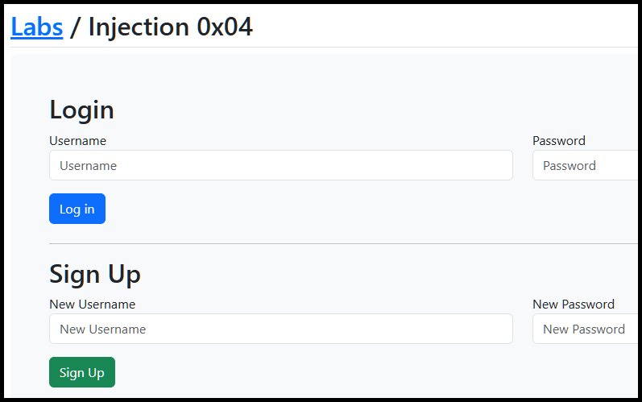
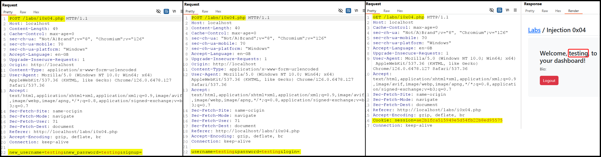
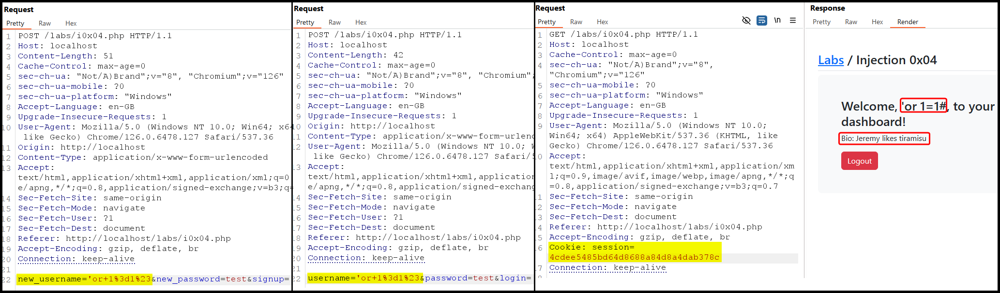

---
layout:
  title:
    visible: true
  description:
    visible: false
  tableOfContents:
    visible: true
  outline:
    visible: true
  pagination:
    visible: true
---

# Second Order


**Second-order SQLi** occurs when malicious input is stored by the application and later used in a SQL query, often at a different stage of the application's workflow.



This allows attackers to inject malicious SQL code that may not be immediately executed but can be triggered later, potentially leading to unauthorized access or data manipulation.



Use prepared statements and parameterized queries throughout the application, validate and sanitize all user inputs, and review and secure data storage and retrieval processes to prevent injection at all stages.


> _The example below is based on TCM's_ [_Practical Bug Bounty_](https://academy.tcm-sec.com/p/practical-bug-bounty) _course._

The application has a `Sign Up` and a `Login` functionality (Figure 1).

<figure><figcaption>
Figure 1: The web application's homepage.
</figcaption></figure>

If we go step through the functionality as intented, i.e., registering a user and then logging in with that user, we will notice that the username gets reflected in the dashboard (Figure 2).&#x20;

<figure><figcaption>
Figure 2: Stepping through the <code>Sign Up</code> and <code>Login</code> flows.
</figcaption></figure>

We can try registering using a common SQLi payload instead of a normal username and check if this has any effect when we log in (Figure 3).

<figure><figcaption>
Figure 3: Achieving a second order SQLi.
</figcaption></figure>
