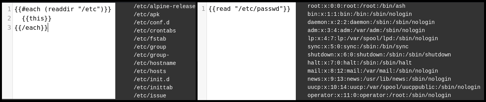

---
layout:
  title:
    visible: true
  description:
    visible: false
  tableOfContents:
    visible: true
  outline:
    visible: true
  pagination:
    visible: true
---

# Handlebars

## Syntax

> _The content below is based on OffSec's_ [_WEB-200_](https://www.offsec.com/courses/web-200/) _course._

The most popular Handlebars library is for **JavaScript** (`handlebars.js`), which allows for both client-side and server-side rendering.

```handlebars
<h1>Hello {{name}}</h1>
{{#if nicknames}}
Also known as:
  {{#each nicknames}}
    {{this}}
  {{/each}}
{{/if}}
```

## SSTI

> _The example below is based on OffSec's_ [_WEB-200_](https://www.offsec.com/courses/web-200/) _course._

Handlebars "_logic-less_" design does not natively support functions that can lead to RCE. However, developers can add additional helpers that expose more of the underlying programming language to the template, such as [`handlebars-helpers`](https://github.com/helpers/handlebars-helpers). The latter includes the [`readdir`](https://github.com/helpers/handlebars-helpers?tab=readme-ov-file#readdir) which returns an array of files from the given directory (Figure 1.1) and  the [`read`](https://github.com/helpers/handlebars-helpers?tab=readme-ov-file#read) function which is used to read system files (Figure 1.2).

```handlebars
{{#each (readdir "/etc")}}
  {{this}}
{{/each}}
```

```handlebars
{{read "/etc/passwd"}}
```

<figure><figcaption><p>Figure 1: Leveraging the <code>handlebars-helpers</code> for reading system files.</p></figcaption></figure>
