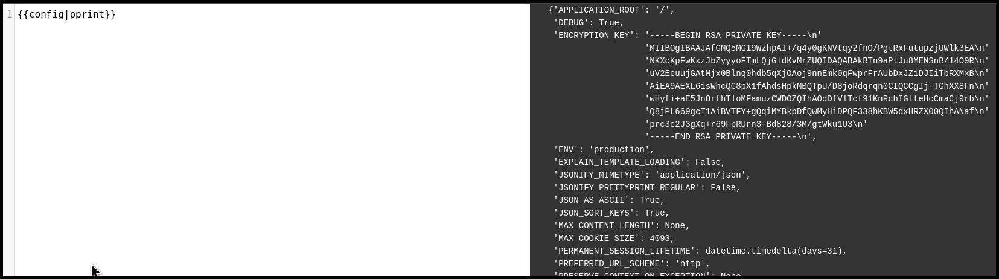

---
layout:
  title:
    visible: true
  description:
    visible: false
  tableOfContents:
    visible: true
  outline:
    visible: true
  pagination:
    visible: true
---

# Jinja

## Syntax

> _The content below is based on OffSec's_ [_WEB-200_](https://www.offsec.com/courses/web-200/) _course._

```django
<h1>Hey {{ name }}</h1>


Here are a couple of reasons why you are great:
<ul>

  <li>{{r}}</li>

</ul>


```

## SSTI

> _The example below is based on OffSec's_ [_WEB-200_](https://www.offsec.com/courses/web-200/) _course._

Jinja uses Python which strictly handles variables, unline PHP, Java, and JavaScript, something we can use to identify it (Figure 1).

```django
{{5*'5'}}
```

<figure><figcaption><p>Figure 1: Identifying a Jinja templating engine.</p></figcaption></figure>

Jinja is typically used with the Flask framework, and the latter sets six global variables: `config`, `request`, `session`, `g`, `url_for()`, and `get_flashed_messages()`. Therefore, another way to identify this templating engine is by accessing those variables (Figure 2).

<figure><figcaption><p>Figure 2: Enumerating a Jinja templating engine via Flask's global variables.</p></figcaption></figure>

The `config` global variable may contain application secrets, such as private keys or database passwords, so it is always a worthwhile check (Figure 3).

```django
{{config|pprint}}
```

<figure><figcaption><p>Figure 3: Inspecting the <code>config</code> global variable's contents</p></figcaption></figure>


RCE is covered in WEB-300.


