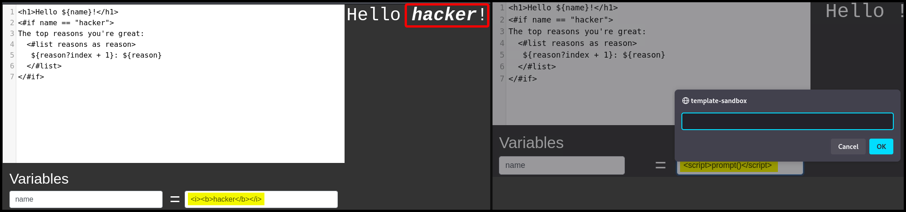

---
layout:
  title:
    visible: true
  description:
    visible: false
  tableOfContents:
    visible: true
  outline:
    visible: true
  pagination:
    visible: true
---

# Template Engines 101

> _The content below is based on OffSec's_ [_WEB-200_](https://www.offsec.com/courses/web-200/) _course._

**Template Engines** are used to display dynamically generated content on web applications. They replace the variables inside a template file with actual values and display these values to the client. For instance, if we wanted to draft an email for every customer such as:&#x20;


```
Hello x7331,

Thank you for ordering ExampleProduct with ID:123456! 

Your items will be shipped out shortly to 10 Example St, London, United Kingdom, EL3123.
```


We could create a template like:


```
Hello {{ name }},

Thank you for ordering {{product.name}} with ID:{{product.id}}! 

Your items will be shipped out shortly to {{address}}.
```


And then fill out the variables:

```json
{
  "name":"x7331",
  "address": "10 Example St, London, United Kingdom, EL3123",
  "cart":[
    {
      "name": "ExampleProduct",
      "id": "123456",
      "price":50"
    }
  ]
}
```

Template engines aimed at web applications can render the HTML template server-side or client-side. The former could result in RCE[^1], while the latter could only result in [XSS](../xss/).

## Template Engines

| Templating Engine | Language       | Server/client Side |
| ----------------- | -------------- | ------------------ |
| Twig              | PHP            | Server Side        |
| Freemarker        | Java (usually) | Server Side        |
| Pug/Jade          | JavaScript     | Mostly Server Side |
| Jinja             | Python         | Server Side        |
| Handlebars        | JavaScript     | Both               |
| Mustache          | Multiple       | Varies             |

## Syntax

### Twig

PHP does not check data types, thus, treats strings as numbers. Both the examples below will be evaluated to `25`.

```twig
{{5*5}} 
{{5*'5'}}
```

A unique piece of Twig syntax is using `-` to trim whitespace.

```twig
{{-name-}}
```

A `for` loop.

```twig


Widget
	Price:	${{product.price}}
	Quanity: {{product.quantity}}
	Total: 	${{product.quantity * product.price}}


```

A `if` statement and the use of the `capitalize` filter.

```twig
<h1>
sudo 
make me a sandwich, {{name|capitalize}}!</h1>
```

### Freemarker

FreeMarker uses the [**FreeMarker Template Language (FTL)**](https://freemarker.apache.org/docs/dgui\_template\_overallstructure.html) which consists of text, interpolation, FTL tags, and comments.

```ftl
<html>[BR]
<head>[BR]
  <title>Welcome!</title>[BR]
</head>[BR]
<body>[BR]
  <#-- Greet the user with his/her name -->[BR]
  <h1>Welcome ${user}!</h1>[BR]
  <p>We have these animals:[BR]
  <ul>[BR]
  <#list animals as animal>[BR]
    <li>${animal.name} for ${animal.price} Euros[BR]
  </#list>[BR]
  </ul>[BR]
</body>[BR]
</html>
```

FreeMarker auto-escapes variables if the content type is an HTML document, while most other templating engines always escape HTML content unless specified not to. This make FreeMarker more susceptile to HTML injection (Figure 1.1) and XSS attacks (Figure 1.2).

<figure><figcaption><p>Figure 1: Testing HTML injection and XSS in FreeMarker.</p></figcaption></figure>

Unlike PHP used in [Twig](template-engines-101.md#twig), Java uses cares about data types so if an integer is multiplied with a string, we expect to get an error (Figure 2).

<figure><figcaption><p>Figure 2: Intentionally inducing an error.</p></figcaption></figure>

[^1]: Remote Code Execution
