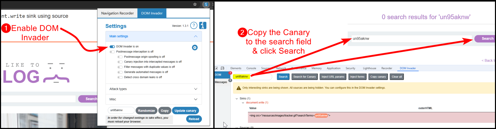
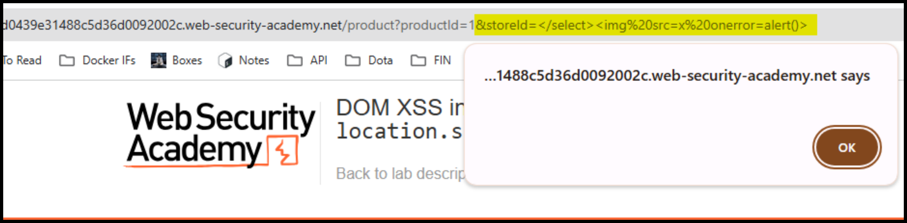

---
layout:
  title:
    visible: true
  description:
    visible: false
  tableOfContents:
    visible: true
  outline:
    visible: true
  pagination:
    visible: true
---

# DOM-Based


**DOM-based XSS** is a type of Cross-Site Scripting where the vulnerability exists in the client-side code rather than the server-side. The malicious script is executed as a result of modifying the Document Object Model (DOM) of the web page, typically through JavaScript.


## Basic

> _The example below is based on TCM's_ [_Practical Bug Bounty_](https://academy.tcm-sec.com/p/practical-bug-bounty) _course._

The below to-do app does not generate any network traffic when we add an item (Figure 1).

<figure><figcaption><p>Figure 1: Inspecting the network traffic of the application.</p></figcaption></figure>

Trying a common XSS payload seems to work (Figure 2).

```javascript

```

<figure><figcaption><p>Figure 2: Executing a DOM-based XSS attack.</p></figcaption></figure>

We also use the above attack to redirect the user to another location (Figure 3).

```javascript

```

<figure><figcaption><p>Figure 3: Executing a DOM-based XSS attack with redirection.</p></figcaption></figure>

## DOM Invader

> The example below is based on PortSwigger's [_DOM XSS in `document.write` sink using source `location.search`_](https://portswigger.net/web-security/cross-site-scripting/dom-based/lab-document-write-sink) lab.

We can automatically enumerate Sinks using the DOM Invader extension within Burp's Chromium browser (Figure 4).


A **Sink** is a point in the web application where data is inserted into the DOM[^1] or executed as code. Sinks are the locations in the code where the untrusted input data can potentially cause malicious scripts to run if not properly sanitized. Examples of common sinks include:`innerHTML`, `outerHTML`, `document.write`, etc.


<figure><figcaption><p>Figure 4: Using DOM Invdader to enumerate sinks.</p></figcaption></figure>

DOM Invader was able to identify a Sink associated with `document.write`. We can find more about it when we click the `Stack Trace` link (Figure 5.3) as well as exploit it by clicking on the `Exploit` button (Figure 5.4).

<figure><figcaption><p>Figure 5: Using DOM Invader's features to find more about the Sink as well as exploit it.</p></figcaption></figure>

## Code Review

> The example below is based on PortSwigger's [_DOM XSS in `document.write` sink using source `location.search` inside a select element_](https://portswigger.net/web-security/cross-site-scripting/dom-based/lab-document-write-sink-inside-select-element) lab.

The product page of the application includes an interesting piece of code (Figure 6).

<figure><figcaption><p>Figure 6: Inspecting the application's front-end code.</p></figcaption></figure>

If we manipulate the `storeId` parameter, it ends up within a `select` statement (Figure 7).

<figure><figcaption><p>Figure 7: Manipulating the <code>storeId</code> parameter.</p></figcaption></figure>

We can terminate the `select` statement and then pass our payload to achieve XSS (Figure 8).

<figure><figcaption><p>Figure 8: Achieving DOM-based XSS.</p></figcaption></figure>

[^1]: Document Object Model
