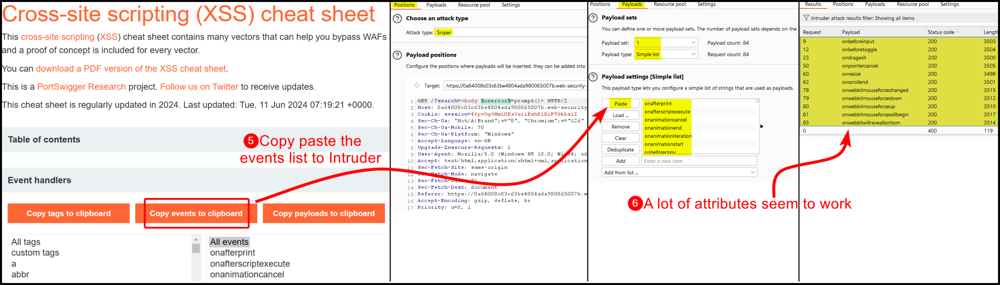
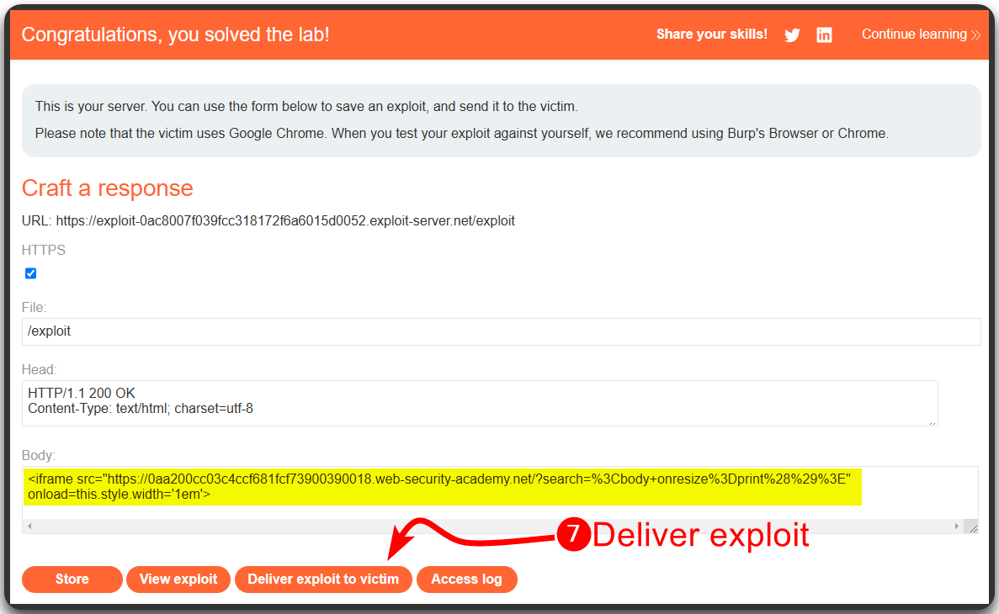

---
layout:
  title:
    visible: true
  description:
    visible: false
  tableOfContents:
    visible: true
  outline:
    visible: true
  pagination:
    visible: true
---

# Reflected


**Reflected XSS** is a type of Cross-Site Scripting where the malicious script is reflected off a web server and executed in a user's browser when they click a link or submit a form. This type of XSS is typically delivered via email or another communication method.


## Filter Bypass

> The example below is based on PortSwigger's [_Reflected XSS into HTML context with most tags and attributes blocked_](https://portswigger.net/web-security/cross-site-scripting/contexts/lab-html-context-with-most-tags-and-attributes-blocked) lab.

In this web application, there is a search functionality and the search term is reflected back into the page within HTML tags (Figure 1).

<figure><figcaption><p>Figure 1: Identifying where our input is reflected.</p></figcaption></figure>

When our payload is inside HTML tags, we can simply add new HTML tags to trigger it. It seems that there is a WAF[^1] blocking specific tags (Figure 2).

<figure><figcaption><p>Figure 2: Common JavaScript tags seem to be blocked by a WAF.</p></figcaption></figure>

We can create a tag wordlist using PortSwigger's [XSS Cheatsheet](https://portswigger.net/web-security/cross-site-scripting/cheat-sheet), and fuzz the application to see which tags are allowed (Figure 3).

<figure><figcaption><p>Figure 3: Fuzzing JavaScript tags with Burp's Intruder.</p></figcaption></figure>

Trying the `<body>` tag results in another verbose error message (Figure 4).

<figure><figcaption><p>Figure 4: Another verbose error message informing us about a blacklisted attribute.</p></figcaption></figure>

We can repeat the same process we did for tags to find allowed attributes (Figure 5).

<figure><figcaption><p>Figure 5: Fuzzing JavaScript attributes with Burp's Intruder.</p></figcaption></figure>

Now, all we have to do is delivering our XSS payload to the victim via the exploit server (Figure 6).


```javascript
<iframe src="https://0a64008c03c63be4804ada980065007b.web-security-academy.net/?search=%3Cbody+onresize%3Dprint%28%29%3E" onload=this.style.width='1em'>
```


<figure><figcaption><p>Figure 6: Delivering the exploit to the victim via an <code>iframe</code>.</p></figcaption></figure>

## Within JS

> The example below is based on PortSwigger's [_Reflected XSS into a JavaScript string with angle brackets HTML encoded_](https://portswigger.net/web-security/cross-site-scripting/contexts/lab-javascript-string-angle-brackets-html-encoded) lab.

This time the search keyword ends up within a block of JS[^2] code (Figure 7).

<figure><figcaption><p>Figure 7: Identifying the context of a potential XSS flaw.</p></figcaption></figure>

We can treat this similar to an [SQLi](../sqli/) flaw and try injecting JS[^3] code to the search keyword (Figure 8).

<figure><figcaption><p>Figure 8: Achieving XSS via JavaScript Injection.</p></figcaption></figure>

[^1]: Web Application Firewall

[^2]: JavaScript

[^3]: JavaScript
