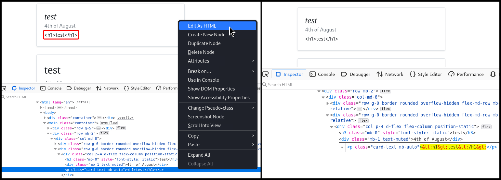
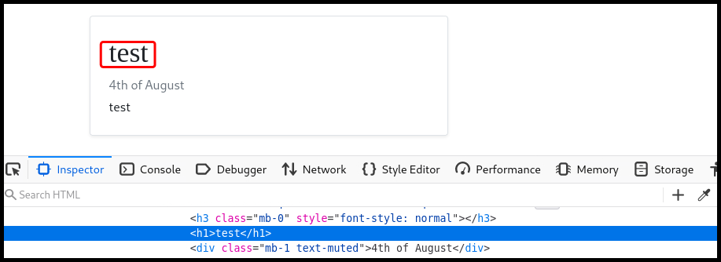
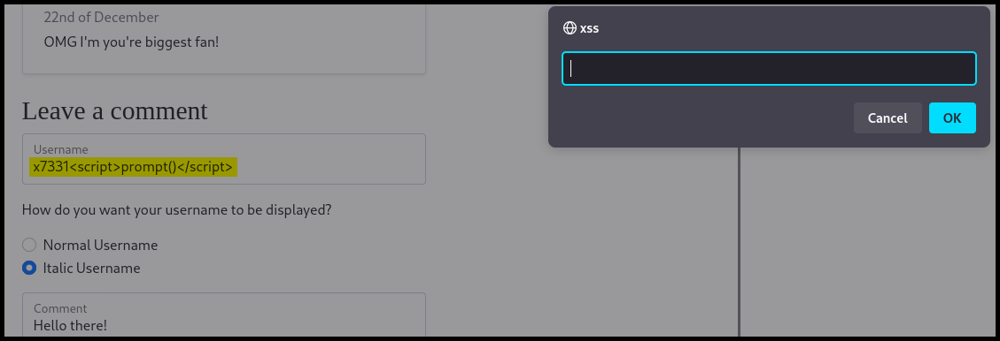
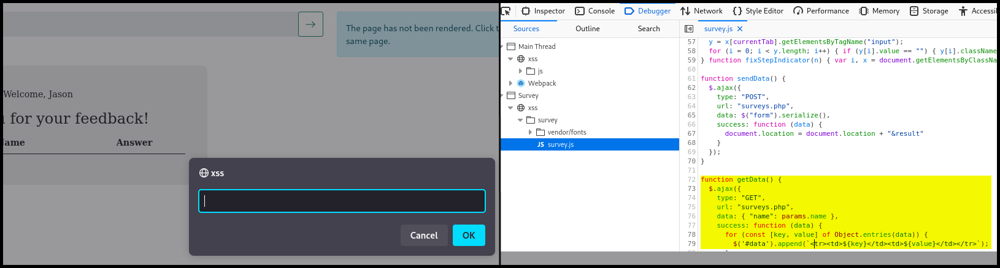
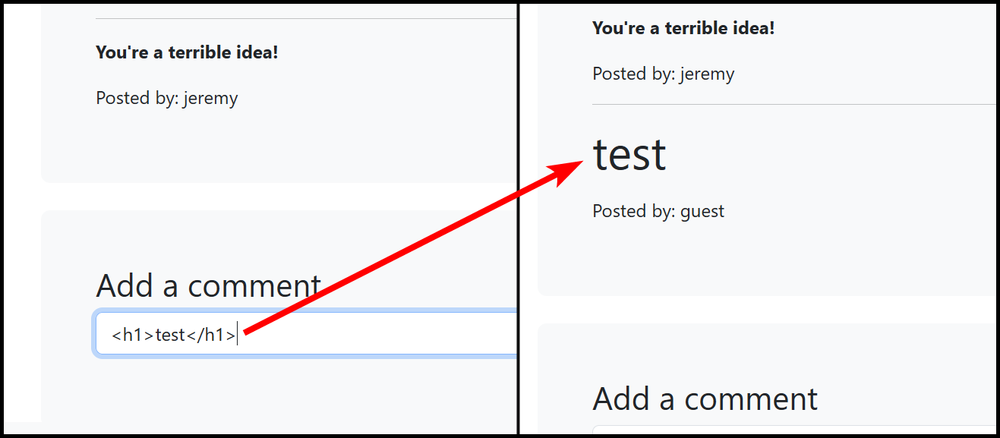
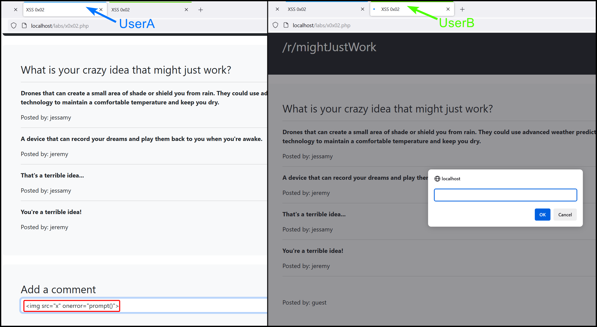
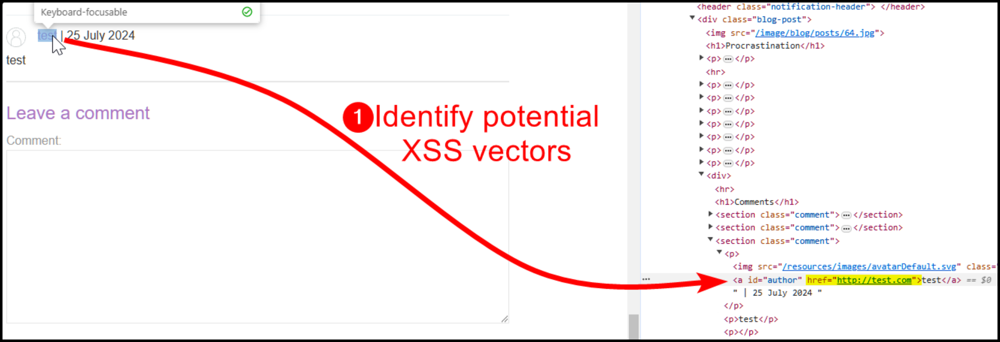
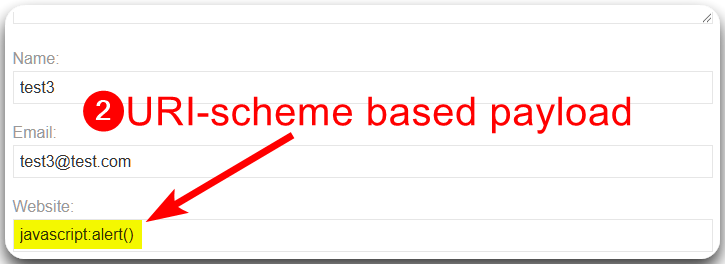

---
layout:
  title:
    visible: true
  description:
    visible: false
  tableOfContents:
    visible: true
  outline:
    visible: true
  pagination:
    visible: true
---

# Stored


Stored XSS is a type of Cross-Site Scripting where malicious scripts are permanently stored on the server (e.g., in a database) and then served to users who view the stored content.



This can lead to persistent attacks, where the malicious script runs every time the stored content is accessed, potentially stealing user data, performing actions on behalf of users, or defacing the website.


## Stored Server XSS

> _The example below is based on OffSec's_ [_WEB-200_](https://www.offsec.com/courses/web-200/) _course._

The Blog we are testing has two fields: `username` and `comment`. When we test the latter for HTML injection, it does not work (Figure 1.1). When diving into what's happening, we can see that the some characters are filtered out by the application (Figure 1.2).

<figure><figcaption><p>Figure 1: Understanding why the HTML injection did not work.</p></figcaption></figure>

Testing for HTML injection on the `username` field seems to work (Figure 2).

<figure><figcaption><p>Figure 2: Enumerating a vulnerable to HTML injection field.</p></figcaption></figure>

Next, we can test for XSS on the `username` field (Figure 3), and if successful, every user that visits the page will have the payload executed on their browser.

<figure><figcaption><p>Figure 3: Enumerating a vulnerable to XSS field.</p></figcaption></figure>

## Stored Client XSS

> _The example below is based on OffSec's_ [_WEB-200_](https://www.offsec.com/courses/web-200/) _course._

This time the application in question has a survey form to complete that includes six fields in total (Figure 4.1 & 4.2), two of them vulnerable to HTML injection (Figure 4.3).&#x20;

<figure><figcaption><p>Figure 4: Stepping through the application and testing for HTML injection.</p></figcaption></figure>

If we test for XSS we get a prompt box back (Figure 5.1), and we can review how this exactly works via the source code of `survey.js` file. At the end of this file, the `getData` function sends a `GET` request and constructs the results table on the front-end (Figure 5.2).

<figure><figcaption><p>Figure 5: Achieving XSS and reviewing how it worked.</p></figcaption></figure>

## Basic

> _The example below is based on TCM's_ [_Practical Bug Bounty_](https://academy.tcm-sec.com/p/practical-bug-bounty) _course._

This application just allows to post comments. We can start by checking if the target is vulnerable to HTML injection before testing straight for XSS (Figure 4).

<figure><figcaption><p>Figure 4: Testing for HTML injection.</p></figcaption></figure>

Next, we want to test for Stored XSS. The easiest way to do this is by using [Firefox's Multi-Account Containers extension](../../authorization/automated-a-b-testing.md#multi-account-containers), create an XSS payload with `UserA`, and then visit the page with `UserB` to see if the payload is executed (Figure 5).

<figure><figcaption><p>Figure 5: Using FireFox's containers to test for Stored XSS.</p></figcaption></figure>

## href Attribute

> The example below is based on PortSwigger's [_Stored XSS into anchor `href` attribute with double quotes HTML-encoded_](https://portswigger.net/web-security/cross-site-scripting/contexts/lab-href-attribute-double-quotes-html-encoded) lab.

In this application there is a comment functionality which also includes a `Website` field. The value of this field is stored within the HTML `href` attribute (Figure 6).

<figure><figcaption><p>Figure 6: Identifying potential XSS vectors.</p></figcaption></figure>

We can try escaping the tag with payloads such as :

```javascript
"><script>alert()</script>
">
```

Unfortunately, neither of the above payloads work. However, the `href` attribute can itself create a scriptable context, thus, we are not required to escape it. In this case, we can use the `javascript` pseudo-protocol directly (Figure 7).

```javascript
javascript:alert()
```

<figure><figcaption><p>Figure 7: Achieving Stored XSS via a URI-scheme based payload.</p></figcaption></figure>
