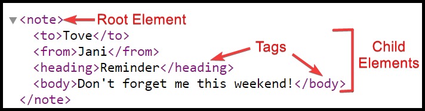
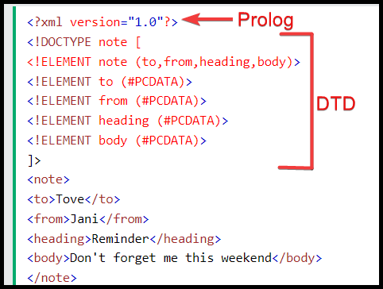
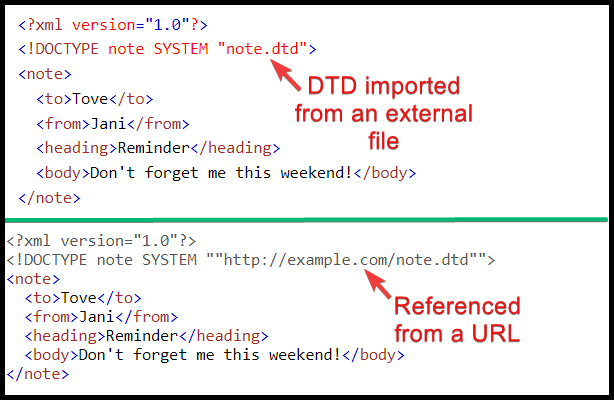

---
layout:
  title:
    visible: true
  description:
    visible: false
  tableOfContents:
    visible: true
  outline:
    visible: true
  pagination:
    visible: true
---

# XML 101

## XML Parsers

XML-based applications will typically use a **XML parser** to validate the data and convert it into an internal object. XML parsing vulnerabilities can serve as **primitives** (building blocks) for further attacks, such as SSRF, information disclosure, DoS[^1], RCE[^2], etc.

## XML Structure

**Extensible Markup Language (XML)**  is focused on the storage and transportation of data and it encodes data in a way that's easier for human and machines to read. XML documents consist of markup, mostly tags, and content. It resembles an HTML file, although HTML documents have predefined tags and XML does not: **each XML document defines its own set of tags**. The key compoments of an XML file are depicted below (Figure 1).

<figure><figcaption><p>Figure 1: The key components of an XML document (<em>image adapted from</em> <a href="https://www.w3schools.com/xml/xml_syntax.asp"><em>here</em></a>).</p></figcaption></figure>

```xml
<?xml version="1.0" encoding="UTF-8"?> <!-- XML declaration -->
  <contacts> <!-- start tag of the contacts element -->
    <contact id="123"> <!-- element attributes are defined within the start tag -->
      <firstName>Tom</firstName> <!-- sub-element of contact -->
      <lastName>Jones</lastName>
    </contact>
    <contact id="456">
      <firstName>Tom</firstName>
      <lastName>Petty</lastName>
    </contact>
  </contacts> <!-- end tag of the contacts element -->
```


If we need to use the XML-specific characters within an XML document they must be replaced with their corresponding entity references.

<table><thead><tr><th width="338">XML reserved character</th><th>Entiry reference</th></tr></thead><tbody><tr><td><code>&#x3C;</code></td><td><code>&#x26;lt;</code></td></tr><tr><td><code>></code></td><td><code>&#x26;gt;</code></td></tr><tr><td><code>&#x26;</code></td><td><code>&#x26;amp;</code></td></tr><tr><td><code>'</code></td><td><code>&#x26;apos;</code></td></tr><tr><td><code>"</code></td><td><code>&#x26;quot;</code></td></tr></tbody></table>

An alternative is to enclosed those characters in a Character Data (`CDATA`) section. XML parsers will treat the contents of a `CDATA` block as text instead of markup.

```xml
<![CDATA[ content ]]>
```

## XML Entities

What we are mostly interesting in from an attacker's POV[^3] is the [**XML Document Type Definition (DTD)**](https://www.w3schools.com/xml/xml\_dtd\_intro.asp) which allows the validation of an XML document against a pre-defined document structure. The DTD can be placed within the XML document itself (Figure 2), imported from an external file (Figure 3.1), or referenced through a URL (Figure 3.2).

<div>

<figure><figcaption><p>Figure 2: An example of a DTD placed within the XML document (image adapted from <a href="https://www.w3schools.com/xml/xml_dtd_intro.asp">here</a>).</p></figcaption></figure>

 

<figure><figcaption><p>Figure 3: A DTD imported from an external file (1) and a URL (2) (images adapted from <a href="https://www.w3schools.com/xml/xml_dtd_intro.asp">here</a>).</p></figcaption></figure>

</div>

Within DTDs we can define **entities** (XML variables) using the `ENTITY` keyword. XML entities can be categorized in three ways:

1. **Internal**, i.e., locally within the DTD using the entity name and its value.

```xml
<?xml version="1.0" encoding="UTF-8"?>
<!DOCTYPE note [
  <!ENTITY sender "x7331">
]>
```

2. **External**, i.e., outside of the DTD, using the `SYSTEM` keyword and its path. These can be further classified as _**private**_ or _**public**_, depending of their intented audience.

```xml
<?xml version="1.0" encoding="UTF-8"?>
<!DOCTYPE note [
  <!ENTITY senderPrivate SYSTEM "http://example.com/note.txt">
  <!ENTITY senderPublic PUBLIC "public_id" "http://example.com/note.txt">
]>
```

3. **Parameter** entities exists only within a DTD and include the `%` prefix.

```xml
<?xml version="1.0" encoding="UTF-8"?>
<!DOCTYPE note [
    <!ENTITY % name SYSTEM "URI">
]>
```

Different entity types can be combined and used together.

```xml
<!-- defining a parameter entity -->
<!ENTITY % name 'x7331'>
<!-- defining an internal entity which includes a parameter entity -->
<!ENTITY Title 'This is the site of %name;'>
```

We can expand an entity using an **entiry reference** via the `&` symbol.

```xml
<name>&name;</name>
```


[^1]: Denial of Service

[^2]: Remote Code Execution

[^3]: Point Of View
