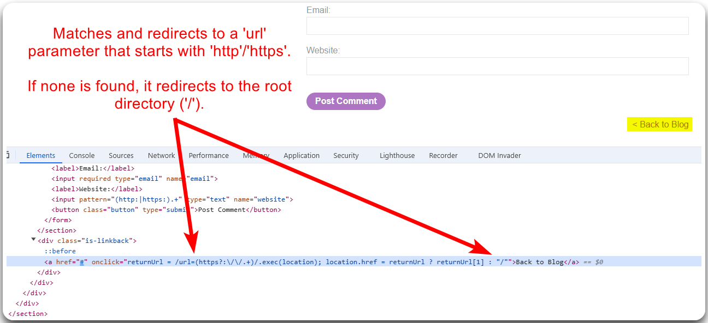
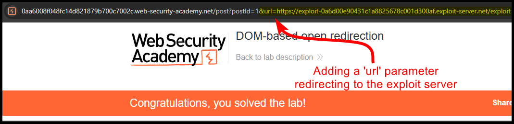

---
layout:
  title:
    visible: true
  description:
    visible: false
  tableOfContents:
    visible: true
  outline:
    visible: true
  pagination:
    visible: true
---

# Open Redirects


An open redirect is a vulnerability where a web application allows an attacker to redirect users to an arbitrary, untrusted URL.



This can be exploited for phishing attacks, where users are tricked into visiting malicious websites that steal sensitive information.



Validate and restrict URL parameters to allow only trusted, predefined URLs for redirection.


## Example

> _The example below is based on PostSwigger's_ [_DOM-based open redirection_](https://portswigger.net/web-security/dom-based/open-redirection/lab-dom-open-redirection) _lab._

If we perform a code review at the front-end code, we will notice the the `Back to Blog` button searches a regex pattern (`http://` or `https://`) and if it redirects to it if one is found (Figure 1).

<figure><figcaption>
Figure 1: Performing frond-end code review.
</figcaption></figure>

As a result, we can pass a `url` parameter ourselves redirecting to the exploit server (Figure 2).

<figure><figcaption>
Figure 2: Exploiting an Open Redirect vulnerability.
</figcaption></figure>
