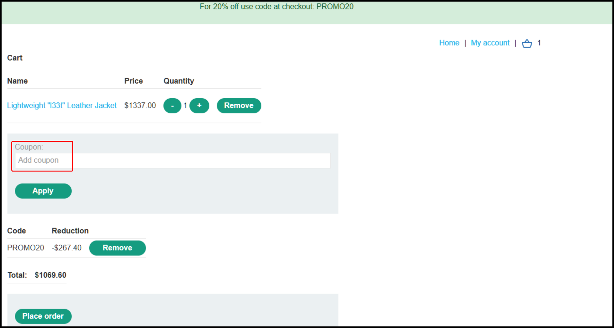
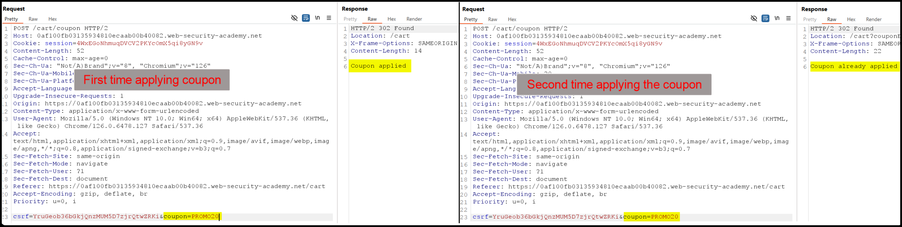
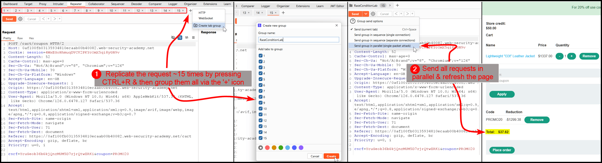
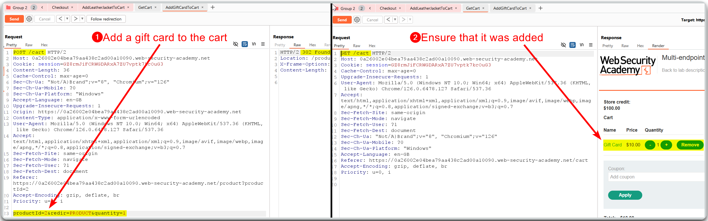
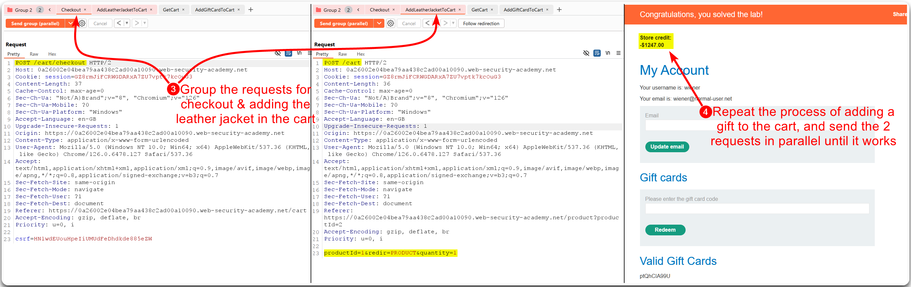

---
layout:
  title:
    visible: true
  description:
    visible: false
  tableOfContents:
    visible: true
  outline:
    visible: true
  pagination:
    visible: true
---

# Race Conditions


Race conditions occur when multiple processes or threads access shared resources simultaneously, leading to unpredictable and incorrect behavior.



This can cause data corruption, security vulnerabilities, and system crashes due to the unsynchronized execution of operations.



Implement proper synchronization mechanisms like locks, semaphores, and atomic operations to ensure orderly access to shared resources.


## Limit Overrun


One-time use actions, such as redeeming a coupon, rating a product, or withdrawing money. The exploitation process is the following:

1. Find a single-use endpoint
2. Send multiple requests to see if the limit can be overrun


> _The example below is based on PostSwigger's_ [_Limit overrun race conditions_](https://portswigger.net/web-security/race-conditions/lab-race-conditions-limit-overrun) _lab._

The application has a field for inserting a coupon at checkout as well as current coupon that gives us 20% off (Figure 1).

<figure><figcaption>
Figure 1: The application's coupon functionality.
</figcaption></figure>

The server prevents coupon abuse, i.e., the same coupon being applied multiple times, when sending the requests sequentially (Figure 2).

<figure><figcaption>
Figure 2: The application prevents coupon reuse.
</figcaption></figure>

We can try testing for a race condition vulnerability by replicating the same request multiple times and sending all simultaneously (Figure 3).

<figure><figcaption>
Figure 3: Leveraging Burp's features to exploit a race conditiong vulnerability.
</figcaption></figure>

## Single-Endpoint


Focusing on an endpoint that has some security impact, such as password reset, account creation, account verification, etc. The goal is to trigger a collision that demonstrates impact rather than just getting requests in before the race window closes.


<figure><figcaption>
Figure 4: The Single-Endpoint race condition process (<em>image adapted from</em> <a href="https://portswigger.net/web-security/race-conditions#single-endpoint-race-conditions"><em>here</em></a>).
</figcaption></figure>

> _The example below is based on PostSwigger's_ [_Single-endpoint race conditions_](https://portswigger.net/web-security/race-conditions/lab-race-conditions-single-endpoint) _lab._

First, we need to understand how the update email process works (Figure 5).

<figure><figcaption>
Figure 5: Stepping through the update email functionality.
</figcaption></figure>

We can test if a collision is possible by sending multiple requests at the same time using different user emails (Figure 6).

<figure><figcaption>
Figure 6: Testing for collisions.
</figcaption></figure>

Next, we can try to achieve the required collision (Figure 7) and when it does (Figure 8), refreshing the application page will give us access to the admin panel .

<figure><figcaption>
Figure 7: Constructing the requests required for the target collision.
</figcaption></figure>

<figure><figcaption>
Figure 8: Achieving the target collision.
</figcaption></figure>

## Multi-Endpoint


Testing a series of actions that make up the application flow or business logic. For example, the checkout, the time it takes to verify a payment, and the confirmation. Could we add more items to the basket during this window between checkout and confirmation?


> _The example below is based on PostSwigger's_ [_Multi-endpoint race conditions_](https://portswigger.net/web-security/race-conditions/lab-race-conditions-multi-endpoint) _lab._

The goal here is to essentially try and sneak a product in our cart before the checkout process completes. To be able to checkout in the first place, we need to have a product in our basket (Figure 9).

<figure><figcaption>
Figure 9: Adding a giftcard to our basket.
</figcaption></figure>

Then we need to simultaneously send the checkout request along with the request that adds the target item in the cart (Figure 10). This will result at the target item sneaking into the cart before the checkout is complete.

<figure><figcaption>
Figure 10: Exploiting a multi-endpoint race condition.
</figcaption></figure>
