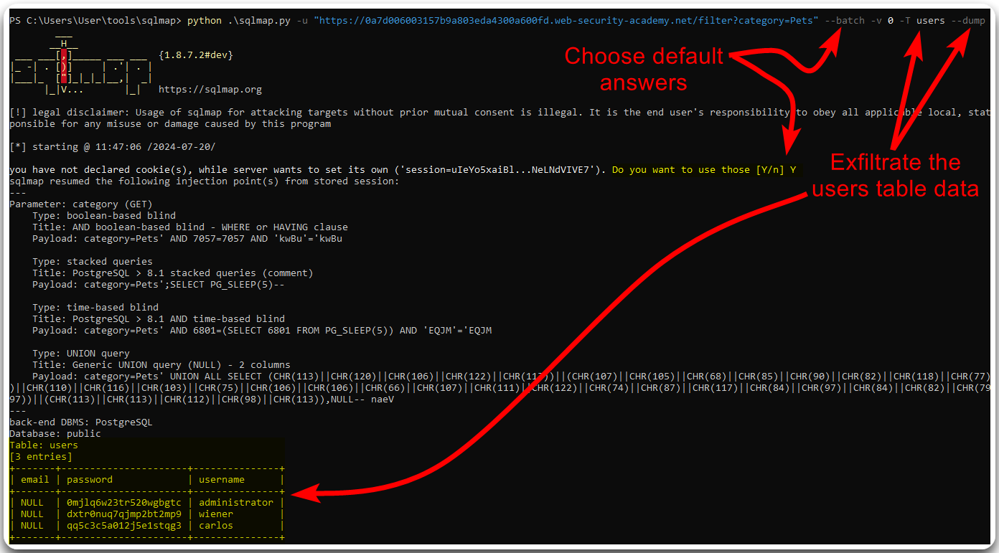

---
layout:
  title:
    visible: true
  description:
    visible: false
  tableOfContents:
    visible: true
  outline:
    visible: true
  pagination:
    visible: true
---

# SQLi


**SQL Injection** (_SQLi_) is a security vulnerability where an attacker inserts or manipulates SQL queries through user inputs to gain unauthorized access, alter data, or execute malicious commands in the database.


## Discovery

We can enumerate SQLi flaws via:

1. Sending **manual** payloads.
2. Searching for dynamic SQL statements during a **code review**.
3. **Fuzzing** the request.

## Simple Workflow

> _The example below is based on PostSwigger's_ [_SQL injection UNION attack, retrieving data from other tables_](https://portswigger.net/web-security/sql-injection/union-attacks/lab-retrieve-data-from-other-tables) _lab._

We can start testing for SQLi flaws by fuzzing the request's parameters with common SQLi payloads (Figure 1).

<figure><figcaption><p>Figure 1: Fuzzing for SQLi flaws.</p></figcaption></figure>

Intruder's results indicate that the `category`parameter is vulnerable to SQLi, so the next step is to manually confirm that we can affect the response's behaviour (Figure 2).

<figure><figcaption><p>Figure 2: Validating the SQLi vulnerability.</p></figcaption></figure>

Now we have discovered and validated the SQLi flaw, we can use automated tools, such as [SQLMap](../../tools/web/sqlmap.md), for data exfiltration (Figure 3).


```bash
sqlmap.py -u "https://0a7d006003157b9a803eda4300a600fd.web-security-academy.net/filter?category=Pets" --batch -v 0 -T users --dump
```


<figure><figcaption><p>Figure 3: Using <code>sqlmap</code> to exfiltrate data from the <code>users</code> table.</p></figcaption></figure>

## Blind SQLi

_The example below is based on PostSwigger's_ [_Blind SQL injection with conditional responses_](https://portswigger.net/web-security/sql-injection/blind/lab-conditional-responses) _lab._


## Assumptions

* IIS -> MSSQL
* Apache/Nginx -> MySQL

## SQLi Types


<figure><figcaption><p>Figure 1: SQL Injection types (<em>imaged adapted from</em> <a href="https://www.qafox.com/sql-injection-types/"><em>here</em></a>).</p></figcaption></figure>

## Detection

| Payload | URL Encoded |
| ------- | ----------- |
| `'`     | `%27`       |
| `"`     | `%22`       |
| `#`     | `%23`       |
| `;`     | `%3B`       |
| `)`     | `%29`       |

## Banned Characters


```bash
ffuf -k -u https://watch.streamio.htb/search.php -d 'q=FUZZ' -w /usr/share/seclists/Fuzzing/special-chars.txt -c -ic -ac -H 'Content-Type: application/x-www-form-urlencoded'
```


## Queries

Try a parameter value that returns results and one that it does not.

* For **MSSQL-specific** SQLi info see [here](../../services/sql/mssql-1433.md#sqli).&#x20;
* For **MySQL-specific** SQLi info see [here](../../services/sql/mysql-3306.md#sqli).

## MySQL -  UNION Attack

Appropriate when the results are returned within the application's response. Two conditions must be met:

1. The invididual queries must return the same number of columns.
   * [ ] [How many columns](sqli.md#number-of-columns) are returned from the original query?
2. The data types in each column must be compatible between the individual queries.
   * [ ] [Which columns are suitable](sqli.md#data-types) to hold the results from the injected query?

### Number of Columns

Incrementing an `ORDER BY` clause's index until it errors. The number represents the column's index; when this exceeds the number of the actual columns we will get an index-related error.

<figure><figcaption><p>Figure 1: Detecting SQLi.</p></figcaption></figure>

<figure><figcaption><p>Figure 2a: Indexing the first column.</p></figcaption></figure>

<figure><figcaption><p>Figure 2b: Indexing the 4th column returns a server error.</p></figcaption></figure>

We can also use the `UNION SELECT NULL` payload to achieve the same goal.

<figure><figcaption><p>Figure 3: Enumerating the number of columns using UNION SELECT NULL.</p></figcaption></figure>

### Data Types

Typically the data we want to exfiltrate is in text form, thus, we must enumerate which column in the original query can hold this type of data. This can be done by passing a random string column by column until the server accepts it.

<figure><figcaption><p>Figure 4: Passing string data to the first column returns a server error.</p></figcaption></figure>

<figure><figcaption><p>Figure 5: Passing string data to the second column is accepted by the server.</p></figcaption></figure>
