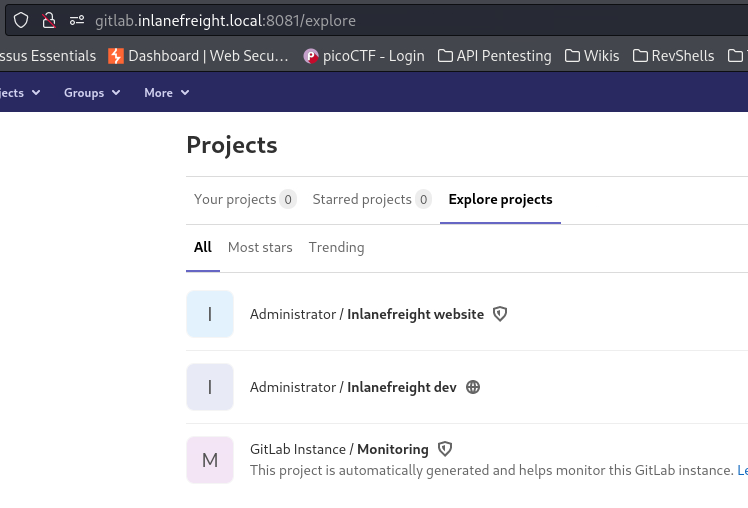

---
layout:
  title:
    visible: true
  description:
    visible: false
  tableOfContents:
    visible: true
  outline:
    visible: true
  pagination:
    visible: false
---

# GitLab

## General

In GitLab the 2FA is disabled by default. It has the following 3 types of repositories:

<table><thead><tr><th width="217">Repository</th><th>Access</th></tr></thead><tbody><tr><td>Public</td><td>Available to everyone (no authentication required)</td></tr><tr><td>Internal</td><td>Available to all authenticated users</td></tr><tr><td>Private</td><td>Restricted to specific users</td></tr></tbody></table>

## Footprinting

For finding the version we can register an account and browse to `/help` (Figure 1).

<figure><figcaption>
Figure 1: Footprinting GitLab as authenticated users.
</figcaption></figure>

## Enumeration

We can browse to `/explore` both as unauthenticated (Figure 2) and authenticated users (Figure 3).

<figure><figcaption>
Figure 2: Exploring project as an unauthenticated user.
</figcaption></figure>

 

<figure><figcaption>
Figure 3: Exploring project as an authenticated user.
</figcaption></figure>


The below examples has been taken from the Gitlab section of the [Attacking Common Applications](https://academy.hackthebox.com/module/113) HTB's module.



