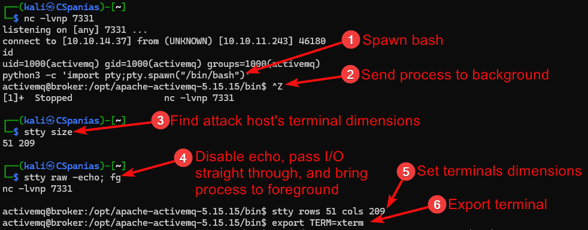

---
layout:
  title:
    visible: true
  description:
    visible: false
  tableOfContents:
    visible: true
  outline:
    visible: true
  pagination:
    visible: true
---

# Shells

### Stabilization



<pre class="language-bash"><code class="lang-bash"><strong># with python3
</strong><strong>python3 -c 'import pty;pty.spawn("/bin/bash")'
</strong><strong># with script
</strong>script -O /dev/null -q /bin/bash
</code></pre>



```bash
# send process to the background
# CTRL+Z
# check size
stty size
# disable echo, send I/O straight through, and bring process to foreground
stty raw -echo; fg
# press enter once and set terminal's dimensions
stty rows 51 cols 209
# export terminal
export TERM=xterm
```



<figure><figcaption></figcaption></figure>
