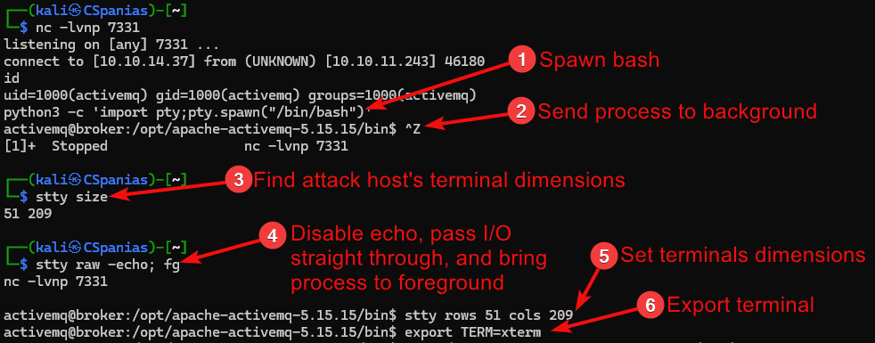

---
layout:
  title:
    visible: true
  description:
    visible: false
  tableOfContents:
    visible: true
  outline:
    visible: true
  pagination:
    visible: true
---

# Stabilization

## TL;DR

| Term | Meaning        |
| ---- | -------------- |
| tty  | teletype       |
| pty  | pseudoterminal |

## Stabilization

Ability to CTRL+C, tab completion, clear screen, up and down arrows, etc.

### Most Common

1. Spawn tty with script or python3.
2. Stabilize shell.

Check if Python3/Script is installed on the target.

Spawn bash with Script or Python3.



```bash
script /dev/null -c /bin/bash
```



```bash
python3 -c 'import pty;pty.spawn("/bin/bash")'
```



Send tty to the backgroup (`CTRL+Z`) and checks terminal's type and dimensions.

```bash
echo $TERM && stty size
```

Disable echo, send I/O straight through, and bring process to foreground.

```bash
stty raw -echo; fg
```

Press enter, reset terminal, and type the terminal's type as an answer to the prompt (`xterm`/`screen`).

```bash
reset
```

Match tty's dimensions to the hosts.

```bash
stty rows 51 cols 209
```

Set the TERM variable to the terminal's type.

```bash
export TERM=xterm
```

<figure><figcaption></figcaption></figure>

```bash
which script
script /dev/null -c /bin/bash
^Z
echo $TERM && stty size
stty raw -echo; fg
reset
stty rows 51 cols 209
export TERM=xterm
```

### Other Ways

```bash
# echo
echo 'os.system('/bin/bash')'
# sh
/bin/sh -i
# bash
/bin/bash -i
# perl
perl -e 'exec "/bin/sh";'
perl: exec "/bin/sh";
# ruby
ruby: exec "/bin/sh"
# awk
awk 'BEGIN {system("/bin/sh")}'
# find
find / -name blahblah 'exec /bin/awk 'BEGIN {system("/bin/sh")}' \;
# lua
lua: os.execute('/bin/sh')
# type more, less, or man command with a file then try
'! /bin/sh'
'!/bin/sh'
'!bash'
```










